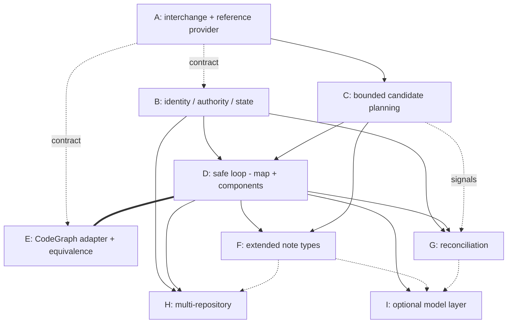

# Design: architecture projection epic decomposition (#141)

Reframes **#141 — provider-neutral architecture projection** from a single
implementation issue into a **parent epic** with a child DAG (A–I). It consumes
the completed **#140** context-graph foundation (shipped v0.7.0) without
restating or weakening it, reuses **#185**'s generated-region and safe-apply
utilities by name, and preserves the **#142** historical-enrichment boundary.

**Scope guard.** This document designs *decomposition and frozen contracts*, not
production code. It defines no new context-graph schema, no new context-graph
canonicalization, and no new endpoint rule — all three remain #140's frozen
output. Architecture projection is a **downstream, rebuildable reading surface**;
it never becomes a context-graph authority. Where this record and a live issue
body diverge, the live body wins and this record must be corrected.

**What #141 consumes from #140 (read-only, never reinvented):** opaque project
identity `project:<32-lowercase-hex>` and stable repository-binding identity
`repository-binding:<32-hex>` from `config.json`; context semantic-node identities
`context-node:<slug>:<32-hex>` and normalized evidence identities (#181) as they
appear in the compiled `index.json`; the generated-region / safe-apply utilities
frozen by #185. Specific symbols are named in §5 and §6.

---

## 1. Problem and product boundary

### Problem

#140 out-of-scope explicitly deferred "CodeGraph ingestion or architecture
projection" and "Historical bulk backfill" to two follow-on consumers: #141
(architecture) and #142 (historical). #141's current body already carries the
correct authority model, identity constraints, and safety requirements, but is
shaped as one implementation issue. The full contract — a provider-neutral
structural-graph interchange, a project-scoped architecture identity space, a
bounded deterministic selection engine, a multi-file safe-apply loop, a real
CodeGraph adapter, richer note types, reconciliation, multi-repository breadth,
and an optional model layer — is program-sized. Delivered as one issue it has a
long time-to-first-green and high integration risk; several of its sub-contracts
(interchange, identity, apply manifest) are load-bearing for the rest and must be
frozen before dependent work begins.

### Product boundary (epic)

**In scope for the #141 epic:**

* a canonical, versioned, **local structural-graph JSON interchange** and a
  reference JSON reader/provider (usable by real tools, not merely a test double);
* a **project-scoped architecture identity** space, provenance, and authority-
  separated state under `.bindle/architecture/`;
* **deterministic bounded candidate planning** (codebase map + components for the
  MVP) computed by Bindle from interchange primitives;
* a **safe projection loop** — preview → confirm → apply → zero-write rerun →
  changed-only refresh — reusing #185 utilities and extending them for a
  variable-cardinality note manifest;
* a **CodeGraph adapter** behind the interchange, with a shared-capability
  equivalence proof;
* later children: extended note types; reconciliation lifecycle; multi-repository
  breadth; an optional model-assisted authoring layer.

**Out of scope (frozen, must not reappear):**

* creating context-graph nodes, edges, candidates, or ledger judgments — #141
  writes **none**;
* activating the reserved semantic kinds `architecture_component`,
  `architecture_flow`, `boundary`, `test_surface` in
  `bin/context_graph/relationships.py` (they stay reserved; architecture identity
  is a separate space — see §3);
* durable local issue/PR/commit note trees; repository-shaped project identity;
  one-project-equals-one-repository; wikilink-as-authority; wholesale source-code
  copying — all already excluded by #140 and #141 and preserved here;
* historical inference, backward projection, or bulk backfill — that is #142,
  which stays separate, blocked, and conditional (§10, §13).

---

## 2. Frozen contracts (epic-wide invariants)

These hold across every child. A child may extend a contract; none may weaken it.

**FC-1 — Authority separation.** The structural provider is authority only for
observed structural facts. The context graph (#140) is authority for durable
project understanding, semantic identity, normalized evidence, and confirmed
human judgments. Architecture projection is downstream and rebuildable. It
**references** context-node and evidence identities read-only from `index.json`;
it creates **no** context-graph edge and **no** entry in the #184 judgment
ledger. If architecture work needs a durable semantic relationship in the context
graph, it goes through #140's proposal → #184 validation → human-judgment path,
never through projection.

**FC-2 — Project-scoped architecture identity.** Architecture-node identity is
project-scoped and opaque:

```text
arch-node:<project-id>:<32-lowercase-hex>
```

where `<project-id>` is the consuming project's **full** `project:<32-hex>`
token (not the bare hex) and the second field is fresh command-allocated
entropy — regex `^arch-node:(project:[0-9a-f]{32}):([0-9a-f]{32})$`. Embedding
the full `project:` token matches the frozen convention of every other compound
ID that embeds a project (`session:`/`handoff:`/`document:`, `ids.py:38-44`) and
keeps a single `grep 'project:<hex>'` able to find every ID scoped to a project;
a bare-hex form would silently break that. A single binding id is **never**
embedded in the identity; repository
participation is mutable provenance (§3). Frozen: context-node IDs are never
reused as architecture IDs; provider structural IDs are never architecture IDs;
filenames, note titles, `owner/repo`, checkout paths, provider labels, and link
text are never identity.

**Continuity is a confidence-gated match, not a hash (frozen — the crux).** An
architecture node names a *derived cluster* of files/symbols recomputed each run,
so there is no stable content to hash and no user-owned source line to carry an
ID marker (the note is generated, FC-5). Identity therefore continues by a
**multi-signal matcher** (child B's central deliverable, §6-B): on each run the
recomputed candidate is matched against the confirmed identities recorded in
`judgments.jsonl` using the signals #141's identity model already names — member
symbol/path overlap, dependency neighborhood, prior projected identity, dominant
anchors — scored to a confidence. Rules, frozen:

* a **high-confidence** match **reuses** the existing `arch_id` and updates
  membership/provenance — so an ordinary edit that adds or removes a file from a
  component does **not** mint a new node;
* a **low/ambiguous** match is a split/merge/rename candidate routed to child G
  for **confirmation** — never a silent mint, stale, or replace;
* membership delta alone is **never** identity and never forces a re-mint;
* the matcher and its confirmed bindings live in `judgments.jsonl` (FC-5), never
  recovered by reading a generated note or `index.json`.

**Non-churning inputs (frozen, extends #141).** Repository rename, transfer,
rebinding, adding/removing a participating repository, **and provider or provider-
capability change** must not churn established identity. Because a coarser
provider (e.g. one lacking `has_calls`) could otherwise re-partition clusters,
child C's clustering must be **deterministic per capability set and degrade
monotonically** — a lost capability may merge or coarsen groupings, never silently
re-partition them; any grouping change that exceeds the high-confidence threshold
is a split/merge routed to child G, not a silent re-identification. Ambiguous
rename/split/merge always require confirmation.

**FC-3 — Provider seam / network independence.** A frozen normalized structural-
graph interchange (§4) sits between any provider and the projection engine. The
engine **never imports CodeGraph or any other provider**; it consumes only the
interchange. Network access is never required for the engine or the reference
provider.

**FC-4 — Source coherence.** Every structural graph is bound to a stable
repository binding, an exact source commit, a provider name and version, and an
interchange schema version. A missing provider, unavailable graph, or commit
mismatch yields an explicit `unavailable` or `stale` state. Provider
disappearance is **never** interpreted as architecture deletion, wholesale
staleness of every note, or permission to rewrite existing notes.

**FC-5 — State authority.** Durable authority lives in structured state under
`.bindle/architecture/` (§3), not in generated Markdown or the materialized
index. **Architecture identity, its match signals, and confirmed
naming/grouping/rename/split/merge/stale decisions live in `judgments.jsonl`**;
generated Markdown and `index.json` are rebuildable materializations and are never
consulted to recover identity or meaning. Deleting a generated note is therefore
always safe (FC-6): the next run recovers the node's `arch_id` by matching the
recomputed cluster against `judgments.jsonl` (FC-2), not by reading the note back.
`index.json` is rebuildable from `judgments.jsonl` **plus the structural graph at
the recorded `source_commit`** — judgments supply the human decisions, the
provider supplies the structural facts (FC-1); judgments alone cannot reproduce
observed provenance such as `source_commit` or `source_symbols`, so a rebuild that
re-observes the provider at a *different* commit legitimately yields different
provenance and staleness, and is not claimed to be byte-identical.

**FC-6 — Note safety and byte preservation.** Every Markdown write reuses #185's
generated-region, marker-validation, byte-preservation, semantic-no-op, and per-
file atomic-replacement utilities (§5). User-authored prose outside generated
regions is preserved byte-identically. A semantic no-op writes zero bytes.

**FC-7 — Bounded and private.** Note counts are capped; minimum evidence
thresholds gate creation; generated, vendored, dependency, cache, build, and
explicitly private paths are excluded; no source file is copied wholesale; source
excerpts are capped and disabled by default; secrets and raw configuration values
never enter notes or logs. **Normalization/redaction covers every provider-supplied
string, not just `source_paths`** — `source_symbols`/provider structural IDs (which
routinely embed absolute workspace paths), entry-point/route strings, and any value
echoed in a degraded-state diagnostic or log are path-normalized and secret-redacted
**at the interchange (child A) boundary, before persistence or logging**, so a raw
absolute path or internal URL from a provider can never reach `.bindle/architecture/`
(a synced/committed tree) or a log line.

**FC-8 — Deterministic core, optional model.** Identity, persistence, structural
normalization, deterministic metrics, candidate keys, confirmation authority, and
apply behavior are owned by deterministic code. Model assistance is optional and
non-blocking (§11, child I); model output enters only through the same reviewable
proposal contract the deterministic workflow consumes.

---

## 3. Architecture identity, provenance, and state authority

### Identity (FC-2)

`arch-node:<project-id>:<32-lowercase-hex>` (full `project:<hex>` token, §2
FC-2). The second field is allocated **once, at the confirmed creation event**,
from command-owned entropy (`secrets.token_hex(16)`), mirroring how context-node
IDs are minted in `bin/context_graph/review.py:204` and `bin/map-entry-id.py:145`
— never model-chosen, never content-hashed, never derived from a filename or a
provider ID. Once allocated it is **immutable**: it is persisted in
`judgments.jsonl` (the authority, FC-5) and never re-derived, regenerated, or
re-minted on a later run. On each run the recomputed cluster is re-matched to that
authority by the confidence-gated matcher (FC-2): a high-confidence match reuses
the existing `arch_id` (a rename that keeps the same cluster keeps the same id and
records the old *name* in `prior_names[]`); a reappearance re-matches and reuses;
split/merge/participation-change are routed through child G's confirmation and can
never silently mint or replace an identity. A merge records each absorbed
`arch_id` in the survivor's `merged_from[]`. A parser/formatter pair belongs
alongside the existing typed-ID grammar in `bin/context_graph/ids.py` (regexes at
`ids.py:33-49`), or in an architecture-local `ids` module that reuses the same
construction discipline.

### Provenance schema (per projected note)

Stored as YAML front-matter on each note and, authoritatively, in
`.bindle/architecture/index.json`:

```text
arch_id                 arch-node:<project-id>:<hex>   (full project: token)
project_id              project:<hex>
binding_ids[]           participating repository bindings (mutable; may grow/shrink)
projection_type         arch_codebase_map | arch_component   (MVP; more in F —
                        arch_-prefixed to avoid colliding with the reserved
                        semantic kinds in relationships.py:36-39)
projection_schema_version
provider_name
provider_version
source_commit           per participating binding
source_paths[]          repository-relative (normalized, FC-7)
source_symbols[]        provider structural IDs, normalized/redacted (FC-7) — a
                        provider ID may embed an absolute path, so it is
                        path-normalized before persistence, never stored raw
per_binding_status[]    per binding: available | unavailable | stale, with the
                        last-known contribution carried forward while unavailable
confidence              high | medium | low
projection_status       current | stale | superseded | merged | partial
prior_names[]           former names after a same-cluster rename (names, not IDs)
merged_from[]           absorbed arch_ids after a confirmed merge (IDs)
last_projected_at       (state only; advances only on real content change)
```

`binding_ids[]` is a **list** and mutable: a component may span repositories, and
adding/removing a participating binding updates provenance without churning
`arch_id` (FC-2). When a participating binding goes unavailable/stale, its
last-known contribution and provenance are **carried forward** (`per_binding_status`
marks it), so a rewrite triggered by *another* available binding never drops the
unavailable binding's content — the node becomes `projection_status: partial`,
never silently re-rendered to only the available bindings (§4.3). `last_projected_at`
must not enter any byte-compared generated region, or it would defeat the semantic
no-op (FC-6); it lives in state only and **advances only when the projection
content actually changed**. On a semantic no-op **every** artifact is byte-stable —
generated notes, `index.json`, `config.json`, and `apply-state.json` (which is not
even created on a no-op, §3 state authority) — so an unchanged rerun performs zero
writes with no timestamp-only churn anywhere (FC-6, and the extended apply
contract in §5).

### State authority (FC-5)

```text
.bindle/architecture/
  config.json        projection settings: participating bindings, caps,
                     thresholds, exclusions, projection schema version
  judgments.jsonl    append-oriented confirmed decisions: naming, grouping,
                     rename, split, merge, stale
  index.json         rebuildable materialized projection state (nodes +
                     provenance + edges-to-context references)
  apply-state.json   multi-file apply manifest + interruption/recovery state
```

Roles are frozen; filenames may change only if a strong existing convention
justifies it, but the authority separation must remain explicit. **`judgments.jsonl`
is the single append-only authority** for confirmed decisions and architecture
identity; `index.json` and the generated Markdown are rebuildable materializations
(from `judgments.jsonl` **plus the structural graph at the recorded commit**, FC-5
— not from judgments alone); `apply-state.json` is **recovery metadata only, never
a semantic authority** — losing it can never change what the projection *means*,
only whether an interrupted write needs resuming.

**`apply-state.json` lifecycle (frozen).** The plan is built and the **changed-set
computed first**; **if the changed-set is empty (a semantic no-op), no
`apply-state.json` is created and zero bytes are written anywhere** — this is what
keeps an unchanged rerun byte-stable (FC-6, AC10/PT8). Only for a **non-empty**
changed-set is `apply-state.json` created (after the manifest is validated, before
the first write), recording each affected path with its **before-hash and intended
after-hash** in the frozen write order; advanced after each write; **cleared**
(removed, or marked `complete`) on successful completion; **retained** on failure
or interruption.

**Resume re-plans; it never replays stored bytes (frozen — safety).** On the next
run a retained `apply-state.json` is used only to *detect* an incomplete prior
apply and to *reconcile* partially-written notes. The actual write decision is
always a **fresh plan against current inputs and current disk** — re-scan markers
(`_scan_markers`), re-detect hand edits and conflicts (`plan_context_md`), rebuild
the manifest from the current interchange. This means: (a) a user hand-edit made to
any note between crash and resume is detected by the fresh marker scan and
preserved or flagged as a conflict, never overwritten with a stale intended byte;
(b) if inputs changed between crash and resume, the new plan supersedes the stale
manifest, and a note the crashed run wrote that is absent from the new plan is
reconciled by its already-recorded `arch_id` (existing node, re-evaluated), never
left orphaned or duplicated. A retained apply-state whose fresh plan is a no-op is
simply cleared.

This mirrors —
but is **separate from** — the context graph's `.bindle/context/{config,index,
judgments.jsonl}` (`bin/context_graph/config.py:42-43`). Architecture state never
lives under `.bindle/context/`, and never mutates it.

`index.json` here is analogous to the context graph's `index_writer.render_index`
output but is its own schema: architecture nodes with provenance, plus
**references** (not context-graph edges) to `context-node:` and evidence
identities. A reference records "this component note cites decision
`context-node:bindle:…`"; it is not an edge in the #140 graph and never enters the
#184 ledger (FC-1).

---

## 4. Structural-graph interchange (decision 5)

A canonical, versioned, provider-neutral local JSON document. It carries
structural **primitives and provider metadata**; it does **not** require a
provider to compute Bindle's conclusions. Bindle computes its own derived signals
(§4.2).

### 4.1 Interchange content (provider-supplied)

```text
interchange_schema_version    integer, frozen per version
provider_name
provider_version
provider_capabilities[]       explicit capability flags (e.g. has_calls,
                              has_tests, has_entry_points, has_symbol_ids)
binding_id                    repository-binding:<hex>  (source coherence, FC-4)
source_commit                 exact commit the graph was observed at
structural_nodes[]
    files                     repo-relative path, stable provider id where available
    symbols                   name, kind, containing file, provider id, is_exported
    tests                     test unit + the symbol/file it exercises
structural_edges[]
    contains                  file→symbol, module→file
    imports | depends_on      module/file dependency
    calls                     symbol→symbol   (raw resolved call edges)
    tests                     test→exercised symbol/file
optional_provider_observations   versioned capability fields only, each gated by a
                              provider_capabilities flag; a provider MAY emit
                              clustering/centrality hints, resolved-dynamic-dispatch
                              call hops, or entry-point/route guesses, but Bindle
                              treats them as HINTS, never as authority, and they
                              never solely determine canonical output
```

**Only raw structural facts are core; conclusions are engine-owned (frozen, D3).**
Two things that look structural are actually provider *interpretations* and are
therefore **not** core interchange fields:

* **Entry points / routes.** "This is a route / entry point" is a framework-
  specific judgment, and #141's *Selection approach* assigns entry-point discovery
  to **Bindle**. So entry points are **derived by child C** from raw facts
  (`is_exported` symbols, symbols called only from outside the module, test/main
  conventions); a provider's `entry_point_observations` may appear **only** as an
  optional capability-gated hint, never as a core field that seeds candidates.
* **Dynamic-dispatch call resolution.** A provider that resolves callbacks / vtable
  / framework re-render hops does so with its own algorithm; those hops belong in
  `optional_provider_observations` under a capability flag, not in the core `calls`
  edge (which carries only directly resolved calls). Naming them in core would bake
  one provider's differentiator into the "neutral" contract.

Provider-specific algorithms (a particular community-detection or centrality
implementation) are **not** part of the core interchange contract. They may only
appear under explicitly versioned `optional_provider_observations` capability
fields, and equivalence (child E) does not require them to match.

### 4.2 Bindle-computed signals (engine-owned)

Bindle normalizes and computes, from interchange primitives:

* fan-in, fan-out;
* dependency/call neighborhoods;
* blast-radius signals;
* default clustering / community signals;
* bounded candidate rankings.

Keeping these engine-owned means a minimal provider (files + imports only) still
yields a projection, and two providers exposing the same supported facts yield
equivalent Bindle conclusions (child E equivalence).

**Capability degradation is visible, never fabricated (frozen).** A missing
`provider_capabilities` flag means the corresponding facts are **unavailable**,
not empty. If a provider does not expose `has_calls`, call-derived signals
(fan-in/out on call edges, call neighborhoods) are marked `unavailable` and any
note that would depend on them says so; the engine must **never** treat "capability
not supported" as "supported and observed to be zero." The two are distinct states
and both are surfaced. This also bounds equivalence (child E): equivalence is
required only over the intersection of supported capabilities, so a provider that
lacks a capability degrades a projection visibly rather than diverging silently.

**Cross-binding aggregation never turns "unavailable" into zero (frozen).** When a
metric is aggregated across bindings whose providers differ in capability (child
H), an `unavailable` contribution must propagate as unknown/partial — the engine
must **not** sum it as `0`. A component spanning binding B1 (`has_calls`, fan-in
40) and B2 (no `has_calls`, fan-in unavailable) has an aggregate fan-in of
"≥40, partial", not "40" and not "40+0"; such a component is flagged partial and
either excluded from hotspot ranking or ranked with an explicit uncertainty
marker — never ranked as though the unavailable contributor were zero.

### 4.3 Degraded states (FC-4)

`unavailable` (no provider / no graph), `unsupported_version` (interchange schema
mismatch), `stale` (graph `source_commit` ≠ current repo commit), `malformed`
(schema-invalid). Each is explicit and blocks writes for the affected binding
without deleting or staling existing notes.

**Degraded states are per-binding and never contagious (frozen, FC-4).** In a
multi-repository project a binding that is unavailable or stale marks **only**
that binding's contributions. Notes sourced solely from other, available bindings
are untouched — not staled, not deleted, not rewritten. An architecture node that
spans bindings and loses one participant is marked `projection_status: partial`;
the unavailable binding's last-known contribution and provenance are **carried
forward** (§3, `per_binding_status`), so even a rewrite triggered by a *different,
available* binding re-renders that node as `merge(current available bindings,
carried-forward unavailable bindings)` — it never drops the unavailable binding's
files/symbols/provenance. A partial provider outage therefore produces zero
destructive reconciliation anywhere, including through the available binding's own
write path.

---

## 5. Safe apply: reuse and the extension gap (decision 8)

### 5.1 Reuse verbatim (name-checked against the live tree)

* **Generated-region contract** — `bin/context_graph/projection.py`:
  `_scan_markers` (`projection.py:165`, returns `valid|unmanaged|malformed`),
  the create/conflict/noop/update plan logic of `plan_context_md`
  (`projection.py:189`), and the pure region renderer pattern of
  `render_managed_region` (`projection.py:143`). These give byte-preserving
  update, conflict/malformed classification, and semantic no-op via region
  equality.
* **Atomic write primitives** — `bin/context_graph/atomic_io.py`: `write_atomic`
  (`atomic_io.py:13`, temp-in-same-dir + fsync + `os.replace` + dir fsync),
  `write_json_atomic` (`atomic_io.py:49`, the `json.dumps(obj, indent=2,
  sort_keys=True)+"\n"` byte contract), `append_line_atomic` (`atomic_io.py:59`,
  for `judgments.jsonl`).
* **Semantic no-op** — `bin/context_graph/apply.py`: `_write_if_changed`
  (`apply.py:340`) writes nothing when on-disk bytes equal planned bytes
  (mtime-stable).
* **Planned-state-before-write *pattern*** — `apply.build_plan`/`apply.apply`
  (`apply.py:65`, `apply.py:379`) demonstrate the discipline to copy: build and
  validate the complete intended final state before the first write, then write
  only changed artifacts under a single-writer lock. Note the architecture apply
  is a **new orchestrator**, not a call into #185's `apply()` — the latter plans a
  **fixed** three-artifact set (map→index→context) and, by its own docstring, has
  "per-file atomicity only -- there is no cross-file atomicity" and no resume
  ledger. Architecture reuses the primitives (`_write_if_changed`, `ProjectLock`,
  `write_atomic`) inside a new plan/apply that handles a variable manifest (§5.2).
* **Single-writer lock** — `bin/context_graph/lock.py`: `ProjectLock`.
* **Minimal-diff marker insertion** — `bin/context_graph/map_writer.py`:
  `plan_map_bytes` (`map_writer.py:30`) as the model for inserting an
  identity-marker comment into an existing line without disturbing other bytes.
* **Evidence normalization** — `bin/context_graph/evidence.py`: `normalize`
  (for resolving evidence references the architecture notes cite).

### 5.2 The exact gaps to extend (do not claim reuse covers these)

1. **Marker namespace.** `projection.py:20-21` hardcodes the full HTML-comment
   literals `<!-- bindle:context-graph:generated:begin -->` /
   `<!-- ...:end -->`. Architecture notes need a **distinct** literal pair, e.g.
   `<!-- bindle:architecture:generated:begin -->` / `end`, so the two surfaces
   never collide. `_scan_markers`/`plan_context_md` must be refactored to accept
   the **whole comment string** as a parameter (extract a marker-agnostic region
   core) rather than duplicating ~50 lines. Gap owner: **child D** (this is
   note-rendering plumbing, D's domain — not the identity/state child B), which
   extracts the shared core and consumes it; if the extracted core is placed in a
   shared module both #185 and D use, D still owns the extraction.
2. **Variable-cardinality multi-file manifest.** `apply.build_plan` plans a
   **fixed** three-artifact set (map.md, index.json, context.md). Architecture
   apply plans **N** component notes plus the codebase map plus state files, where
   N varies per run. The extension: a complete planned **file manifest** — every
   affected path with its exact intended bytes/hash — constructed before the first
   write. Gap owner: child B (manifest + `apply-state.json` schema), child D
   (execution).
3. **Interruption detection and safe resume.** #185's apply is single-pass and
   per-file atomic but has no cross-file resume ledger. Architecture apply records
   **before-hash and intended after-hash** per file plus deterministic write
   ordering in `apply-state.json`, and on the next run **re-plans against current
   inputs and disk** (re-scanning markers, re-detecting hand edits) rather than
   replaying stored bytes — see the frozen resume rule in §3. This is what keeps a
   hand edit made between crash and resume from being clobbered, and reconciles a
   changed-input resume without orphaning or duplicating notes. Gap owner: child B
   (`apply-state.json` schema + identity reconciliation of partial writes), child D
   (the re-plan/apply loop).

Frozen apply contract for architecture (extends #185, weakens nothing):

* complete planned file manifest before the first write;
* exact intended bytes or hash for every affected file;
* deterministic write ordering;
* before/after hashes recorded;
* incomplete-apply detection;
* safe resume or rerun;
* temp-file cleanup or explicit reporting;
* no unrelated file rewrites;
* all user-owned prose preserved byte-identically;
* zero writes on a semantic no-op;
* **no false claim of cross-file filesystem atomicity** — atomicity is per-file;
  cross-file integrity is provided by the manifest + resume ledger, not by the
  filesystem.

---

## 6. Child DAG (A–I)

Each child names what it **owns**, its **dependencies**, and **acceptance**.
Titles are proposed; §8 gives paste-ready bodies.

### A — Structural-graph interchange and reference provider

**Owns:** the versioned normalized structural-graph schema (§4.1); the provider
capability model; exact-commit and repository-binding coherence (FC-4); a
canonical local JSON reader/provider; a canonical fixture corpus conforming to the
interchange; malformed / unsupported-version / stale-commit / unavailable-provider
behavior (§4.3). **Does not** own bounded candidate selection. Reuses `atomic_io`
read/serialization discipline; reuses `ids.py` binding-id grammar for
`binding_id`. **Depends on:** nothing (foundation). **Blocks:** B, C, D, E.
**Acceptance:** a JSON document conforming to the schema loads into normalized
in-memory facts; a malformed/unsupported/stale/unavailable input yields the
correct explicit state and writes nothing; the fixture corpus is committed and
validated.

### B — Architecture identity, authority, provenance, and state

**Owns:** project-scoped `arch-node:<project-id>:<hex>` identity (full `project:`
token, FC-2), allocated once at confirmed creation and immutable thereafter, and
its parser/formatter;
separation from context-node and provider-node identity; projection `config.json`;
append-oriented `judgments.jsonl` (the identity + decisions authority, FC-5);
rebuildable `index.json`; **the confidence-gated continuity matcher** (FC-2 — B's
central deliverable: match a recomputed cluster to a confirmed identity by
symbol/path overlap, neighborhood, prior identity, and dominant anchors, scored to
a confidence; high → reuse, low → G confirmation); `prior_names[]` / `merged_from[]`;
`apply-state.json` schema + identity reconciliation of partial writes (§5.2); the
provenance schema (§3). **Depends on:** A (a contract dep — only where interchange
identifiers `binding_id`/`source_commit` are consumed; B's identity/state core
needs no A code and can start in parallel with A). **Blocks:** D, G, H.
**Acceptance:** identity round-trips and is stable across simulated rename/rebind
**and provider/capability change**; adding a file to a component reuses the id (no
mint); context-node IDs are provably never reused; state files have frozen schemas
with conformance tests; a rebuild from `judgments.jsonl` **plus the same-commit
structural graph** reproduces `index.json` (judgments alone cannot, FC-5).

### C — Deterministic bounded candidate planning

**Owns:** graph metrics and derived signals (§4.2); **engine-derived entry
points/routes** (from `is_exported`, external-only callers, main/test conventions
— never taken from a provider conclusion, §4.1); exclusions and privacy filtering
(FC-7); bounded **codebase-map** and **component** candidates; **capability-set-
deterministic, monotonically-degrading clustering** (a lost capability may merge/
coarsen, never re-partition — FC-2); minimum evidence thresholds; maximum note
counts; deterministic ordering; candidate provenance; deterministic diffs;
unchanged-vs-changed classification. **Depends on:** A. **Must not be merged with
A.** **Blocks:** D, F. **Acceptance:** identical interchange + config yields
byte-identical candidate output (determinism); dropping a capability coarsens but
never re-partitions clusters; caps/thresholds enforced and observable; excluded
paths never appear; a changed input produces a minimal, correct changed-set.

### D — Safe projection loop for map and components

**Owns:** the loop `preview → confirm → apply → zero-write rerun → changed-only
refresh`; **the agent-agnostic invocation surface (the CLI/command entrypoint that
Claude Code and Codex both call identically — the deterministic workflow behind
AC18)**; rendering of **only** codebase-map and component notes; **extraction of
the marker-agnostic generated-region core** from `projection.py` (§5.2 gap 1) and
generated-region safety; the planned multi-file apply + **re-plan-based resume**
(§5.2 gaps 2–3, §3); repositoryless clean degradation; provider-unavailable /
stale-input behavior; context-node and normalized-evidence **references** without
creating context-graph edges (FC-1); invoking B's continuity matcher to reuse ids;
classification of uncertain reconciliation cases **without** advanced inference
(deferred to G). **Depends on:** B, C. **With A, is the internal contract
milestone; with E, the first usable release.** **Acceptance:** all §9 criteria
mapped to D pass on the reference provider; a rerun at the same commit writes zero
bytes (no apply-state created); a changed-only refresh updates only affected notes;
user prose survives byte-identically, **including a hand edit made between an
interrupted apply and its resume**; an interrupted apply is detected and safely
resumed by re-planning.

### E — CodeGraph adapter and equivalence proof

**Owns:** a CodeGraph CLI/export/direct adapter as justified by available stable
interfaces (preferred order: stable local export/CLI → direct local adapter →
MCP-assisted only where deterministic access is insufficient); translation into
A's interchange; **no CodeGraph imports in the engine**; shared-capability
equivalence tests (inputs exposing the same supported structural facts produce
equivalent normalized facts and projection plans **modulo freshly-allocated
identity** — arch-ids are fresh entropy per run (§3), so equivalence compares
structural + grouping + candidate decisions, not id bytes; agent≡agent
equivalence, AC18, is **D's** determinism, not E's); optional provider
observations need **not** match; stale-commit detection; provider-version
provenance.
**Depends on:** A; **implementation-parallel with B, C, D** (D's own acceptance
runs against A's reference provider, so D needs no adapter to be built and
tested). **Acceptance:** CodeGraph output translates into schema-valid
interchange; the equivalence suite shows fixture-input and CodeGraph-input over
the same facts yield equivalent plans; commit mismatch is detected and surfaced
as `stale`; **plus the first-usable-release gate — a complete real-CodeGraph
end-to-end test** (CodeGraph → interchange → bounded candidates → preview →
confirm → apply → zero-write rerun on an actual indexed repo), not fixture
equivalence alone. That end-to-end gate is a **release dependency on D + E
together**, distinct from E's implementation parallelism with D.

### F — Extended architecture note types

F is a **phased sub-track, not one mergeable unit** — split into independently
mergeable children, each a distinct note type with its own selection + rendering
acceptance: **F1 flows → F2 boundaries → F3 test surfaces → F4 hotspots/risk
seams** (deliberate order). Hotspots (F4) render as **temporal status inside
durable component/boundary notes**, not as durable identities by default, to avoid
note-per-metric-wiggle churn. **Metric-churn guard (frozen):** any metric shown
inside a durable generated region is **bucketed/thresholded** (bands like
low/med/high, or ≥N), never a raw number — so `fan-in 41→42` is byte-identical and
a no-op, and only a band crossing rewrites. **Depends on:** C, D. **Closure:** F1–F3
deliver #141's enumerated durable note types and **block epic closure** (§10); F4
(hotspots) is non-blocking when rendered as temporal status. **Acceptance:** each
type has deterministic selection + generated-region rendering; a transient metric
change within a band does not create or churn a durable note; flows/boundaries
reference structural evidence without creating context-graph edges.

### G — Architecture reconciliation

**Owns:** rename; reappearance; split; merge; stale/removed; generated-region hand
edits; missing/corrupted markers; ambiguous identity matching; confirmation
policy; **never-auto-delete**; preservation of user-authored content. **Depends
on:** B, D. The MVP (D) may only *classify* uncertain cases; G owns intelligent
reconciliation and durable lifecycle. **Acceptance:** each pressure-test case
(§9: rename resilience, split/merge reviewable proposals, hand-edited notes,
stale-not-deleted) passes; every lifecycle transition that exceeds structural
evidence requires confirmation.

### H — Multi-repository architecture projection

**Owns:** explicit participating-binding selection; architecture nodes spanning
multiple bindings; cross-repository components and flows; same-path / same-symbol
collision handling; **partial provider availability with carry-forward** of an
unavailable binding's contribution (§3/§4.3); **cross-binding metric aggregation
that propagates `unavailable`, never sum-as-zero** (§4.2); correct attribution to
all contributing bindings. **Depends on:** B, D (both hard). **Not E:** H is fully
testable on A's reference provider with **multi-binding fixtures** (multiple
graphs, cross-repo components, collisions, one binding marked `unavailable`); E
supplies real-CodeGraph ingestion, which is a *release* concern, so any cross-repo
real-CodeGraph end-to-end is a release dependency `{D,E,H}`, not a build edge. May
softly depend on F for cross-repository flows. **Repositoryless degradation does
not belong here — it already works in D.** **Acceptance:** the multi-repository
and repository-rename pressure tests (§9) pass; nodes from two bindings remain
distinct and correctly attributed; adding a binding does not churn identity; a
partial outage never drops the unavailable binding's content.

> **Note on H's boundary.** *Fundamental* multi-repository identity correctness
> (identity spans bindings; adding/removing a binding, or a binding going
> unavailable, does not churn identity or drop content) is frozen in **B** and
> enforced by **D** from the MVP — it is **not** deferred to H. H owns only the
> *incremental* cross-repository features above (explicit multi-binding selection,
> cross-repo components/flows, collision handling, aggregation). H is its own
> child (multi-repository correctness is a distinct authority boundary from
> note-types) and does not fold into F. It must never absorb identity correctness
> back out of B/D.

### I — Optional model-assisted architecture authoring

**Owns:** only the proposal / interactive-authoring layer. A model may propose
component names, responsibility descriptions, groupings, likely flows, likely
boundaries, and split/merge candidates. It **may not** own identity, persistence,
structural normalization, deterministic metrics, candidate keys, confirmation
authority, or apply behavior (FC-8). Model output enters through the same
reviewable proposal contract the deterministic workflow consumes — mirroring how
the context-graph authoring skill sits over the CLI. **Depends on:** D (and, for
richer proposals, F and G). **Non-blocking for epic closure** (§11, §10).

---

## 7. Dependency graph (parallelizable work)



ASCII fallback (`···` contract dep, `───` implementation dep, `===` release-gate pair):

```text
A ···B ──┬── D ──┬── F ─┐
   │     │       │      ├─(dashed)─ H
A ──C ───┘       ├── G ─┘         │
A ···E           C···G      B ────┘
D === E   (release-gate: first-usable + cross-repo real-CodeGraph {D,E,H})
D ── I    (F, G optional inputs to I)
```

**Parallel fronts once A's schema is frozen:** B, C, and E proceed concurrently
(B contract-only on A). D joins after B and C. After D: F, G, H, I open. Solid
arrows are hard implementation deps; dotted `A→B`/`A→E` are contract deps; dashed
(F→H, C→G, F→I, G→I) are soft (richer inputs, not blockers); `D===E` is a
release-gate pairing, not a build edge. **`E→H` is deliberately absent** — H is
testable on A's reference provider (§6-H).

**Dependency types (each edge classified — not all "depends on" are equal):**

* **Contract dependency** — needs only the upstream *schema/interface frozen*, not
  its code running. `A→B`, `A→C`, `A→E` are contract deps: B/C/E bind to A's
  interchange schema. B's core (arch-node identity, state-file schemas) needs *no*
  part of A; only B's provenance fields that reference `binding_id`/`source_commit`
  wait on A's schema freeze — so **B can start in parallel with A** and finalize
  provenance once A freezes.
* **Implementation dependency** — needs the upstream code. `B→D`, `C→D`: D consumes
  B's identity/state modules and C's candidate output at runtime. E is
  implementation-parallel to D (see §6-E).
* **Release dependency** — not a build-order edge; gates a *release*, not a start.
  The first-usable-release end-to-end gate needs **D + E together**; a cross-repo
  real-CodeGraph end-to-end (optional) needs **D + E + H**; the epic closure set
  (§10) is a release-level constraint over A,B,C,D,E,G,F1–F3,H.
* **Optional-enrichment dependency** — dashed edges (F→H, C→G, F→I, G→I): richer
  inputs that improve a downstream child but never block it. C→G: G's identity
  matching may read C's overlap/neighborhood signals, but can obtain them via D's
  embedded candidate provenance, so it is soft. I's deps are all of this kind at
  the closure level (I is non-blocking, §10).

**No cycle exists.** Reconciliation (G) depends on B, D (+ soft C); multi-repo (H)
on B, D (**not** E — §6-H); model (I) on D (+ soft F, G). None of B/C/D/E depends
on F/G/H/I, so the later children cannot feed back into the foundation — the graph
is a DAG.

---

## 8. Proposed child issues (titles + implementation-ready bodies)

Paste-ready. Each body carries `Parent: #141` (the repo's epic-child convention —
`gh issue list --search` does not reliably enumerate children; parent is recorded
in the body and children are found by grepping `Parent: #141`). Labels proposed:
`type: feat`, `status: ready` for A/B/C/E; `status: blocked` for D/F/G/H/I until
their dependencies close. Milestone assignment is the operator's call (§10).

### A — `feat: structural-graph interchange and reference provider (#141 child)`

```markdown
Parent: #141

## Summary
Define the canonical, versioned, provider-neutral local structural-graph JSON
interchange and a reference JSON reader/provider. This is the seam every other
#141 child builds on; the projection engine consumes only this interchange and
never imports CodeGraph or any other provider.

## Owns
- versioned normalized structural-graph schema of RAW STRUCTURAL FACTS ONLY
  (files, symbols incl. is_exported, tests; contains/imports|depends_on/calls/
  tests edges; provider name/version/capabilities; binding_id; exact source_commit);
- capability model + explicitly versioned optional_provider_observations —
  entry-point/route guesses, resolved-dynamic-dispatch hops, and clustering/
  centrality hints live HERE (capability-gated hints), never in core;
- exact-commit + repository-binding coherence;
- canonical local JSON reader/provider;
- canonical fixture corpus conforming to the interchange;
- normalization/redaction of ALL provider strings (paths, symbol IDs, routes,
  diagnostics) at this boundary before persistence/logging (FC-7);
- malformed / unsupported-version / stale-commit / unavailable-provider states.

## Does not own
Bounded candidate selection (child C). Provider-specific metric algorithms
(engine-owned, child C).

## Reuse
`bin/context_graph/atomic_io.py` (read/serialization discipline);
`bin/context_graph/ids.py` binding-id grammar for `binding_id`.

## Acceptance
- a conforming JSON document loads into normalized in-memory facts;
- malformed / unsupported-version / stale-commit / unavailable inputs each yield
  the correct explicit state and write nothing;
- the fixture corpus is committed and schema-validated;
- no network access is required.

## Boundary
Consumes #140 identities read-only. Creates no context-graph state. Blocks B, C,
D, E.
```

### B — `feat: architecture identity, authority, provenance, and state (#141 child)`

```markdown
Parent: #141

## Summary
Own the project-scoped architecture identity space, authority-separated state
under .bindle/architecture/, provenance, and the multi-file apply-state schema.

## Owns
- identity `arch-node:<project-id>:<32-lowercase-hex>` (full `project:<hex>`
  token; regex `^arch-node:(project:[0-9a-f]{32}):([0-9a-f]{32})$`), allocated
  once at confirmed creation, immutable thereafter, + parser/formatter;
- separation from context-node and provider structural identity;
- .bindle/architecture/{config.json, judgments.jsonl (identity+decisions
  authority), index.json (rebuildable), apply-state.json (recovery only)} with
  frozen roles;
- provenance schema (project_id, binding_ids[] mutable, projection_type arch_-
  prefixed, source_commit/paths/symbols, per_binding_status[] with carry-forward,
  confidence, projection_status incl. partial, prior_names[], merged_from[]);
- THE CONFIDENCE-GATED CONTINUITY MATCHER (central deliverable): match a recomputed
  cluster to a confirmed identity in judgments.jsonl by symbol/path overlap,
  neighborhood, prior identity, dominant anchors -> high=reuse id, low=route to G;
  membership delta alone never mints; identity never recovered by reading a note;
- apply-state.json schema + identity reconciliation of partial writes.

## Frozen
- context-node IDs never reused; provider IDs never architecture IDs; filename,
  title, owner/repo, checkout path, provider label, link text never identity;
- repository rename/transfer/rebind, adding/removing a participating binding, AND
  provider/capability change never churn identity;
- ambiguous rename/split/merge require confirmation (lifecycle owned by G).

## Depends on
#141-A (CONTRACT dep — only where binding_id / source_commit are consumed; the
identity/state/matcher core needs no A code and can start in parallel with A).

## Acceptance
- identity round-trips; stable across simulated rename/rebind AND provider/
  capability change; adding a file to a component reuses the id (no mint);
- context-node reuse is provably impossible (test);
- state files have frozen schemas + conformance tests;
- rebuild from judgments.jsonl PLUS the same-commit structural graph reproduces
  index.json (judgments alone cannot — it holds no observed provenance).

## Boundary
Creates no context-graph edges/judgments. Generated-region core extraction is
child D's (rendering plumbing), not this child's. Blocks D, G, H.
```

### C — `feat: deterministic bounded candidate planning (#141 child)`

```markdown
Parent: #141

## Summary
Compute Bindle's own structural signals from interchange primitives and produce
bounded, deterministic codebase-map and component candidates.

## Owns
- fan-in, fan-out, neighborhoods, blast-radius;
- ENGINE-DERIVED entry points/routes (from is_exported, external-only callers,
  main/test conventions) — a provider's entry-point hint is never authoritative;
- capability-set-deterministic, MONOTONICALLY-DEGRADING clustering/community (a
  lost capability may merge/coarsen, never re-partition);
- exclusions + privacy filtering (generated/vendored/dependency/cache/build/
  private paths; repo-relative normalization);
- bounded codebase-map + component candidates;
- minimum evidence thresholds; maximum note counts; deterministic ordering;
- candidate provenance; deterministic diffs; unchanged-vs-changed classification.

## Depends on
#141-A. MUST NOT be merged with A.

## Acceptance
- identical interchange + config -> byte-identical candidate output;
- dropping a capability coarsens but never re-partitions clusters;
- caps/thresholds enforced and observable;
- excluded paths never appear;
- a changed input yields a minimal correct changed-set.

## Boundary
No model assistance (deterministic only). Blocks D, F.
```

### D — `feat: safe projection loop for map and components (#141 child)`

```markdown
Parent: #141

## Summary
The user-facing forward loop for codebase maps and components: preview -> confirm
-> apply -> zero-write rerun -> changed-only refresh, with safe multi-file apply.

## Owns
- render ONLY codebase-map + component notes;
- THE AGENT-AGNOSTIC INVOCATION SURFACE (CLI/command entrypoint Claude Code and
  Codex both call identically — the deterministic workflow behind AC18);
- extraction of the marker-agnostic generated-region core from projection.py
  (new full-comment literal <!-- bindle:architecture:generated:begin/end -->);
- planned multi-file apply: complete file manifest + before/after hashes before
  first write; deterministic ordering; apply-state created ONLY for a non-empty
  changed-set; RESUME BY RE-PLANNING against current inputs+disk (re-scan markers,
  re-detect hand edits), NEVER replaying stored bytes; no unrelated rewrites;
- invoke B's continuity matcher to reuse ids; classification (not resolution) of
  uncertain cases;
- repositoryless clean degradation; provider-unavailable / stale-input behavior;
- context-node + normalized-evidence REFERENCES without creating context-graph edges.

## Reuse
projection.py (_scan_markers :165, plan_context_md :189, render_managed_region
pattern :143), atomic_io.py (write_atomic/write_json_atomic), apply.py
(_write_if_changed :340, build_plan planned-state pattern), lock.py (ProjectLock).
Architecture apply is a NEW orchestrator (variable manifest), not a call into
#185's fixed-3-file apply() — do NOT claim reuse covers the manifest/resume.

## Depends on
#141-B, #141-C.

## Acceptance
- rerun at the same commit writes zero bytes (no apply-state created; no
  timestamp-only writes anywhere);
- changed-only refresh updates only affected notes;
- user prose survives byte-identically, INCLUDING a hand edit made between an
  interrupted apply and its resume;
- interrupted apply detected and safely resumed by re-planning (no duplicate/lost
  notes, no stale-byte clobber);
- codebase map + a restrained number of components produced; raw files/symbols
  never become notes (enforcing C's exclusion).

## Boundary
With A = internal contract milestone; with E = first usable release. Advanced
reconciliation (rename/split/merge/stale) is G. Complete reconciliation (AC12) is
G, not this child.
```

### E — `feat: CodeGraph adapter and interchange equivalence proof (#141 child)`

```markdown
Parent: #141

## Summary
A CodeGraph adapter behind the #141-A interchange, proving provider neutrality by
equivalence with the reference JSON provider.

## Owns
- CodeGraph CLI/export/direct adapter (preferred order: stable local export/CLI
  -> direct local adapter -> MCP-assisted only where deterministic access is
  insufficient);
- translation into A's interchange; NO CodeGraph imports in the engine;
- shared-capability equivalence tests; stale-commit detection; provider-version
  provenance.

## Equivalence
Inputs exposing the same supported structural facts produce equivalent normalized
facts and projection plans MODULO freshly-allocated identity (arch-ids are fresh
entropy per run, so compare structural+grouping+candidate decisions, not id bytes;
agent-agnostic equivalence AC18 is child D's determinism, not this child's).
Optional provider observations need NOT be identical.

## Depends on
#141-A. May proceed in parallel with B, C, D.

## Acceptance
- CodeGraph output -> schema-valid interchange;
- equivalence suite: fixture-input and CodeGraph-input over the same facts yield
  equivalent plans;
- commit mismatch detected and surfaced as stale;
- FIRST-USABLE-RELEASE GATE: a complete real-CodeGraph end-to-end test
  (CodeGraph -> interchange -> bounded candidates -> preview -> confirm -> apply
  -> zero-write rerun on an actually-indexed repo), not fixture equivalence alone.
  This gate is a release dependency on D + E together; E is otherwise
  implementation-parallel with D (D tests against A's reference provider).
```

### F — `feat: extended architecture note types (#141 sub-track F1-F4)`

```markdown
Parent: #141

## Summary
Add the remaining note types beyond MVP map+components. This is a SUB-TRACK, not
one mergeable unit — file it as four independently-mergeable children, each a
distinct note type with its own selection + rendering acceptance:
- F1 architectural flows
- F2 boundaries
- F3 test surfaces
- F4 hotspots / risk seams
Deliberate order F1 -> F2 -> F3 -> F4.

## Frozen
- F4 hotspots render as TEMPORAL STATUS inside durable component/boundary notes,
  not as durable identities by default.
- METRIC-CHURN GUARD: any metric shown in a durable generated region is bucketed/
  thresholded (bands, not raw numbers), so fan-in 41->42 is a byte-identical
  no-op; only a band crossing rewrites.

## Closure
F1-F3 deliver #141's enumerated durable note types and BLOCK epic closure. F4
(hotspots as temporal status) is non-blocking.

## Depends on
#141-C, #141-D.

## Acceptance (per note type)
- deterministic selection + generated-region rendering;
- a transient metric change within a band does not create/churn a durable note;
- flows/boundaries reference structural evidence, create no context-graph edges.
```

### G — `feat: architecture reconciliation lifecycle (#141 child)`

```markdown
Parent: #141

## Summary
Intelligent identity reconciliation and durable lifecycle: rename, reappearance,
split, merge, stale/removed, and hand-edit conflict handling.

## Owns
rename; reappearance; split; merge; stale/removed; generated-region hand edits;
missing/corrupted markers; ambiguous identity matching; confirmation policy;
never-auto-delete; preservation of user-authored content.

## Depends on
#141-B, #141-D. (MVP D only classifies uncertain cases; G resolves them.)

## Acceptance
- rename resilience: rename a component dir + key symbols without changing
  responsibility -> existing note updates, no duplicate;
- split/merge produce reviewable proposals; user content preserved;
- hand-edited generated regions -> preservation or conflict classification;
- removed nodes marked stale, never deleted;
- every transition exceeding structural evidence requires confirmation.
```

### H — `feat: multi-repository architecture projection (#141 child)`

```markdown
Parent: #141

## Summary
Incremental cross-repository features on top of the multi-repository identity
correctness already frozen in B and enforced in D.

## Owns
explicit participating-binding selection; architecture nodes spanning multiple
bindings; cross-repository components/flows; same-path/same-symbol collision
handling; partial provider availability WITH CARRY-FORWARD of an unavailable
binding's contribution (never dropped by another binding's write); cross-binding
metric aggregation that propagates `unavailable`, never sum-as-zero; correct
attribution to all contributing bindings.

## Does not own
Repositoryless degradation (already in D). Fundamental multi-repository identity
correctness (frozen in B, enforced in D) — must not be deferred here.

## Depends on
#141-B, #141-D. NOT #141-E: H is testable on A's reference provider with
multi-binding fixtures (multiple graphs, collisions, one binding unavailable). A
cross-repo real-CodeGraph e2e is a RELEASE dependency {D,E,H}, not a build edge.
Soft dep on #141-F for cross-repository flows.

## Acceptance
- multi-repository + repository-rename pressure tests pass;
- nodes from two bindings remain distinct and correctly attributed;
- adding a binding does not churn identity;
- a partial outage never drops the unavailable binding's content; aggregate
  metrics over mixed-capability bindings never fabricate zero.
```

### I — `feat: optional model-assisted architecture authoring (#141 child, non-blocking)`

```markdown
Parent: #141

## Summary
An optional proposal / interactive-authoring layer over the deterministic
projection. Non-blocking for #141 epic closure.

## Owns (only)
propose component names, responsibility descriptions, groupings, likely flows,
likely boundaries, split/merge candidates — entering through the same reviewable
proposal contract the deterministic workflow consumes.

## May not own
identity; persistence; structural normalization; deterministic metrics; candidate
keys; confirmation authority; apply behavior.

## Depends on
#141-D (and #141-F, #141-G for richer proposals).

## Acceptance
- no model output is written without preview + provenance;
- the deterministic epic closes without this child;
- model proposals are indistinguishable, downstream, from human proposals
  (same contract).
```

---

## 9. Traceability: #141 acceptance criteria + pressure tests → owning child

Every current #141 acceptance criterion and pressure test maps to exactly one
owning child (the child whose completion makes it verifiable). "Enforced-by"
notes where an invariant is *frozen* earlier than the owning child.

| # | #141 acceptance criterion | Owner | Enforced-by |
|---|---|---|---|
| AC1 | structurally-indexed repo produces a previewable projection | D | A,C |
| AC2 | codebase map + restrained number of architectural nodes | D | C |
| AC3 | raw files/symbols do not become notes by default | C | D |
| AC4 | identity scoped to project (+ binding provenance), never filename/title/owner-repo/path/label/link | B | D |
| AC5 | context semantic-node IDs never reused | B | D |
| AC6 | notes reference context nodes + evidence without inventing meaning or reinterpreting #140 relationships | D | B |
| AC7 | projection creates no context-graph judgments / ledger entries | D | B (FC-1) |
| AC8 | repositoryless projects degrade cleanly | D | — |
| AC9 | multi-repository projects supported with explicit binding selection | H | B,D |
| AC10 | re-run at same commit + config → zero writes | D | C |
| AC11 | changed-only refresh updates affected areas only | D | C |
| AC12 | full refresh reconciles the complete projection | G | D (changed-only is D; complete reconciliation needs G's lifecycle — not met by first-usable release) |
| AC13 | user-authored sections survive byte-identically | D | B (region core) |
| AC14 | renames preserved where confidence high | G | B |
| AC15 | ambiguous rename/split/merge require confirmation | G | B,D (classify) |
| AC16 | removed nodes marked stale, not deleted | G | — |
| AC17 | projection operates without network access | A | D,E |
| AC18 | Claude Code and Codex invoke the same provider-neutral workflow with equivalent results | D | E (provider neutrality). Agent≡agent = D's deterministic model-free workflow + invocation surface, not E's provider≡provider proof |
| AC19 | no custom Obsidian plugin required | D | — |
| AC20 | no local GitHub artifact mirror created | D | (FC-1) |
| AC21 | no source code copied wholesale | D | C, FC-7 |

| # | #141 pressure test | Owner | Enforced-by |
|---|---|---|---|
| PT1 | multi-repository: nodes from two bindings distinct + attributed | H | B |
| PT2 | repository rename with stable IDs (project/binding/projection no churn) | B | D (identity stability under rename is frozen in B, enforced by D from MVP — verifiable without H) |
| PT3 | provider graph unavailable → reports unavailable, no inference/deletion | D | A (A produces the `unavailable` state; D owns the no-inference/no-deletion behavior) |
| PT4 | provider graph stale → detect commit mismatch, refuse/mark stale | D | A, E (A/E detect mismatch; D acts) |
| PT5 | context node referenced without identity conflation | B | D |
| PT6 | structural proximity does not create a semantic relationship | D | B (FC-1) |
| PT7 | equivalent deterministic fixture output (CLI ≡ another adapter) | E | A |
| PT8 | unchanged rerun → zero writes | D | C |
| PT9 | repositoryless: projection unavailable, project otherwise intact | D | A |
| PT10 | noise control on hundreds of modules / generated / vendored / monorepo / tests | C | D,F |
| PT11 | rename resilience: rename dir + symbols, note updates not duplicates | G | B |
| PT12 | split and merge: reviewable proposals, user content preserved | G | D |
| PT13 | hand-edited notes: user/generated/removed-marker edits → preserve or conflict | G | D (classify) |
| PT14 | privacy: secrets/ignored/absolute paths/sensitive IDs never in notes or logs | C | A,D (FC-7) |
| PT15 | interrupted write resumes without duplicates or partial corruption | D | B (apply-state) |
| PT16 | provider/capability toggle at same commit (e.g. lose `has_calls`) → clusters coarsen monotonically, identity does not churn | B | C (monotonic clustering) |
| PT17 | partial multi-repo outage → unavailable binding's content carried forward (not dropped by another binding's write); aggregate metric not zero-fabricated | H | B, D (carry-forward), C (aggregation) |
| PT18 | hand edit made between an interrupted apply and its resume → preserved, never clobbered by a stale intended byte | D | B (re-plan resume) |

Every criterion and pressure test has **exactly one primary owner** (the `Owner`
column); the `Enforced-by` column lists supporting children where an invariant is
*frozen* earlier — supporting ownership never means a second authoritative owner.
No criterion or pressure test is left without an owner (§12 audit confirms).

**Owner distribution → closure (§10).** Primary owners after reassignment: A
(AC17); B (AC4, AC5, PT2, PT5, PT16); C (AC3, PT10, PT14); D (AC1, AC2, AC6–AC8,
AC10, AC11, AC13, AC18–AC21, PT3, PT4, PT6, PT8, PT9, PT15, PT18); E (PT7); G
(AC12, AC14–AC16, PT11–PT13); H (AC9, PT1, PT17).

**F owns no *acceptance-criterion bullet* — but that does not make it closure-
optional.** #141's *Projection model* enumerates **six** "**Initial** supported
note types" (codebase map, component, architectural flow, boundary, hotspot, test
surface) and its *Intended user experience* renders all six; AC2's "restrained
number of architectural **nodes**" is a *bounding* constraint, not a reduction to
components. So closing #141 with flows/boundaries/test-surfaces unbuilt would
under-deliver its stated initial scope. **F1 (flows), F2 (boundaries), F3 (test
surfaces) therefore block epic closure**; F4 (hotspots rendered as temporal status,
not a durable type) and I are non-blocking. This corrects the prior readiness-audit
framing that treated F as closure-optional by reading the AC bullets in isolation —
three independent reviews and #141's own note-type enumeration agree F's durable
types are in scope. (Note AC12 "full refresh reconciles the *complete* projection"
is owned by **G**, so the first usable release A–E, which lacks G, is explicitly a
*partial-projection* release that does not yet claim AC12 or ongoing-refactor
reconciliation.)

---

## 10. Release and epic-closure table

| Milestone | Children | Kind | User-facing? | Notes |
|---|---|---|---|---|
| Internal contract milestone | A + B + C + D | contract validation | **No** | full engine + projection loop proven on the canonical local JSON provider/fixtures; validates the interchange, identity, selection, and apply contracts |
| **First usable release** | A + B + C + D + **E** | release | **Yes (partial)** | the complete CodeGraph → normalized graph → bounded map/component candidates → preview → confirm → safe projection → zero-write rerun loop. Gated on a **real-CodeGraph end-to-end test**, not fixture equivalence alone (§6-E). *Partial:* usable for initial projection + idempotent/changed-only refresh, but **not** ongoing-refactor maintenance — rename/removal (G, AC14/AC16) and complete reconciliation (AC12) are not yet in |
| Later release | F1 flows → F2 boundaries → F3 test surfaces | release(s) | Yes | delivers #141's remaining enumerated durable note types. **F1–F3 gate epic closure** (they complete #141's initial note-type set) |
| Reconciliation + breadth | G + H | release(s) | Yes | may be separate releases if scopes remain substantial. **Both gate closure** (G owns AC12/AC14–16/PT11–13; H owns AC9/PT1/PT17) |
| Post-MVP / optional | F4 hotspots · I model layer | enhancement | Yes | **non-blocking**: F4 renders hotspots as temporal status (not a durable type); I is optional model-assisted authoring |

**Epic closure — corrected by the three-review gate.** Closure is gated by
#141's *full promised outcome*, not the AC bullets read in isolation. #141's
*Projection model* names six "initial supported note types," so the durable ones
must ship. The closure-blocking set is **A, B, C, D, E, F1, F2, F3, G, H**
(equivalently: **all of A–H, with F scoped to its durable types F1–F3**).

* **F1–F3 block closure** — flows, boundaries, and test surfaces are #141's
  enumerated initial note types; closing without them under-delivers the stated
  scope. (This reverses the prior readiness-audit's "F non-blocking," which three
  independent reviews and #141's note-type enumeration corrected.)
* **F4 (hotspots) does *not* block closure** — rendered as temporal status inside
  durable notes, it is not a durable identity type and no criterion requires it.
* **I does *not* block closure** — optional model assistance; no acceptance
  criterion requires model-generated content (§11 D5).
* **#142** (historical enrichment) is **not** part of #141 closure and stays
  separate, blocked, and conditional.

If the operator instead wants #141 to close at the first usable release and spins
flows/boundaries/test-surfaces into a *successor* issue, that is a legitimate
scope amendment of #141 — but it must be recorded explicitly on #141, not assumed,
because #141's body as written lists all six note types as initial scope.

---

## 11. Decisions and rejected alternatives

**D1 — Fixture-first, but the first provider is a real interchange, not a test
double. (Chosen.)** A canonical versioned local JSON interchange + reference
reader/provider (child A), usable by real tools; tests use fixtures conforming to
it. *Rejected: CodeGraph-first* — would couple the engine to one provider before
the seam is frozen, block all engine work on CodeGraph availability, and violate
the "engine never imports a provider" and "network never required" invariants
(FC-3). *Rejected: fixtures-only as the seam* — a pure test double is not usable
by real tools and would need re-contracting when a real provider arrives.

**D2 — Project-scoped opaque identity, binding participation as mutable
provenance. (Chosen.)** `arch-node:<project-id>:<hex>` — full `project:<hex>`
token embedded (matching `session:`/`handoff:`/`document:` per `ids.py:38-44`),
allocated once at confirmed creation; `binding_ids[]` is
mutable provenance. *Rejected: binding-scoped identity
(`arch-node:<project>:<binding>:<hex>`)* — a component or flow may span multiple
repositories, and embedding a binding id churns identity whenever repository
participation changes (rename/transfer/rebind/add/remove), violating FC-2 and
PT2. Project-scoping keeps identity stable while attribution stays accurate.

**D3 — Engine-computed metrics; providers supply primitives + optional hints.
(Chosen.)** Bindle computes fan-in/out, neighborhoods, blast-radius, clustering,
and rankings from interchange primitives (§4.2). *Rejected: provider-computed
metrics as contract* — would force every provider to reproduce Bindle's
conclusions, make a minimal provider unusable, and make equivalence (child E)
depend on matching provider-specific algorithms. Optional provider observations
are allowed only under versioned capability fields and are never authoritative.

**D4 — MVP *release* = codebase map + components only; flows/boundaries are a later
release but still block closure. (Chosen.)** *Rejected: include a flow or boundary
in the first release* — they require additional architectural interpretation
(multi-hop synthesis, seam judgment) that belongs in child F and would lengthen the
first usable release. **But this is a release-staging choice, not a scope
reduction:** F1–F3 (flows, boundaries, test surfaces) are #141's enumerated initial
note types and **do gate epic closure** (§10). The prior readiness-audit conflated
"not in the first release" with "not required for closure"; the three-review gate
corrected that. F4 hotspots render as temporal status and are non-blocking.

**D5 — Model assistance does not block epic closure. (Chosen.)** The deterministic
closure set (A, B, C, D, E, F1–F3, G, H — the primary owners of every acceptance
criterion and pressure test, plus #141's durable note types, §9/§10) delivers all
of them with no model in the path; AC18 (Claude Code ≡ Codex equivalent results) is
satisfied by **child D's** deterministic, agent-agnostic workflow and invocation
surface (not E's provider-equivalence proof), with child I adding only an optional
authoring-parity layer. *Rejected: model assistance as a closure requirement* — no
acceptance criterion requires model-generated content; making it blocking would
couple a deterministic, testable epic to non-deterministic output. If a future
product decision makes authoring assistance mandatory, the exact blocking
acceptance criterion must be named on child I; none exists today.

---

## 12. Audit: lost / weakened / duplicated / orphaned requirements

Systematic pass over the current #141 body against the child DAG.

> **Second-round corrections (readiness audit).** This pass also folded in the
> implementation-readiness audit: (1) `arch-node` identity now embeds the **full
> `project:<hex>` token**, matching the `session:`/`handoff:`/`document:` ID
> convention (`ids.py:38-44`) and preserving cross-ID grep-ability, rather than a
> bare hex; (2) every acceptance criterion/pressure test now has **exactly one
> primary owner** (AC2, AC21 de-duplicated to D); (3) apply-state lifecycle,
> per-binding non-contagious degradation, visible capability degradation,
> allocate-once identity, and no-timestamp-only zero-write frozen explicitly.
>
> **Third-round corrections (three independent adversarial reviews).** Fixes driven
> by the falsification gate: (1) **continuity is now a defined confidence-gated
> matcher over `judgments.jsonl`** (FC-2/FC-5) — the reviews proved a derived
> cluster has no stable hash and no source line for a marker, so the earlier
> "exact-match continuity" property was undefined and its obvious instantiations
> (name/hash) were self-forbidden or churning; (2) **identity + decisions live in
> `judgments.jsonl`, never recovered from a generated note/index** (fixes the
> "rebuildable artifact becomes authority" contradiction; rebuild = judgments +
> same-commit graph); (3) **provider/capability change added to the non-churning
> inputs**, with monotonic clustering (child C); (4) **resume re-plans, never
> replays** (fixes clobbering a hand edit made between crash and resume); (5)
> **partial-outage carry-forward** and **aggregate-never-zero** frozen; (6)
> **entry points are engine-derived**, dynamic-dispatch hops demoted to optional
> hints (both were provider *conclusions* leaking into the core); (7) **F1–F3
> restored to the closure set** (below); (8) **AC12→G, AC18→D, PT2→B, PT3/PT4→D**
> reassigned; PT16–PT18 added; (9) FC-7 normalization extended to all provider
> strings; projection_type labels `arch_`-prefixed to avoid reserved-kind
> collision; generated-region-core extraction moved from B to D.

* **Lost:** none. Every acceptance criterion and pressure test has an owner (§9).
* **Weakened:** none, but **one deliberate deviation is flagged, not laundered.**
  #141's body says identity is "scoped to project **and, where relevant, stable
  repository-binding identity**." D2 removes binding id from identity entirely
  (participation → mutable provenance). This is a *deliberate deviation* from
  #141's literal model — stricter against churn (PT2/PT16), but a deviation
  nonetheless — so per this doc's scope guard (the live #141 body governs) the
  **rewritten epic body (§13) carries the amendment explicitly**; adopting §13 is
  what makes the change authoritative, rather than this record asserting "no
  divergence." All other contracts (FC-1/FC-4/FC-7, safe apply §5) carry #141's
  requirements at equal or greater specificity.
* **Duplicated:** the split between B (identity/state) and G (reconciliation
  lifecycle) could look duplicative on "rename/split/merge." Resolved by authority:
  B **owns** identity, aliases, and the confidence-gated continuity **matcher**
  (the mechanism that scores a candidate against confirmed identities); G **owns
  the lifecycle logic** that acts on a low-confidence match — deciding a
  rename/split/merge occurred and driving confirmation. D only **invokes** the
  matcher and **classifies** uncertain cases for G. No requirement is implemented
  twice.
* **Orphaned owner risk — checked and closed:**
  * "changed-only refresh" (AC11 → **D**) vs "full refresh reconciles the
    *complete* projection" (AC12 → **G**): distinct owners. D's changed-only
    refresh updates the note set it renders without advanced inference; AC12's
    complete reconciliation needs G's stale/split/merge lifecycle, so the
    first-usable release (A–E, no G) explicitly does not yet claim AC12.
  * "no source copied wholesale" (AC21 → **D** primary, C exclusion + FC-7):
    single owner.
  * "operates without network access" (AC17 → **A**): frozen in A (interchange +
    reference provider are local), preserved by D and E.
  * AC18 (Codex ≡ Claude Code) → **D**: satisfied by D's deterministic,
    agent-agnostic workflow + invocation surface, with E (provider neutrality) as
    enforcer. *Not* E-owned — E proves provider≡provider, AC18 is agent≡agent. No
    child previously owned the invocation surface; it is now explicitly D's.
* **Boundary bleed — checked:** #142 (historical) receives nothing from this
  decomposition; F/G/H add only forward projection. No child performs backward
  projection or backfill.

---

## 13. Proposed rewritten #141 epic body

Paste-ready replacement for the #141 body, preserving its authority split,
identity model, security/privacy, and (via §9) its acceptance criteria while
replacing the single-issue implementation shape with the child DAG. **Not yet
applied — no GitHub mutation performed.**

```markdown
# Epic: provider-neutral architecture projection

> **Epic reframe.** #141 is now the parent epic for provider-neutral architecture
> projection. Its acceptance criteria and pressure tests are distributed across
> child issues A–I (see the decomposition design doc
> docs/design/2026-07-18-141-architecture-projection-epic.md). This epic consumes
> the completed #140 context-graph foundation without restating or weakening it,
> and preserves the #142 historical boundary.

## Summary
Create and safely maintain a bounded, human-readable architecture map (codebase
map + components first; flows, boundaries, test surfaces, hotspots later) from a
provider-neutral structural graph. The structural provider is authority only for
observed structural facts; the context graph (#140) is authority for durable
understanding, semantic identity, normalized evidence, and confirmed judgments;
architecture projection is a downstream, rebuildable reading surface that
references — never redefines — context-graph meaning and creates no context-graph
judgments or ledger entries.

## Frozen contracts
- Authority separation: projection creates no context-graph edges/judgments;
  references context-node + evidence identities read-only from index.json.
- Identity: project-scoped opaque arch-node identity (embedding the full
  project:<hex> token, matching #140's compound-ID convention); repository
  participation is mutable provenance, not identity; never derived from
  filename/title/owner-repo/path/provider-label/link-text; no binding id in
  identity. Continuity is a confidence-gated MATCH over the judgments authority
  (high → reuse id, ambiguous → confirmation), not a hash — so an ordinary edit
  never mints a new node. Repository rename/transfer/rebind, adding/removing a
  binding, AND provider/capability change never churn identity.
- Provider seam: a versioned normalized structural-graph interchange of raw
  structural facts sits between any provider and the engine; conclusions
  (metrics, clustering, entry points) are engine-owned; the engine never imports
  a provider; network is never required.
- Source coherence: every graph is bound to a stable binding, exact commit,
  provider name+version, and interchange schema version; missing/unavailable/
  mismatched → explicit unavailable/stale; provider disappearance is never
  deletion or blanket staleness; a partial multi-repo outage carries forward the
  unavailable binding's content and never staled unaffected notes.
- State authority: identity and confirmed decisions live in an append-only
  judgments log; generated Markdown and the materialized index are rebuildable
  materializations (from judgments + the same-commit graph), never authorities;
  recovery state is metadata only. (Exact state-file layout: design doc §3 / child B.)
- Safe apply: reuse #185's generated-region / byte-preservation / semantic-no-op /
  per-file-atomic utilities; extend for a variable multi-file manifest with
  incomplete-apply detection and resume that RE-PLANS against current inputs
  (never replays stale bytes, never clobbers a hand edit); zero writes on a no-op;
  no false cross-file atomicity claim. (Mechanism: design doc §5 / children B, D.)
- Bounded + private: note caps, evidence thresholds, exclusions, repo-relative
  paths, no wholesale source copy, capped/disabled excerpts, no secrets in notes
  or logs.
- Deterministic core; model assistance optional and non-blocking, entering only
  through the reviewable proposal contract.

## Child DAG
- A structural-graph interchange + reference provider (blocks all)
- B architecture identity, authority, provenance, state, continuity matcher (contract-dep A)
- C deterministic bounded candidate planning + engine-derived metrics/entry-points (dep A)
- D safe projection loop — map + components + invocation surface (dep B, C)
- E CodeGraph adapter + equivalence proof (contract-dep A; implementation-parallel to B/C/D)
- F extended note types, phased: F1 flows, F2 boundaries, F3 test surfaces, F4 hotspots (dep C, D)
- G reconciliation lifecycle (dep B, D)
- H multi-repository projection (dep B, D — NOT E)
- I optional model-assisted authoring — non-blocking (dep D)

## Releases
- Internal contract milestone: A+B+C+D on the reference provider (not user-facing).
- First usable release (partial): A+B+C+D+E — the complete CodeGraph→map/component
  loop; gated on a real-CodeGraph end-to-end test. Not yet ongoing-refactor
  maintenance (rename/removal + complete reconciliation come with G).
- Later releases: F1→F2→F3 (durable note types); then G + H (may be separate).
- Post-MVP / optional: F4 hotspots (temporal status); I model layer.

## Closure
Closure is gated by #141's full promised outcome — including its six enumerated
initial note types — not the acceptance-criterion bullets read in isolation. The
closure-blocking set is A, B, C, D, E, F1, F2, F3, G, H. Non-blocking: F4
(hotspots as temporal status) and I (optional model assistance). #142 (historical
enrichment) is separate, blocked, conditional, and not part of this closure. Note:
this epic's project-scoped identity model (binding participation as provenance,
not identity) is a deliberate amendment of #141's earlier "scoped to project and,
where relevant, binding" wording; adopting this body records that amendment.

## Out of scope
Context-graph node/edge/judgment creation; activating reserved semantic kinds;
durable local issue/PR/commit note trees; repository-shaped identity; wikilink-as-
authority; wholesale source copying; historical inference / backward projection /
bulk backfill (see #142); a custom Obsidian plugin; a local GitHub artifact mirror.
```

---

## 14. Unresolved questions (repository evidence cannot resolve)

1. **CodeGraph export surface + e2e-gate executability (child E).** Whether
   CodeGraph exposes a stable local export/CLI sufficient for deterministic
   ingestion, or whether child E must fall back to MCP-assisted discovery, is not
   determinable from this repo — there is no CodeGraph adapter or export sample
   in-tree today, and the only confirmed access is the harness-level
   `codegraph_explore` MCP tool (agent-mediated, ~1s watcher lag, non-deterministic).
   Consequently the first-usable-release "real-CodeGraph end-to-end" gate may only
   be runnable as a **manual, agent-in-the-loop, non-reproducible check** rather
   than an automatable CI gate — acceptable given CI is billing-blocked (local
   gates only) but a real release-planning constraint E must resolve. Child A
   freezes the interchange so E binds to whichever surface proves stable; does not
   block A–D.
2. **Continuity-matcher signals/thresholds (deferred to child B).** FC-2 freezes
   the matcher *contract* (multi-signal, confidence-gated, judgments-authority,
   G-confirmation for ambiguous). The exact signals, weights, and high-confidence
   threshold are B's implementation detail, to be pressure-tested against the
   rename/add-file/capability-toggle fixtures (PT11/PT16) — the epic does not fix
   the algorithm, only the contract it must satisfy.
3. **Milestone placement of children.** #141 sits on milestone v0.8.0. Whether all
   children ride v0.8.0 or later children move to a subsequent milestone is an
   operator release-planning decision, not a design decision.

Everything else in the brief and the three-review gate is resolved by the
decisions in §11 and the contracts in §2–§5.
