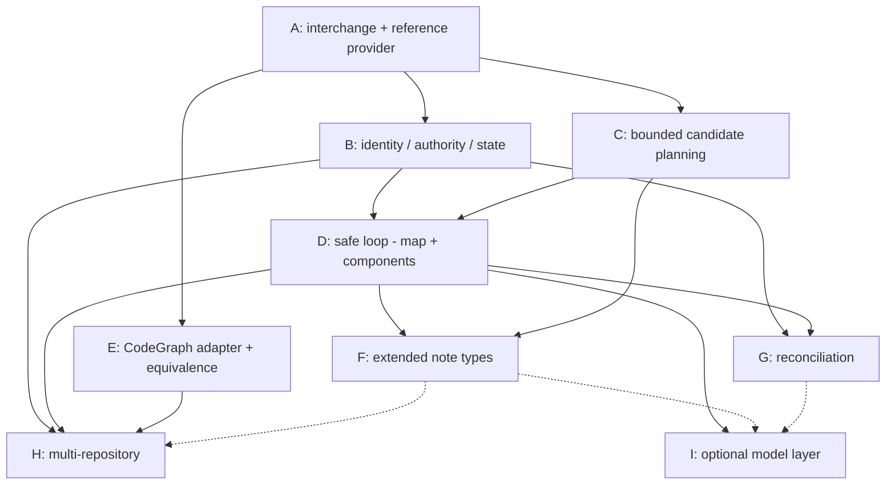

# Design: architecture projection epic decomposition (#141)

Reframes **#141 — provider-neutral architecture projection** from a single
implementation issue into a **parent epic** with a child DAG (A–I). It consumes
the completed **#140** context-graph foundation (shipped v0.7.0) without
restating or weakening it, reuses **#185**'s generated-region and safe-apply
utilities by name, and preserves the **#142** historical-enrichment boundary.

**Scope guard.** This document designs *decomposition and frozen contracts*, not
production code. It defines no new context-graph schema, no new context-graph
canonicalization, and no new endpoint rule — all three remain #140's frozen
output. Architecture projection is a **downstream, rebuildable reading surface**;
it never becomes a context-graph authority. Where this record and a live issue
body diverge, the live body wins and this record must be corrected.

**What #141 consumes from #140 (read-only, never reinvented):** opaque project
identity `project:<32-lowercase-hex>` and stable repository-binding identity
`repository-binding:<32-hex>` from `config.json`; context semantic-node identities
`context-node:<slug>:<32-hex>` and normalized evidence identities (#181) as they
appear in the compiled `index.json`; the generated-region / safe-apply utilities
frozen by #185. Specific symbols are named in §5 and §6.

---

## 1. Problem and product boundary

### Problem

#140 out-of-scope explicitly deferred "CodeGraph ingestion or architecture
projection" and "Historical bulk backfill" to two follow-on consumers: #141
(architecture) and #142 (historical). #141's current body already carries the
correct authority model, identity constraints, and safety requirements, but is
shaped as one implementation issue. The full contract — a provider-neutral
structural-graph interchange, a project-scoped architecture identity space, a
bounded deterministic selection engine, a multi-file safe-apply loop, a real
CodeGraph adapter, richer note types, reconciliation, multi-repository breadth,
and an optional model layer — is program-sized. Delivered as one issue it has a
long time-to-first-green and high integration risk; several of its sub-contracts
(interchange, identity, apply manifest) are load-bearing for the rest and must be
frozen before dependent work begins.

### Product boundary (epic)

**In scope for the #141 epic:**

* a canonical, versioned, **local structural-graph JSON interchange** and a
  reference JSON reader/provider (usable by real tools, not merely a test double);
* a **project-scoped architecture identity** space, provenance, and authority-
  separated state under `.bindle/architecture/`;
* **deterministic bounded candidate planning** (codebase map + components for the
  MVP) computed by Bindle from interchange primitives;
* a **safe projection loop** — preview → confirm → apply → zero-write rerun →
  changed-only refresh — reusing #185 utilities and extending them for a
  variable-cardinality note manifest;
* a **CodeGraph adapter** behind the interchange, with a shared-capability
  equivalence proof;
* later children: extended note types; reconciliation lifecycle; multi-repository
  breadth; an optional model-assisted authoring layer.

**Out of scope (frozen, must not reappear):**

* creating context-graph nodes, edges, candidates, or ledger judgments — #141
  writes **none**;
* activating the reserved semantic kinds `architecture_component`,
  `architecture_flow`, `boundary`, `test_surface` in
  `bin/context_graph/relationships.py` (they stay reserved; architecture identity
  is a separate space — see §3);
* durable local issue/PR/commit note trees; repository-shaped project identity;
  one-project-equals-one-repository; wikilink-as-authority; wholesale source-code
  copying — all already excluded by #140 and #141 and preserved here;
* historical inference, backward projection, or bulk backfill — that is #142,
  which stays separate, blocked, and conditional (§10, §13).

---

## 2. Frozen contracts (epic-wide invariants)

These hold across every child. A child may extend a contract; none may weaken it.

**FC-1 — Authority separation.** The structural provider is authority only for
observed structural facts. The context graph (#140) is authority for durable
project understanding, semantic identity, normalized evidence, and confirmed
human judgments. Architecture projection is downstream and rebuildable. It
**references** context-node and evidence identities read-only from `index.json`;
it creates **no** context-graph edge and **no** entry in the #184 judgment
ledger. If architecture work needs a durable semantic relationship in the context
graph, it goes through #140's proposal → #184 validation → human-judgment path,
never through projection.

**FC-2 — Project-scoped architecture identity.** Architecture-node identity is
project-scoped and opaque:

```text
arch-node:<project-id>:<32-lowercase-hex>
```

where `<project-id>` is the consuming project's **full** `project:<32-hex>`
token (not the bare hex) and the second field is fresh command-allocated
entropy — regex `^arch-node:(project:[0-9a-f]{32}):([0-9a-f]{32})$`. Embedding
the full `project:` token matches the frozen convention of every other compound
ID that embeds a project (`session:`/`handoff:`/`document:`, `ids.py:38-44`) and
keeps a single `grep 'project:<hex>'` able to find every ID scoped to a project;
a bare-hex form would silently break that. A single binding id is **never**
embedded in the identity; repository
participation is mutable provenance (§3). Frozen: context-node IDs are never
reused as architecture IDs; provider structural IDs are never architecture IDs;
filenames, note titles, `owner/repo`, checkout paths, provider labels, and link
text are never identity. Repository rename, transfer, rebinding, or adding/
removing a participating repository must not churn established architecture
identity. Ambiguous rename/split/merge require confirmation.

**FC-3 — Provider seam / network independence.** A frozen normalized structural-
graph interchange (§4) sits between any provider and the projection engine. The
engine **never imports CodeGraph or any other provider**; it consumes only the
interchange. Network access is never required for the engine or the reference
provider.

**FC-4 — Source coherence.** Every structural graph is bound to a stable
repository binding, an exact source commit, a provider name and version, and an
interchange schema version. A missing provider, unavailable graph, or commit
mismatch yields an explicit `unavailable` or `stale` state. Provider
disappearance is **never** interpreted as architecture deletion, wholesale
staleness of every note, or permission to rewrite existing notes.

**FC-5 — State authority.** Durable authority lives in structured state under
`.bindle/architecture/` (§3), not in generated Markdown or the materialized
index. Generated Markdown and `index.json` are rebuildable projections, never
semantic authorities.

**FC-6 — Note safety and byte preservation.** Every Markdown write reuses #185's
generated-region, marker-validation, byte-preservation, semantic-no-op, and per-
file atomic-replacement utilities (§5). User-authored prose outside generated
regions is preserved byte-identically. A semantic no-op writes zero bytes.

**FC-7 — Bounded and private.** Note counts are capped; minimum evidence
thresholds gate creation; generated, vendored, dependency, cache, build, and
explicitly private paths are excluded; no source file is copied wholesale; source
excerpts are capped and disabled by default; absolute local paths are normalized
to repository-relative; secrets and raw configuration values never enter notes or
logs.

**FC-8 — Deterministic core, optional model.** Identity, persistence, structural
normalization, deterministic metrics, candidate keys, confirmation authority, and
apply behavior are owned by deterministic code. Model assistance is optional and
non-blocking (§11, child I); model output enters only through the same reviewable
proposal contract the deterministic workflow consumes.

---

## 3. Architecture identity, provenance, and state authority

### Identity (FC-2)

`arch-node:<project-id>:<32-lowercase-hex>` (full `project:<hex>` token, §2
FC-2). The second field is allocated **once, at the confirmed creation event**,
from command-owned entropy (`secrets.token_hex(16)`), mirroring how context-node
IDs are minted in `bin/context_graph/review.py:204` and `bin/map-entry-id.py:145`
— never model-chosen, never content-hashed, never derived from a filename or a
provider ID. Once allocated it is **immutable**: it is persisted (judgments +
index) and never re-derived, regenerated, or re-minted on a later run. A rename
updates the existing node and appends to `prior_ids[]`; a reappearance reuses the
existing identity via continuity; split/merge/participation-change flow through
child G's confirmation and can never silently mint or replace an identity. A
parser/formatter pair belongs alongside the existing typed-ID grammar in
`bin/context_graph/ids.py` (regexes at `ids.py:33-49`), or in an architecture-
local `ids` module that reuses the same construction discipline. Prior identities
and aliases are retained on the node so exact-match continuity survives a rename.

### Provenance schema (per projected note)

Stored as YAML front-matter on each note and, authoritatively, in
`.bindle/architecture/index.json`:

```text
arch_id                 arch-node:<project-id>:<hex>   (full project: token)
project_id              project:<hex>
binding_ids[]           participating repository bindings (mutable; may grow/shrink)
projection_type         codebase_map | component            (MVP; more in F)
projection_schema_version
provider_name
provider_version
source_commit           per participating binding
source_paths[]          repository-relative
source_symbols[]        provider structural IDs where available
confidence              high | medium | low
projection_status       current | stale | superseded | merged
prior_ids[]             aliases after rename/merge
last_projected_at       (written to state, not to prose that must be no-op stable)
```

`binding_ids[]` is a **list** and mutable: a component may span repositories, and
adding/removing a participating binding updates provenance without churning
`arch_id` (FC-2). `last_projected_at` must not enter any byte-compared generated
region, or it would defeat the semantic no-op (FC-6); it lives in state only, and
**advances only when the projection content actually changed**. On a semantic
no-op **every** artifact is byte-stable — generated notes, `index.json`,
`config.json`, and `apply-state.json` alike — so an unchanged rerun performs zero
writes with no timestamp-only churn anywhere (FC-6, and the extended apply
contract in §5).

### State authority (FC-5)

```text
.bindle/architecture/
  config.json        projection settings: participating bindings, caps,
                     thresholds, exclusions, projection schema version
  judgments.jsonl    append-oriented confirmed decisions: naming, grouping,
                     rename, split, merge, stale
  index.json         rebuildable materialized projection state (nodes +
                     provenance + edges-to-context references)
  apply-state.json   multi-file apply manifest + interruption/recovery state
```

Roles are frozen; filenames may change only if a strong existing convention
justifies it, but the authority separation must remain explicit. **`judgments.jsonl`
is the single append-only authority** for confirmed decisions; `index.json` and
the generated Markdown are rebuildable from it; `apply-state.json` is **recovery
metadata only, never a semantic authority** — losing it can never change what the
projection *means*, only whether an interrupted write needs resuming.

**`apply-state.json` lifecycle (frozen).** Created after the complete file
manifest is built and validated and **before** the first write; advanced after
each file write (appending that path plus its post-write hash, in the frozen
write order); **cleared** (removed, or marked `complete`) on successful
completion of the whole manifest; **retained** on any failure or interruption so
the next run detects an incomplete apply, compares on-disk hashes against the
manifest, and resumes or safely reruns without duplicating notes or discarding
user content (§5.2). A retained apply-state whose manifest already matches disk
is a completed apply and is simply cleared — never replayed.

This mirrors —
but is **separate from** — the context graph's `.bindle/context/{config,index,
judgments.jsonl}` (`bin/context_graph/config.py:42-43`). Architecture state never
lives under `.bindle/context/`, and never mutates it.

`index.json` here is analogous to the context graph's `index_writer.render_index`
output but is its own schema: architecture nodes with provenance, plus
**references** (not context-graph edges) to `context-node:` and evidence
identities. A reference records "this component note cites decision
`context-node:bindle:…`"; it is not an edge in the #140 graph and never enters the
#184 ledger (FC-1).

---

## 4. Structural-graph interchange (decision 5)

A canonical, versioned, provider-neutral local JSON document. It carries
structural **primitives and provider metadata**; it does **not** require a
provider to compute Bindle's conclusions. Bindle computes its own derived signals
(§4.2).

### 4.1 Interchange content (provider-supplied)

```text
interchange_schema_version    integer, frozen per version
provider_name
provider_version
provider_capabilities[]       explicit capability flags (e.g. has_calls,
                              has_tests, has_entry_points, has_symbol_ids)
binding_id                    repository-binding:<hex>  (source coherence, FC-4)
source_commit                 exact commit the graph was observed at
structural_nodes[]
    files                     repo-relative path, stable provider id where available
    symbols                   name, kind, containing file, provider id
    tests                     test unit + the symbol/file it exercises
    entry_point_observations  routes, mains, exported entry symbols
structural_edges[]
    contains                  file→symbol, module→file
    imports | depends_on      module/file dependency
    calls                     symbol→symbol (including dynamic-dispatch hops
                              where the provider resolves them)
    tests                     test→exercised symbol/file
optional_provider_observations   versioned capability fields only; a provider
                              MAY emit clustering/centrality hints, but Bindle
                              treats them as hints, never as authority
```

Provider-specific algorithms (a particular community-detection or centrality
implementation) are **not** part of the core interchange contract. They may only
appear under explicitly versioned `optional_provider_observations` capability
fields, and equivalence (child E) does not require them to match.

### 4.2 Bindle-computed signals (engine-owned)

Bindle normalizes and computes, from interchange primitives:

* fan-in, fan-out;
* dependency/call neighborhoods;
* blast-radius signals;
* default clustering / community signals;
* bounded candidate rankings.

Keeping these engine-owned means a minimal provider (files + imports only) still
yields a projection, and two providers exposing the same supported facts yield
equivalent Bindle conclusions (child E equivalence).

**Capability degradation is visible, never fabricated (frozen).** A missing
`provider_capabilities` flag means the corresponding facts are **unavailable**,
not empty. If a provider does not expose `has_calls`, call-derived signals
(fan-in/out on call edges, call neighborhoods) are marked `unavailable` and any
note that would depend on them says so; the engine must **never** treat "capability
not supported" as "supported and observed to be zero." The two are distinct states
and both are surfaced. This also bounds equivalence (child E): equivalence is
required only over the intersection of supported capabilities, so a provider that
lacks a capability degrades a projection visibly rather than diverging silently.

### 4.3 Degraded states (FC-4)

`unavailable` (no provider / no graph), `unsupported_version` (interchange schema
mismatch), `stale` (graph `source_commit` ≠ current repo commit), `malformed`
(schema-invalid). Each is explicit and blocks writes for the affected binding
without deleting or staling existing notes.

**Degraded states are per-binding and never contagious (frozen, FC-4).** In a
multi-repository project a binding that is unavailable or stale marks **only**
that binding's contributions. Notes sourced solely from other, available bindings
are untouched — not staled, not deleted, not rewritten. An architecture node that
spans bindings and loses one participant is marked partially degraded (the
affected `binding_ids[]` entry noted), never deleted or blanket-staled. A partial
provider outage therefore produces zero destructive reconciliation anywhere.

---

## 5. Safe apply: reuse and the extension gap (decision 8)

### 5.1 Reuse verbatim (name-checked against the live tree)

* **Generated-region contract** — `bin/context_graph/projection.py`:
  `_scan_markers` (`projection.py:165`, returns `valid|unmanaged|malformed`),
  the create/conflict/noop/update plan logic of `plan_context_md`
  (`projection.py:189`), and the pure region renderer pattern of
  `render_managed_region` (`projection.py:143`). These give byte-preserving
  update, conflict/malformed classification, and semantic no-op via region
  equality.
* **Atomic write primitives** — `bin/context_graph/atomic_io.py`: `write_atomic`
  (`atomic_io.py:13`, temp-in-same-dir + fsync + `os.replace` + dir fsync),
  `write_json_atomic` (`atomic_io.py:49`, the `json.dumps(obj, indent=2,
  sort_keys=True)+"\n"` byte contract), `append_line_atomic` (`atomic_io.py:59`,
  for `judgments.jsonl`).
* **Semantic no-op** — `bin/context_graph/apply.py`: `_write_if_changed`
  (`apply.py:340`) writes nothing when on-disk bytes equal planned bytes
  (mtime-stable).
* **Planned-state-before-write *pattern*** — `apply.build_plan`/`apply.apply`
  (`apply.py:65`, `apply.py:379`) demonstrate the discipline to copy: build and
  validate the complete intended final state before the first write, then write
  only changed artifacts under a single-writer lock. Note the architecture apply
  is a **new orchestrator**, not a call into #185's `apply()` — the latter plans a
  **fixed** three-artifact set (map→index→context) and, by its own docstring, has
  "per-file atomicity only -- there is no cross-file atomicity" and no resume
  ledger. Architecture reuses the primitives (`_write_if_changed`, `ProjectLock`,
  `write_atomic`) inside a new plan/apply that handles a variable manifest (§5.2).
* **Single-writer lock** — `bin/context_graph/lock.py`: `ProjectLock`.
* **Minimal-diff marker insertion** — `bin/context_graph/map_writer.py`:
  `plan_map_bytes` (`map_writer.py:30`) as the model for inserting an
  identity-marker comment into an existing line without disturbing other bytes.
* **Evidence normalization** — `bin/context_graph/evidence.py`: `normalize`
  (for resolving evidence references the architecture notes cite).

### 5.2 The exact gaps to extend (do not claim reuse covers these)

1. **Marker namespace.** `projection.py` hardcodes the literals
   `bindle:context-graph:generated:begin/end` (`projection.py:20-21`). Architecture
   notes need a **distinct** namespace, e.g.
   `bindle:architecture:generated:begin/end`, so the two surfaces never collide.
   `_scan_markers`/`plan_context_md` must be refactored to accept a marker pair
   (extract a marker-agnostic region core) rather than duplicating ~50 lines. Gap
   owner: child B (primitive extraction) consumed by child D.
2. **Variable-cardinality multi-file manifest.** `apply.build_plan` plans a
   **fixed** three-artifact set (map.md, index.json, context.md). Architecture
   apply plans **N** component notes plus the codebase map plus state files, where
   N varies per run. The extension: a complete planned **file manifest** — every
   affected path with its exact intended bytes/hash — constructed before the first
   write. Gap owner: child B (manifest + `apply-state.json` schema), child D
   (execution).
3. **Interruption detection and safe resume.** #185's apply is single-pass and
   per-file atomic but has no cross-file resume ledger. Architecture apply must
   record before/after hashes and deterministic write ordering in
   `apply-state.json`, detect an incomplete apply on the next run, and resume or
   safely rerun **without duplicating notes or discarding user content**. Gap
   owner: child B (state), child D (loop).

Frozen apply contract for architecture (extends #185, weakens nothing):

* complete planned file manifest before the first write;
* exact intended bytes or hash for every affected file;
* deterministic write ordering;
* before/after hashes recorded;
* incomplete-apply detection;
* safe resume or rerun;
* temp-file cleanup or explicit reporting;
* no unrelated file rewrites;
* all user-owned prose preserved byte-identically;
* zero writes on a semantic no-op;
* **no false claim of cross-file filesystem atomicity** — atomicity is per-file;
  cross-file integrity is provided by the manifest + resume ledger, not by the
  filesystem.

---

## 6. Child DAG (A–I)

Each child names what it **owns**, its **dependencies**, and **acceptance**.
Titles are proposed; §8 gives paste-ready bodies.

### A — Structural-graph interchange and reference provider

**Owns:** the versioned normalized structural-graph schema (§4.1); the provider
capability model; exact-commit and repository-binding coherence (FC-4); a
canonical local JSON reader/provider; a canonical fixture corpus conforming to the
interchange; malformed / unsupported-version / stale-commit / unavailable-provider
behavior (§4.3). **Does not** own bounded candidate selection. Reuses `atomic_io`
read/serialization discipline; reuses `ids.py` binding-id grammar for
`binding_id`. **Depends on:** nothing (foundation). **Blocks:** B, C, D, E.
**Acceptance:** a JSON document conforming to the schema loads into normalized
in-memory facts; a malformed/unsupported/stale/unavailable input yields the
correct explicit state and writes nothing; the fixture corpus is committed and
validated.

### B — Architecture identity, authority, provenance, and state

**Owns:** project-scoped `arch-node:<project-id>:<hex>` identity (full `project:`
token, FC-2), allocated once at confirmed creation and immutable thereafter, and
its parser/formatter;
separation from context-node and provider-node identity; projection `config.json`;
append-oriented `judgments.jsonl`; rebuildable `index.json`; aliases / prior
identities and exact-match continuity; `apply-state.json` schema (interrupted-apply
state, §5.2); the provenance schema (§3). Extracts the marker-agnostic region core
from `projection.py` (§5.2 gap 1). **Depends on:** A (only where interchange
identifiers — `binding_id`, `source_commit` — are consumed). **Blocks:** D, G, H.
**Acceptance:** identity round-trips and is stable across simulated rename/rebind;
context-node IDs are provably never reused; state files have frozen schemas with
conformance tests; a rebuild from `judgments.jsonl` reproduces `index.json`.

### C — Deterministic bounded candidate planning

**Owns:** graph metrics and derived signals (§4.2); exclusions and privacy
filtering (FC-7); bounded **codebase-map** and **component** candidates; minimum
evidence thresholds; maximum note counts; deterministic ordering; candidate
provenance; deterministic diffs; unchanged-vs-changed classification. **Depends
on:** A. **Must not be merged with A.** **Blocks:** D, F. **Acceptance:** identical
interchange input + config yields byte-identical candidate output (determinism);
caps and thresholds are enforced and observable; excluded paths never appear; a
changed input produces a minimal, correct changed-set.

### D — Safe projection loop for map and components

**Owns:** the loop `preview → confirm → apply → zero-write rerun → changed-only
refresh`; rendering of **only** codebase-map and component notes; generated-region
safety (consuming B's extracted core); the planned multi-file apply + resume (§5.2
gaps 2–3); repositoryless clean degradation; provider-unavailable / stale-input
behavior; context-node and normalized-evidence **references** without creating
context-graph edges (FC-1); exact identity continuity; classification of uncertain
reconciliation cases **without** advanced inference (deferred to G). **Depends
on:** B, C. **Closes the internal contract milestone (with A) and the first usable
release (with E).** **Acceptance:** all acceptance criteria in §9 mapped to D
pass on the fixture provider; a rerun at the same commit writes zero bytes; a
changed-only refresh updates only affected notes; user prose survives byte-
identically; an interrupted apply is detected and safely resumed.

### E — CodeGraph adapter and equivalence proof

**Owns:** a CodeGraph CLI/export/direct adapter as justified by available stable
interfaces (preferred order: stable local export/CLI → direct local adapter →
MCP-assisted only where deterministic access is insufficient); translation into
A's interchange; **no CodeGraph imports in the engine**; shared-capability
equivalence tests (inputs exposing the same supported structural facts produce
equivalent normalized facts and projection plans; optional provider observations
need **not** match); stale-commit detection; provider-version provenance.
**Depends on:** A; **implementation-parallel with B, C, D** (D's own acceptance
runs against A's reference provider, so D needs no adapter to be built and
tested). **Acceptance:** CodeGraph output translates into schema-valid
interchange; the equivalence suite shows fixture-input and CodeGraph-input over
the same facts yield equivalent plans; commit mismatch is detected and surfaced
as `stale`; **plus the first-usable-release gate — a complete real-CodeGraph
end-to-end test** (CodeGraph → interchange → bounded candidates → preview →
confirm → apply → zero-write rerun on an actual indexed repo), not fixture
equivalence alone. That end-to-end gate is a **release dependency on D + E
together**, distinct from E's implementation parallelism with D.

### F — Extended architecture note types

**Owns, in deliberate order:** (1) architectural flows, (2) boundaries, (3) test
surfaces, (4) hotspots / risk seams. Evaluate rendering hotspots as **temporal
status inside durable component or boundary notes** rather than granting them
durable identities by default, to prevent noisy note churn from transient metric
changes. **Depends on:** C, D. **Acceptance:** each type has deterministic
selection + generated-region rendering; transient metric changes do not create or
churn durable notes; flows/boundaries reference structural evidence without
creating context-graph edges.

### G — Architecture reconciliation

**Owns:** rename; reappearance; split; merge; stale/removed; generated-region hand
edits; missing/corrupted markers; ambiguous identity matching; confirmation
policy; **never-auto-delete**; preservation of user-authored content. **Depends
on:** B, D. The MVP (D) may only *classify* uncertain cases; G owns intelligent
reconciliation and durable lifecycle. **Acceptance:** each pressure-test case
(§9: rename resilience, split/merge reviewable proposals, hand-edited notes,
stale-not-deleted) passes; every lifecycle transition that exceeds structural
evidence requires confirmation.

### H — Multi-repository architecture projection

**Owns:** explicit participating-binding selection; architecture nodes spanning
multiple bindings; cross-repository components and flows; same-path / same-symbol
collision handling; partial provider availability; adding/removing a participating
binding without identity churn; correct attribution to all contributing bindings.
**Depends on:** B, D, E; may also depend on F for cross-repository flows.
**Repositoryless degradation does not belong here — it already works in D.**
**Acceptance:** the multi-repository and repository-rename pressure tests (§9)
pass; nodes from two bindings remain distinct and correctly attributed; adding a
binding does not churn identity.

> **Note on H's reduced scope.** *Fundamental* multi-repository identity
> correctness (identity spans bindings; adding/removing a binding does not churn
> identity) is frozen in **B** and enforced by **D** from the MVP — it is not
> deferred. H owns only the *incremental* cross-repository features: explicit
> multi-binding selection UX, cross-repository components/flows, and collision
> handling. If, during B/D implementation, the MVP already demonstrates complete
> multi-repository identity correctness, H reduces to those incremental features
> and may even fold into F. It must never absorb identity correctness back out of
> B/D.

### I — Optional model-assisted architecture authoring

**Owns:** only the proposal / interactive-authoring layer. A model may propose
component names, responsibility descriptions, groupings, likely flows, likely
boundaries, and split/merge candidates. It **may not** own identity, persistence,
structural normalization, deterministic metrics, candidate keys, confirmation
authority, or apply behavior (FC-8). Model output enters through the same
reviewable proposal contract the deterministic workflow consumes — mirroring how
the context-graph authoring skill sits over the CLI. **Depends on:** D (and, for
richer proposals, F and G). **Non-blocking for epic closure** (§11, §10).

---

## 7. Dependency graph (parallelizable work)



ASCII fallback:

```text
A ── B ──┬── D ──┬── F ─┐
    │    │       │      ├─(dashed)─ H
A ── C ──┘       ├── G ─┘
A ── E ──────────┴──────── H
D ── I   (F, G optional inputs to I)
```

**Parallel fronts once A's schema is frozen:** B, C, and E proceed concurrently.
D joins after B and C. After D: F, G, H, I open. Solid arrows are hard
dependencies; dashed arrows (F→H, F→I, G→I) are soft (richer inputs, not blockers).

**Dependency types (each edge classified — not all "depends on" are equal):**

* **Contract dependency** — needs only the upstream *schema/interface frozen*, not
  its code running. `A→B`, `A→C`, `A→E` are contract deps: B/C/E bind to A's
  interchange schema. B's core (arch-node identity, state-file schemas) needs *no*
  part of A; only B's provenance fields that reference `binding_id`/`source_commit`
  wait on A's schema freeze — so **B can start in parallel with A** and finalize
  provenance once A freezes.
* **Implementation dependency** — needs the upstream code. `B→D`, `C→D`: D consumes
  B's identity/state modules and C's candidate output at runtime. E is
  implementation-parallel to D (see §6-E).
* **Release dependency** — not a build-order edge; gates a *release*, not a start.
  The first-usable-release end-to-end gate needs **D + E together**; the epic
  closure set (§10) is a release-level constraint over A,B,C,D,E,G,H.
* **Optional-enrichment dependency** — dashed edges (F→H, F→I, G→I): richer inputs
  that improve a downstream child but never block it; I's deps are all of this
  kind at the closure level (I is non-blocking, §10).

**No cycle exists.** Reconciliation (G) depends on B, D; multi-repo (H) on B, D,
E (+ soft F); model (I) on D (+ soft F, G). None of B/C/D/E depends on F/G/H/I, so
the later children cannot feed back into the foundation — the graph is a DAG.

---

## 8. Proposed child issues (titles + implementation-ready bodies)

Paste-ready. Each body carries `Parent: #141` (the repo's epic-child convention —
`gh issue list --search` does not reliably enumerate children; parent is recorded
in the body and children are found by grepping `Parent: #141`). Labels proposed:
`type: feat`, `status: ready` for A/B/C/E; `status: blocked` for D/F/G/H/I until
their dependencies close. Milestone assignment is the operator's call (§10).

### A — `feat: structural-graph interchange and reference provider (#141 child)`

```markdown
Parent: #141

## Summary
Define the canonical, versioned, provider-neutral local structural-graph JSON
interchange and a reference JSON reader/provider. This is the seam every other
#141 child builds on; the projection engine consumes only this interchange and
never imports CodeGraph or any other provider.

## Owns
- versioned normalized structural-graph schema (files, symbols, tests,
  entry-point observations; contains/imports|depends_on/calls/tests edges;
  provider name/version/capabilities; binding_id; exact source_commit);
- capability model + explicitly versioned optional_provider_observations;
- exact-commit + repository-binding coherence;
- canonical local JSON reader/provider;
- canonical fixture corpus conforming to the interchange;
- malformed / unsupported-version / stale-commit / unavailable-provider states.

## Does not own
Bounded candidate selection (child C). Provider-specific metric algorithms
(engine-owned, child C).

## Reuse
`bin/context_graph/atomic_io.py` (read/serialization discipline);
`bin/context_graph/ids.py` binding-id grammar for `binding_id`.

## Acceptance
- a conforming JSON document loads into normalized in-memory facts;
- malformed / unsupported-version / stale-commit / unavailable inputs each yield
  the correct explicit state and write nothing;
- the fixture corpus is committed and schema-validated;
- no network access is required.

## Boundary
Consumes #140 identities read-only. Creates no context-graph state. Blocks B, C,
D, E.
```

### B — `feat: architecture identity, authority, provenance, and state (#141 child)`

```markdown
Parent: #141

## Summary
Own the project-scoped architecture identity space, authority-separated state
under .bindle/architecture/, provenance, and the multi-file apply-state schema.

## Owns
- identity `arch-node:<project-id>:<32-lowercase-hex>` (full `project:<hex>`
  token; regex `^arch-node:(project:[0-9a-f]{32}):([0-9a-f]{32})$`), allocated
  once at confirmed creation, immutable thereafter, + parser/formatter;
- separation from context-node and provider structural identity;
- .bindle/architecture/{config.json, judgments.jsonl, index.json, apply-state.json}
  with frozen roles;
- provenance schema (project_id, binding_ids[] mutable, projection_type,
  source_commit/paths/symbols, confidence, projection_status, prior_ids[]);
- aliases / prior identities and exact-match continuity;
- extraction of a marker-agnostic generated-region core from
  bin/context_graph/projection.py (new namespace bindle:architecture:generated).

## Frozen
- context-node IDs never reused; provider IDs never architecture IDs; filename,
  title, owner/repo, checkout path, provider label, link text never identity;
- repository rename/transfer/rebind or adding/removing a participating binding
  never churns identity;
- ambiguous rename/split/merge require confirmation (lifecycle owned by G).

## Depends on
#141-A (only where binding_id / source_commit are consumed).

## Acceptance
- identity round-trips; stable across simulated rename/rebind;
- context-node reuse is provably impossible (test);
- state files have frozen schemas + conformance tests;
- a rebuild from judgments.jsonl reproduces index.json.

## Boundary
Creates no context-graph edges/judgments. Blocks D, G, H.
```

### C — `feat: deterministic bounded candidate planning (#141 child)`

```markdown
Parent: #141

## Summary
Compute Bindle's own structural signals from interchange primitives and produce
bounded, deterministic codebase-map and component candidates.

## Owns
- fan-in, fan-out, neighborhoods, blast-radius, default clustering/community;
- exclusions + privacy filtering (generated/vendored/dependency/cache/build/
  private paths; repo-relative normalization);
- bounded codebase-map + component candidates;
- minimum evidence thresholds; maximum note counts; deterministic ordering;
- candidate provenance; deterministic diffs; unchanged-vs-changed classification.

## Depends on
#141-A. MUST NOT be merged with A.

## Acceptance
- identical interchange + config -> byte-identical candidate output;
- caps/thresholds enforced and observable;
- excluded paths never appear;
- a changed input yields a minimal correct changed-set.

## Boundary
No model assistance (deterministic only). Blocks D, F.
```

### D — `feat: safe projection loop for map and components (#141 child)`

```markdown
Parent: #141

## Summary
The user-facing forward loop for codebase maps and components: preview -> confirm
-> apply -> zero-write rerun -> changed-only refresh, with safe multi-file apply.

## Owns
- render ONLY codebase-map + component notes;
- generated-region safety (consuming B's extracted marker-agnostic core);
- planned multi-file apply: complete file manifest + exact bytes/hashes before
  first write; deterministic ordering; before/after hashes; incomplete-apply
  detection; safe resume/rerun; temp-file cleanup; no unrelated rewrites;
- repositoryless clean degradation; provider-unavailable / stale-input behavior;
- context-node + normalized-evidence REFERENCES without creating context-graph
  edges;
- exact identity continuity; classification (not resolution) of uncertain cases.

## Reuse
projection.py (_scan_markers, plan_context_md, render_managed_region pattern),
atomic_io.py (write_atomic/write_json_atomic), apply.py (_write_if_changed,
build_plan planned-state), lock.py (ProjectLock). Extend per this issue's manifest
+ resume requirements — do NOT claim reuse covers multi-file manifest/resume.

## Depends on
#141-B, #141-C.

## Acceptance
- rerun at the same commit writes zero bytes;
- changed-only refresh updates only affected notes;
- user prose survives byte-identically;
- interrupted apply is detected and safely resumed (no duplicate/lost notes);
- codebase map + a restrained number of components produced; raw files/symbols
  never become notes.

## Boundary
Closes the internal contract milestone (with A). Closes the first usable release
(with E). Advanced reconciliation is G.
```

### E — `feat: CodeGraph adapter and interchange equivalence proof (#141 child)`

```markdown
Parent: #141

## Summary
A CodeGraph adapter behind the #141-A interchange, proving provider neutrality by
equivalence with the reference JSON provider.

## Owns
- CodeGraph CLI/export/direct adapter (preferred order: stable local export/CLI
  -> direct local adapter -> MCP-assisted only where deterministic access is
  insufficient);
- translation into A's interchange; NO CodeGraph imports in the engine;
- shared-capability equivalence tests; stale-commit detection; provider-version
  provenance.

## Equivalence
Inputs exposing the same supported structural facts produce equivalent normalized
facts and projection plans. Optional provider observations need NOT be identical.

## Depends on
#141-A. May proceed in parallel with B, C, D.

## Acceptance
- CodeGraph output -> schema-valid interchange;
- equivalence suite: fixture-input and CodeGraph-input over the same facts yield
  equivalent plans;
- commit mismatch detected and surfaced as stale;
- FIRST-USABLE-RELEASE GATE: a complete real-CodeGraph end-to-end test
  (CodeGraph -> interchange -> bounded candidates -> preview -> confirm -> apply
  -> zero-write rerun on an actually-indexed repo), not fixture equivalence alone.
  This gate is a release dependency on D + E together; E is otherwise
  implementation-parallel with D (D tests against A's reference provider).
```

### F — `feat: extended architecture note types (#141 child)`

```markdown
Parent: #141

## Summary
Add architectural flows, boundaries, test surfaces, and carefully bounded
hotspots, in that order, beyond the MVP map + components.

## Owns (in order)
1. architectural flows; 2. boundaries; 3. test surfaces; 4. hotspots/risk seams.
Evaluate rendering hotspots as temporal status inside durable component/boundary
notes rather than granting durable identities by default. Prevent noisy note
churn from transient metric changes.

## Depends on
#141-C, #141-D.

## Acceptance
- each type has deterministic selection + generated-region rendering;
- transient metric changes do not create/churn durable notes;
- flows/boundaries reference structural evidence, create no context-graph edges.
```

### G — `feat: architecture reconciliation lifecycle (#141 child)`

```markdown
Parent: #141

## Summary
Intelligent identity reconciliation and durable lifecycle: rename, reappearance,
split, merge, stale/removed, and hand-edit conflict handling.

## Owns
rename; reappearance; split; merge; stale/removed; generated-region hand edits;
missing/corrupted markers; ambiguous identity matching; confirmation policy;
never-auto-delete; preservation of user-authored content.

## Depends on
#141-B, #141-D. (MVP D only classifies uncertain cases; G resolves them.)

## Acceptance
- rename resilience: rename a component dir + key symbols without changing
  responsibility -> existing note updates, no duplicate;
- split/merge produce reviewable proposals; user content preserved;
- hand-edited generated regions -> preservation or conflict classification;
- removed nodes marked stale, never deleted;
- every transition exceeding structural evidence requires confirmation.
```

### H — `feat: multi-repository architecture projection (#141 child)`

```markdown
Parent: #141

## Summary
Incremental cross-repository features on top of the multi-repository identity
correctness already frozen in B and enforced in D.

## Owns
explicit participating-binding selection; architecture nodes spanning multiple
bindings; cross-repository components/flows; same-path/same-symbol collision
handling; partial provider availability; adding/removing a participating binding
without identity churn; correct attribution to all contributing bindings.

## Does not own
Repositoryless degradation (already in D). Fundamental multi-repository identity
correctness (frozen in B, enforced in D) — must not be deferred here.

## Depends on
#141-B, #141-D, #141-E (and #141-F for cross-repository flows).

## Acceptance
- multi-repository + repository-rename pressure tests pass;
- nodes from two bindings remain distinct and correctly attributed;
- adding a binding does not churn identity.
```

### I — `feat: optional model-assisted architecture authoring (#141 child, non-blocking)`

```markdown
Parent: #141

## Summary
An optional proposal / interactive-authoring layer over the deterministic
projection. Non-blocking for #141 epic closure.

## Owns (only)
propose component names, responsibility descriptions, groupings, likely flows,
likely boundaries, split/merge candidates — entering through the same reviewable
proposal contract the deterministic workflow consumes.

## May not own
identity; persistence; structural normalization; deterministic metrics; candidate
keys; confirmation authority; apply behavior.

## Depends on
#141-D (and #141-F, #141-G for richer proposals).

## Acceptance
- no model output is written without preview + provenance;
- the deterministic epic closes without this child;
- model proposals are indistinguishable, downstream, from human proposals
  (same contract).
```

---

## 9. Traceability: #141 acceptance criteria + pressure tests → owning child

Every current #141 acceptance criterion and pressure test maps to exactly one
owning child (the child whose completion makes it verifiable). "Enforced-by"
notes where an invariant is *frozen* earlier than the owning child.

| # | #141 acceptance criterion | Owner | Enforced-by |
|---|---|---|---|
| AC1 | structurally-indexed repo produces a previewable projection | D | A,C |
| AC2 | codebase map + restrained number of architectural nodes | D | C |
| AC3 | raw files/symbols do not become notes by default | C | D |
| AC4 | identity scoped to project (+ binding provenance), never filename/title/owner-repo/path/label/link | B | D |
| AC5 | context semantic-node IDs never reused | B | D |
| AC6 | notes reference context nodes + evidence without inventing meaning or reinterpreting #140 relationships | D | B |
| AC7 | projection creates no context-graph judgments / ledger entries | D | B (FC-1) |
| AC8 | repositoryless projects degrade cleanly | D | — |
| AC9 | multi-repository projects supported with explicit binding selection | H | B,D |
| AC10 | re-run at same commit + config → zero writes | D | C |
| AC11 | changed-only refresh updates affected areas only | D | C |
| AC12 | full refresh reconciles the complete projection | D | G (lifecycle) |
| AC13 | user-authored sections survive byte-identically | D | B (region core) |
| AC14 | renames preserved where confidence high | G | B |
| AC15 | ambiguous rename/split/merge require confirmation | G | B,D (classify) |
| AC16 | removed nodes marked stale, not deleted | G | — |
| AC17 | projection operates without network access | A | D,E |
| AC18 | Claude Code and Codex invoke the same provider-neutral workflow with equivalent results | E | A (+ I for authoring parity) |
| AC19 | no custom Obsidian plugin required | D | — |
| AC20 | no local GitHub artifact mirror created | D | (FC-1) |
| AC21 | no source code copied wholesale | D | C, FC-7 |

| # | #141 pressure test | Owner | Enforced-by |
|---|---|---|---|
| PT1 | multi-repository: nodes from two bindings distinct + attributed | H | B |
| PT2 | repository rename with stable IDs (project/binding/projection no churn) | H | B |
| PT3 | provider graph unavailable → reports unavailable, no inference/deletion | A | D |
| PT4 | provider graph stale → detect commit mismatch, refuse/mark stale | A | D,E |
| PT5 | context node referenced without identity conflation | B | D |
| PT6 | structural proximity does not create a semantic relationship | D | B (FC-1) |
| PT7 | equivalent deterministic fixture output (CLI ≡ another adapter) | E | A |
| PT8 | unchanged rerun → zero writes | D | C |
| PT9 | repositoryless: projection unavailable, project otherwise intact | D | A |
| PT10 | noise control on hundreds of modules / generated / vendored / monorepo / tests | C | D,F |
| PT11 | rename resilience: rename dir + symbols, note updates not duplicates | G | B |
| PT12 | split and merge: reviewable proposals, user content preserved | G | D |
| PT13 | hand-edited notes: user/generated/removed-marker edits → preserve or conflict | G | D (classify) |
| PT14 | privacy: secrets/ignored/absolute paths/sensitive IDs never in notes or logs | C | A,D (FC-7) |
| PT15 | interrupted write resumes without duplicates or partial corruption | D | B (apply-state) |

Every criterion and pressure test has **exactly one primary owner** (the `Owner`
column); the `Enforced-by` column lists supporting children where an invariant is
*frozen* earlier — supporting ownership never means a second authoritative owner.
No criterion or pressure test is left without an owner (§12 audit confirms).

**Owner distribution → closure (§10).** Primary owners are: A (AC17, PT3, PT4);
B (AC4, AC5, PT5); C (AC3, PT10, PT14); D (AC1, AC2, AC6–AC13, AC19–AC21, PT6,
PT8, PT9, PT15); E (AC18, PT7); G (AC14–AC16, PT11–PT13); H (AC9, PT1, PT2).
**F is the primary owner of no acceptance criterion or pressure test** — it
appears only as a supporting/enforcing child (PT10). That is the evidence behind
the closure decision in §10: F cannot be a closure blocker under #141's own
acceptance contract, whereas G and H each own criteria that gate closure.

---

## 10. Release and epic-closure table

| Milestone | Children | Kind | User-facing? | Notes |
|---|---|---|---|---|
| Internal contract milestone | A + B + C + D | contract validation | **No** | full engine + projection loop proven on the canonical local JSON provider/fixtures; validates the interchange, identity, selection, and apply contracts |
| **First usable release** | A + B + C + D + **E** | release | **Yes** | closes the complete CodeGraph → normalized graph → bounded map/component candidates → preview → confirm → safe Markdown projection → zero-write rerun loop. Gated on a **real-CodeGraph end-to-end test**, not fixture equivalence alone (§6-E) |
| Later release | F | release | Yes | flows + boundaries first, then test surfaces, then carefully bounded hotspots. **Does not gate epic closure** (owns no acceptance criterion) but completes #141's enumerated note-type model |
| Reconciliation + breadth | G + H | release(s) | Yes | may be separate releases if scopes remain substantial. **Both gate closure** (G owns AC14–16/PT11–13; H owns AC9/PT1–2) |
| Optional enhancement | I | enhancement | Yes | non-blocking model-assisted authoring |

**Epic closure — corrected against #141's acceptance contract.** Closure is gated
by satisfying #141's acceptance criteria and pressure tests, and each maps to a
primary owner (§9). The closure-blocking set is therefore **A, B, C, D, E, G, H**
— every child that primarily owns at least one criterion or pressure test.

* **F does *not* block closure.** F is the primary owner of no acceptance
  criterion or pressure test (§9): #141's acceptance bar is "a codebase map and a
  restrained number of selected architectural nodes" (AC2, owned by D), *not*
  flows/boundaries. F completes #141's enumerated note-type *model* and is a
  committed in-epic release, but under #141's own acceptance contract it is
  non-blocking. (This follows #141's promised product outcome, not merely the
  requested decomposition — the acceptance criteria, not the note-type
  enumeration, define "delivered.")
* **I does *not* block closure** — optional model assistance; no acceptance
  criterion requires model-generated content (§11 D5).
* **#142** (historical enrichment) is **not** part of #141 closure and stays
  separate, blocked, and conditional.

If the operator decides #141 must not close until the full note-type model
(flows/boundaries/test-surfaces) ships, that is a *policy* choice to add F to the
blocking set — it is not forced by the acceptance criteria as written, and it
should be recorded explicitly rather than assumed.

---

## 11. Decisions and rejected alternatives

**D1 — Fixture-first, but the first provider is a real interchange, not a test
double. (Chosen.)** A canonical versioned local JSON interchange + reference
reader/provider (child A), usable by real tools; tests use fixtures conforming to
it. *Rejected: CodeGraph-first* — would couple the engine to one provider before
the seam is frozen, block all engine work on CodeGraph availability, and violate
the "engine never imports a provider" and "network never required" invariants
(FC-3). *Rejected: fixtures-only as the seam* — a pure test double is not usable
by real tools and would need re-contracting when a real provider arrives.

**D2 — Project-scoped opaque identity, binding participation as mutable
provenance. (Chosen.)** `arch-node:<project-id>:<hex>` — full `project:<hex>`
token embedded (matching `session:`/`handoff:`/`document:` per `ids.py:38-44`),
allocated once at confirmed creation; `binding_ids[]` is
mutable provenance. *Rejected: binding-scoped identity
(`arch-node:<project>:<binding>:<hex>`)* — a component or flow may span multiple
repositories, and embedding a binding id churns identity whenever repository
participation changes (rename/transfer/rebind/add/remove), violating FC-2 and
PT2. Project-scoping keeps identity stable while attribution stays accurate.

**D3 — Engine-computed metrics; providers supply primitives + optional hints.
(Chosen.)** Bindle computes fan-in/out, neighborhoods, blast-radius, clustering,
and rankings from interchange primitives (§4.2). *Rejected: provider-computed
metrics as contract* — would force every provider to reproduce Bindle's
conclusions, make a minimal provider unusable, and make equivalence (child E)
depend on matching provider-specific algorithms. Optional provider observations
are allowed only under versioned capability fields and are never authoritative.

**D4 — MVP = codebase map + components only; flows/boundaries later. (Chosen.)**
*Rejected: include a flow or boundary in the MVP* — flows and boundaries require
additional architectural interpretation (multi-hop call/dependency synthesis,
seam judgment) that belongs in child F; including them lengthens the first usable
release and dilutes the "restrained number of nodes" acceptance criterion.
Hotspots are further deferred and may render as temporal status rather than
durable identities.

**D5 — Model assistance does not block epic closure. (Chosen.)** The deterministic
closure set (A, B, C, D, E, G, H — the primary owners of every acceptance
criterion and pressure test, §9/§10) delivers all of them with no model in the
path; AC18 (Claude Code ≡ Codex equivalent results) is satisfied by
the provider-neutral deterministic workflow (child E), with child I adding only an
optional authoring-parity layer. *Rejected: model assistance as a closure
requirement* — no acceptance criterion requires model-generated content; making it
blocking would couple a deterministic, testable epic to non-deterministic output.
If a future product decision makes authoring assistance mandatory, the exact
blocking acceptance criterion must be named on child I; none exists today.

---

## 12. Audit: lost / weakened / duplicated / orphaned requirements

Systematic pass over the current #141 body against the child DAG.

> **Second-round corrections (readiness audit).** This pass also folded in the
> implementation-readiness audit: (1) `arch-node` identity now embeds the **full
> `project:<hex>` token**, matching the `session:`/`handoff:`/`document:` ID
> convention (`ids.py:38-44`) and preserving cross-ID grep-ability, rather than a
> bare hex; (2) every acceptance criterion/pressure test now has **exactly one
> primary owner** (AC2, AC21 de-duplicated to D); (3) **closure is corrected to A,
> B, C, D, E, G, H** — F owns no criterion and is non-blocking; (4) `apply-state.json`
> lifecycle, per-binding non-contagious degradation, visible capability degradation,
> allocate-once identity, and no-timestamp-only zero-write are now frozen explicitly.

* **Lost:** none. Every acceptance criterion and pressure test has an owner (§9).
* **Weakened:** none. Authority separation (FC-1), identity constraints (FC-2),
  source coherence (FC-4), bounded/private (FC-7), and safe apply (§5) each carry
  #141's requirements at equal or greater specificity. The identity model is
  *strengthened*: #141's body allowed identity "scoped to project and, where
  relevant, stable repository-binding identity"; D2 removes binding id from
  identity entirely (participation → provenance), which is stricter against churn
  (PT2) and never weaker.
* **Duplicated:** the split between B (identity/state) and G (reconciliation
  lifecycle) could look duplicative on "rename/split/merge." Resolved by authority:
  B **freezes** identity, aliases, and exact-match continuity; G **owns the
  lifecycle logic** that decides when a rename/split/merge occurred and drives
  confirmation. D only **classifies** uncertain cases. No requirement is
  implemented twice.
* **Orphaned owner risk — checked and closed:**
  * "changed-only refresh" (AC11) vs "full refresh reconciles" (AC12): AC11 → D;
    AC12's *complete reconciliation* including stale/split/merge → G. D's full
    refresh reconciles the note set it can render (map+components) without advanced
    inference; G completes reconciliation for the lifecycle cases.
  * "no source copied wholesale" (AC21) / privacy (PT14): filtering owned by C,
    enforced at write by D; frozen as FC-7. Owner assigned.
  * "operates without network access" (AC17): frozen in A (interchange + reference
    provider are local), preserved by D and E. Owner assigned.
  * AC18 (Codex ≡ Claude Code): owner E (deterministic provider-neutral workflow);
    authoring parity, if pursued, is child I but is **not** required for AC18 as
    written (the workflow, not a model, produces the equivalent results).
* **Boundary bleed — checked:** #142 (historical) receives nothing from this
  decomposition; F/G/H add only forward projection. No child performs backward
  projection or backfill.

---

## 13. Proposed rewritten #141 epic body

Paste-ready replacement for the #141 body, preserving its authority split,
identity model, security/privacy, and (via §9) its acceptance criteria while
replacing the single-issue implementation shape with the child DAG. **Not yet
applied — no GitHub mutation performed.**

```markdown
# Epic: provider-neutral architecture projection

> **Epic reframe.** #141 is now the parent epic for provider-neutral architecture
> projection. Its acceptance criteria and pressure tests are distributed across
> child issues A–I (see the decomposition design doc
> docs/design/2026-07-18-141-architecture-projection-epic.md). This epic consumes
> the completed #140 context-graph foundation without restating or weakening it,
> and preserves the #142 historical boundary.

## Summary
Create and safely maintain a bounded, human-readable architecture map (codebase
map + components first; flows, boundaries, test surfaces, hotspots later) from a
provider-neutral structural graph. The structural provider is authority only for
observed structural facts; the context graph (#140) is authority for durable
understanding, semantic identity, normalized evidence, and confirmed judgments;
architecture projection is a downstream, rebuildable reading surface that
references — never redefines — context-graph meaning and creates no context-graph
judgments or ledger entries.

## Frozen contracts
- Authority separation: projection creates no context-graph edges/judgments;
  references context-node + evidence identities read-only from index.json.
- Identity: arch-node:<project-id>:<32-hex> (full project:<hex> token embedded,
  matching session/handoff/document ID convention), project-scoped and opaque,
  allocated once at confirmed creation and immutable thereafter;
  repository participation (binding_ids[]) is mutable provenance; never derived
  from filename/title/owner-repo/path/provider-label/link-text; no binding id in
  identity; rename/transfer/rebind/add/remove never churns identity.
- Provider seam: a versioned normalized structural-graph interchange sits between
  any provider and the engine; the engine never imports a provider; network is
  never required.
- Source coherence: every graph is bound to a stable binding, exact commit,
  provider name+version, and interchange schema version; missing/unavailable/
  mismatched → explicit unavailable/stale; provider disappearance is never
  deletion or blanket staleness.
- State authority: .bindle/architecture/{config,judgments.jsonl,index,apply-state}
  ; generated Markdown and index.json are rebuildable, never authorities.
- Safe apply: reuse #185 generated-region/byte-preservation/semantic-no-op/marker-
  validation/per-file-atomic utilities; extend for a complete multi-file manifest,
  before/after hashes, deterministic ordering, incomplete-apply detection, and
  safe resume; no false cross-file atomicity claim.
- Bounded + private: note caps, evidence thresholds, exclusions, repo-relative
  paths, no wholesale source copy, capped/disabled excerpts, no secrets in notes
  or logs.
- Deterministic core; model assistance optional and non-blocking, entering only
  through the reviewable proposal contract.

## Child DAG
- A structural-graph interchange + reference provider (blocks all)
- B architecture identity, authority, provenance, state (dep A)
- C deterministic bounded candidate planning (dep A)
- D safe projection loop — map + components (dep B, C)
- E CodeGraph adapter + equivalence proof (dep A; parallel to B/C/D)
- F extended note types — flows, boundaries, test surfaces, hotspots (dep C, D)
- G reconciliation lifecycle (dep B, D)
- H multi-repository projection (dep B, D, E)
- I optional model-assisted authoring — non-blocking (dep D)

## Releases
- Internal contract milestone: A+B+C+D on the reference provider (not user-facing).
- First usable release: A+B+C+D+E — the complete CodeGraph→map/component loop.
- Later: F; then G+H (possibly separate releases).
- Optional: I.

## Closure
Closure is gated by #141's acceptance criteria/pressure tests, which map to
primary owners A, B, C, D, E, G, H — this is the closure-blocking set. F owns no
acceptance criterion (it completes the note-type model but does not gate closure)
and I is optional model assistance; both are non-blocking. #142 (historical
enrichment) is separate, blocked, and conditional and is not part of this closure.

## Out of scope
Context-graph node/edge/judgment creation; activating reserved semantic kinds;
durable local issue/PR/commit note trees; repository-shaped identity; wikilink-as-
authority; wholesale source copying; historical inference / backward projection /
bulk backfill (see #142); a custom Obsidian plugin; a local GitHub artifact mirror.
```

---

## 14. Unresolved questions (repository evidence cannot resolve)

1. **CodeGraph export surface (child E).** Whether CodeGraph exposes a stable
   local export/CLI sufficient for deterministic ingestion, or whether child E
   must fall back to MCP-assisted discovery, is not determinable from this repo —
   there is no CodeGraph adapter or export sample in-tree today (recon confirmed
   `bin/`/`schemas/` contain no CodeGraph reference). Child A freezes the
   interchange so E can bind to whichever surface proves stable; the choice is
   deferred to E's own investigation and does not block A–D.
2. **Milestone placement of children.** #141 sits on milestone v0.8.0. Whether all
   children ride v0.8.0 or later children move to a subsequent milestone is an
   operator release-planning decision, not a design decision.

Everything else in the brief is resolved by the decisions in §11 and the contracts
in §2–§5.
