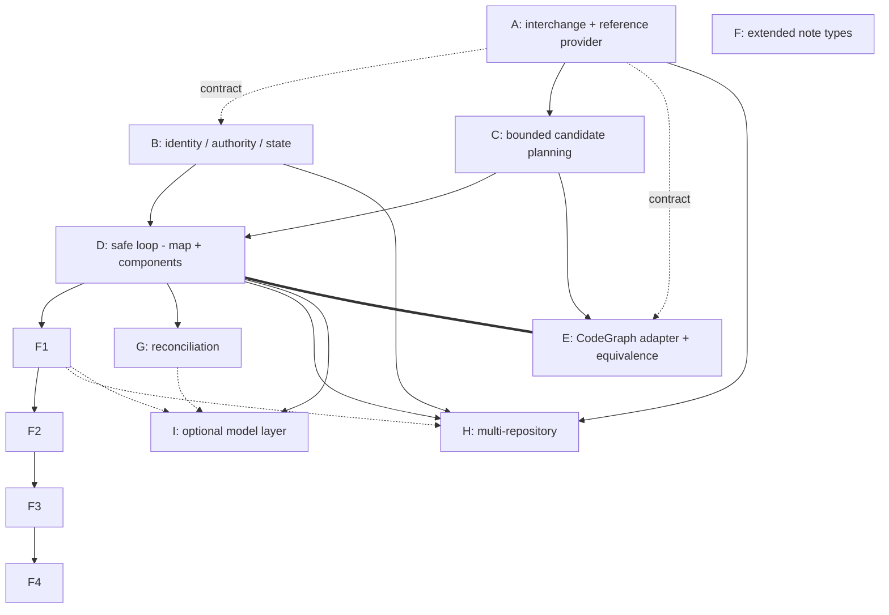

# Design: architecture projection epic decomposition (#141)

Reframes **#141 — provider-neutral architecture projection** from a single
implementation issue into a **parent epic** with a child DAG (A–I). It consumes
the completed **#140** context-graph foundation (shipped v0.7.0) without
restating or weakening it, reuses **#185**'s generated-region and safe-apply
utilities by name, and preserves the **#142** historical-enrichment boundary.

**Scope guard.** This document designs *decomposition and frozen contracts*, not
production code. It defines no new context-graph schema, no new context-graph
canonicalization, and no new endpoint rule — all three remain #140's frozen
output. Architecture projection is a **downstream, rebuildable reading surface**;
it never becomes a context-graph authority. Where this record and a live issue
body diverge, the live body wins and this record must be corrected.

> **Contract-provenance warning (fourth-round gate).** The §13 replacement body
> **was applied** to live #141 at `2026-07-18T18:53:20Z` — after all three commits
> on this branch, and contrary to §13's own "not yet applied" note (now corrected).
> The replacement **dropped #141's `## Acceptance criteria` and `## Pressure tests`
> sections entirely**, so AC1–AC21 and PT1–PT15 no longer exist on the live issue;
> `gh issue view 141 | grep -c 'Acceptance criteria\|Pressure tests'` returns `0`.
> Combined with the scope guard above ("the live body wins"), that would have made
> every AC/PT in §9 trace to text that exists nowhere authoritative, and would have
> silently destroyed four requirement sections (*Intended user experience*,
> *Selection approach*, *Confirmation policy*, *Security and privacy*) that §12's
> audit never traversed.
>
> **The pre-amendment #141 body is therefore preserved verbatim in Appendix A**
> (recovered via `gh api graphql … userContentEdits`, revision index 1,
> `2026-07-16T23:38:58Z`). **Appendix A is the contract this document is audited
> against.** Restoring the AC/PT and requirement sections to live #141 is a
> required operator action before any child issue is filed — see §15.

**What #141 consumes from #140 (read-only, never reinvented):** opaque project
identity `project:<32-lowercase-hex>` and stable repository-binding identity
`repository-binding:<32-hex>` from `config.json`; context semantic-node identities
`context-node:<slug>:<32-hex>` and normalized evidence identities (#181) as they
appear in the compiled `index.json`; the generated-region / safe-apply utilities
frozen by #185. Specific symbols are named in §5 and §6.

---

## 1. Problem and product boundary

### Problem

#140 out-of-scope explicitly deferred "CodeGraph ingestion or architecture
projection" and "Historical bulk backfill" to two follow-on consumers: #141
(architecture) and #142 (historical). #141's current body already carries the
correct authority model, identity constraints, and safety requirements, but is
shaped as one implementation issue. The full contract — a provider-neutral
structural-graph interchange, a project-scoped architecture identity space, a
bounded deterministic selection engine, a multi-file safe-apply loop, a real
CodeGraph adapter, richer note types, reconciliation, multi-repository breadth,
and an optional model layer — is program-sized. Delivered as one issue it has a
long time-to-first-green and high integration risk; several of its sub-contracts
(interchange, identity, apply manifest) are load-bearing for the rest and must be
frozen before dependent work begins.

### Product boundary (epic)

**In scope for the #141 epic:**

* a canonical, versioned, **local structural-graph JSON interchange** and a
  reference JSON reader/provider (usable by real tools, not merely a test double);
* a **project-scoped architecture identity** space, provenance, and authority-
  separated state under
  `<notes_home>/projects/<project_slug>/.bindle/architecture/` (§3);
* **deterministic bounded candidate planning** (codebase map + components for the
  MVP) computed by Bindle from interchange primitives;
* a **safe projection loop** — preview → confirm → apply → zero-write rerun →
  changed-only refresh — reusing #185 utilities and extending them for a
  variable-cardinality note manifest;
* a **CodeGraph adapter** behind the interchange, with a shared-capability
  equivalence proof;
* later children: extended note types; reconciliation lifecycle; multi-repository
  breadth; an optional model-assisted authoring layer.

**Out of scope (frozen, must not reappear):**

* creating context-graph nodes, edges, candidates, or ledger judgments — #141
  writes **none**;
* activating the reserved semantic kinds `architecture_component`,
  `architecture_flow`, `boundary`, `test_surface` in
  `bin/context_graph/relationships.py` (they stay reserved; architecture identity
  is a separate space — see §3);
* durable local issue/PR/commit note trees; repository-shaped project identity;
  one-project-equals-one-repository; wikilink-as-authority; wholesale source-code
  copying — all already excluded by #140 and #141 and preserved here;
* historical inference, backward projection, or bulk backfill — that is #142,
  which stays separate, blocked, and conditional (§10, §13).

---

## 2. Frozen contracts (epic-wide invariants)

These hold across every child. A child may extend a contract; none may weaken it.

**FC-1 — Authority separation.** The structural provider is authority only for
observed structural facts. The context graph (#140) is authority for durable
project understanding, semantic identity, normalized evidence, and confirmed
human judgments. Architecture projection is downstream and rebuildable. It
**references** context-node and evidence identities read-only from `index.json`;
it creates **no** context-graph edge and **no** entry in the #184 judgment
ledger. If architecture work needs a durable semantic relationship in the context
graph, it goes through #140's proposal → #184 validation → human-judgment path,
never through projection.

**FC-2 — Project-scoped architecture identity.** Architecture-node identity is
project-scoped and opaque:

```text
arch-node:<project-id>:<32-lowercase-hex>
```

where `<project-id>` is the consuming project's **full** `project:<32-hex>`
token (not the bare hex) and the second field is fresh command-allocated
entropy — regex `^arch-node:(project:[0-9a-f]{32}):([0-9a-f]{32})$`. Embedding
the full `project:` token matches the frozen convention of every other compound
ID that embeds a project (`session:`/`handoff:`/`document:`, `ids.py:38-44`) and
keeps a single `grep 'project:<hex>'` able to find every ID scoped to a project;
a bare-hex form would silently break that. A single binding id is **never**
embedded in the identity; repository
participation is mutable provenance (§3). Frozen: context-node IDs are never
reused as architecture IDs; provider structural IDs are never architecture IDs;
filenames, note titles, `owner/repo`, checkout paths, provider labels, and link
text are never identity.

**Continuity is a confidence-gated match, not a hash (frozen — the crux).** An
architecture node names a *derived cluster* of files/symbols recomputed each run,
so there is no stable content to hash and no user-owned source line to carry an
ID marker (the note is generated, FC-5). Identity therefore continues by a
**multi-signal matcher** (child B's central deliverable, §6-B): on each run the
recomputed candidate is matched against the confirmed identities recorded in
`judgments.jsonl` using the signals #141's identity model already names — member
symbol/path overlap, dependency neighborhood, prior projected identity, dominant
anchors — scored to a confidence.

**Match signals must be provider-independent (frozen).** A provider's structural
IDs are opaque and version-unstable: a provider patch release that changes its ID
format (e.g. `file.py::Class.method` → `file.py:42:method`) would drive
`source_symbols[]` overlap to zero at an unchanged commit and route *every* node
to G — the exact churn the non-churning-inputs rule below forbids. So every signal
the matcher scores on must be expressed over **provider-independent** terms
(repo-relative paths, symbol *names*, and neighborhoods derived from them). Raw
provider IDs may be stored as provenance but must **never** be a matcher signal.

**The outcome set is four-valued, exhaustive, and injective (frozen).** Matching
is a **bipartite assignment** between this run's candidates and the *live*
confirmed identities, not an independent per-candidate score. Exactly four
outcomes exist, and every candidate reaches exactly one:

1. **No match** (no live identity scores above the low threshold — including the
   ordinary case of a **fresh project whose `judgments.jsonl` is empty**) → this is
   the **confirmed creation event**: a new `arch_id` is minted under §3's identity
   commit rule. Owner **B** (allocator), driven by **D**'s confirm step (§6-D);
   **G is not required**, so a first-ever projection works in the first usable
   release. Without this branch the MVP could create nothing.
2. **Unique high-confidence match** → **reuse** the existing `arch_id` and update
   membership/provenance — an ordinary edit that adds or removes a file from a
   component does **not** mint a new node.
3. **Contested high-confidence match** — two or more candidates claim one identity,
   or one candidate clears the threshold against two or more identities → **demote
   all contestants to ambiguous** and route to G. Never resolve a contest by
   picking a winner: a one-to-many claim is a split and a many-to-one claim is a
   merge, and both are G's confirmation, not the matcher's.
4. **Low/ambiguous match** → split/merge/rename candidate routed to child G for
   **confirmation** — never a silent mint, stale, or replace.

The `confidence` enum (§3) is `high | medium | low`; `medium` is the **recorded
score band for outcomes 3 and 4** (routed, not auto-applied), so the enum and the
outcome set agree. B may not collapse `medium` into a silent reuse.

**Matching is scoped to live identities (frozen).** Candidates are matched only
against identities whose `projection_status` is not `stale`. A **reappearance** —
a structural match against a *stale* identity — is **never** an automatic reuse:
it is routed to G for confirmation. Otherwise a component deleted in v1.0 and an
unrelated feature later written at the same paths would score near-perfect path
overlap, and the new component would silently inherit the dead node's `arch_id`,
its `prior_names[]`, its `merged_from[]` lineage, and every wikilink that cited
the old one. Structural overlap alone cannot distinguish a true reappearance from
path reuse, so the distinction is a human judgment.

Further frozen rules:

* membership delta alone is **never** identity and never forces a re-mint;
* the matcher and its confirmed bindings live in `judgments.jsonl` (FC-5), never
  recovered by reading a generated note or `index.json`;
* **only child B may mint an `arch_id`.** C, D, F, G, H, and I consume B's
  allocator and may not mint, replace, infer, or retire an identity — G and H
  *drive* lifecycle transitions but route every allocation through B (§6-G, §6-H).

**Non-churning inputs (frozen, extends #141).** Repository rename, transfer,
rebinding, adding/removing a participating repository, **and provider or provider-
capability change** must not churn established identity. Because a coarser
provider (e.g. one lacking `has_calls`) could otherwise re-partition clusters,
child C's clustering must be **deterministic per capability set and degrade
monotonically** — a lost capability may merge or coarsen groupings, never silently
re-partition them; any grouping change that exceeds the high-confidence threshold
is a split/merge routed to child G, not a silent re-identification. Ambiguous
rename/split/merge always require confirmation.

**FC-3 — Provider seam / network independence.** A frozen normalized structural-
graph interchange (§4) sits between any provider and the projection engine. The
engine **never imports CodeGraph or any other provider**; it consumes only the
interchange. Network access is never required for the engine or the reference
provider.

**FC-4 — Source coherence.** Every structural graph is bound to a stable
repository binding, an exact source commit, a provider name and version, and an
interchange schema version. A missing provider, unavailable graph, or commit
mismatch yields an explicit `unavailable` or `stale` state. Provider
disappearance is **never** interpreted as architecture deletion, wholesale
staleness of every note, or permission to rewrite existing notes.

**FC-5 — State authority.** Durable authority lives in structured state under
`<notes_home>/projects/<project_slug>/.bindle/architecture/` (§3), not in
generated Markdown or the materialized index. **Architecture identity, its match
signals, and confirmed naming/grouping/rename/split/merge/stale decisions live in
`judgments.jsonl`**; generated Markdown and `index.json` are rebuildable
materializations and are never consulted to recover identity or meaning. Deleting
a generated note is therefore always safe (FC-6): the next run recovers the node's
`arch_id` by matching the recomputed cluster against `judgments.jsonl` (FC-2), not
by reading the note back.

**`judgments.jsonl` carries two record kinds — decisions *and* observations
(frozen; corrects a circular rebuild rule).** The earlier phrasing made
`index.json` rebuildable "from `judgments.jsonl` plus the structural graph at the
recorded `source_commit`" while `source_commit` itself was recorded *only* in
`index.json` and in note front-matter. That rebuild is unexecutable: delete
`index.json` and there is no legal source for the commit to rebuild at, since
FC-5 forbids reading it back out of a note. It also left **carry-forward content**
(§4.3 — an unavailable binding's last-known contribution) with no authoritative
home, so deleting a "rebuildable" `index.json` during an outage would permanently
destroy good content. Both are closed by giving the log two record kinds:

* **`decision` records** — human-confirmed naming, grouping, creation, rename,
  split, merge, stale. Authority for *meaning*.
* **`observation` records** — the append-only provenance ledger: per apply, the
  `source_commit`, `provider_name`/`provider_version`, `interchange_schema_version`,
  and per-binding contribution + status for every affected `arch_id`. Authority for
  *what was observed and when*, and therefore for carry-forward.

`index.json` is then genuinely rebuildable — from decisions + the latest
observation per `(arch_id, binding_id)` + the structural graph at the observed
commit — and is **never** an authority for anything. A rebuild that re-observes a
provider at a *different* commit legitimately yields different provenance and
staleness, and is not claimed to be byte-identical. Note front-matter is
**decorative only** (§3): it is rendered *inside* the generated region and is never
parsed back.

**FC-6 — Note safety and byte preservation.** Every Markdown write reuses #185's
generated-region, marker-validation, byte-preservation, semantic-no-op, and per-
file atomic-replacement utilities (§5). User-authored prose outside generated
regions is preserved byte-identically. A semantic no-op writes zero bytes.

**FC-7 — Bounded and private.** Note counts are capped (**and the cap has a defined
over-cap behavior — §6-C; a cap without one is unenforceable against
never-auto-delete**); minimum evidence thresholds gate creation; generated,
vendored, dependency, cache, build, gitignored, and explicitly private paths are
excluded; no source file is copied wholesale; source excerpts are capped and
disabled by default; secrets and raw configuration values never enter notes or
logs. External links are **allowlisted and previewed** (#141 *Security and
privacy*; owner **D** at render, using A's normalized values). **All writes remain
below the configured notes home** (§3).

**Normalization/redaction covers every provider-supplied string, not just
`source_paths`** — `source_symbols`/provider structural IDs (which routinely embed
absolute workspace paths), entry-point/route strings, and any value echoed in a
degraded-state diagnostic or log are path-normalized and secret-redacted **at the
interchange (child A) boundary, before persistence or logging**.

> **Redaction is a build gap, not a reuse (frozen — corrects a false reuse claim).**
> §5.1 previously named `evidence.py: normalize` as the enabling reuse. That
> function does **not** normalize absolute paths — it *rejects* them and returns the
> offending value verbatim: `bin/context_graph/evidence.py:246-256` returns
> `{"status": "rejected", "reason": "path_absolute", "value": value}`, and findings
> are printed and logged. A provider emitting
> `/Users/<user>/Developer/<client-repo>/svc/billing.py::charge` would put the
> user's home directory, the client name, and the workspace layout straight into a
> log line — precisely what this contract promises it cannot. Normalization and
> redaction are therefore a **named build gap owned by child A** (§5.2 gap 4), and
> A must consume the repo's **existing** privacy machinery rather than reinvent it:
> `bin/check-private-info.sh`, `.gitleaks.toml`, the `~/.bindle/private-denylist.txt`
> contract in `docs/privacy-boundaries.md`, and `.gitignore`. A also owns reading
> the denylist and `.gitignore` — FC-7 asserts those exclusions, so a child must own
> them.

**The threat model is the vault, not a git tree (corrected).** The state directory
is **not** a committed tree — it lives under the notes home
(`<notes_home>/projects/<project_slug>/.bindle/architecture/`, §3), which
`docs/notes-home.md` places *outside every project repo on purpose*. The real
exposure is that the notes home **is an Obsidian vault**: routinely on iCloud /
Dropbox / Obsidian Sync, routinely screen-shared, and often shared with others.
That is a broader surface than a git commit, and it — not "a synced/committed
tree" — is what FC-7 defends.

**FC-8 — Deterministic core, optional model.** Identity, persistence, structural
normalization, deterministic metrics, candidate keys, confirmation authority, and
apply behavior are owned by deterministic code. Model assistance is optional and
non-blocking (§11, child I); model output enters only through the same reviewable
proposal contract the deterministic workflow consumes.

---

## 3. Architecture identity, provenance, and state authority

### Identity (FC-2)

`arch-node:<project-id>:<32-lowercase-hex>` (full `project:<hex>` token, §2
FC-2). The second field is allocated **once, at the confirmed creation event**,
from command-owned entropy (`secrets.token_hex(16)`), mirroring how context-node
IDs are minted in `bin/context_graph/review.py:204` and `bin/map-entry-id.py:145`
— never model-chosen, never content-hashed, never derived from a filename or a
provider ID. Once allocated it is **immutable**: it is persisted in
`judgments.jsonl` (the authority, FC-5) and never re-derived, regenerated, or
re-minted on a later run. On each run the recomputed cluster is re-matched to that
authority by the confidence-gated matcher (FC-2): a high-confidence match reuses
the existing `arch_id` (a rename that keeps the same cluster keeps the same id and
records the old *name* in `prior_names[]`); a **reappearance against a stale
identity is routed to G, never auto-reused** (FC-2); split/merge/participation-
change are routed through child G's confirmation and can never silently mint or
replace an identity.

**Lineage is recorded in both directions (frozen).** A merge records each absorbed
`arch_id` in the survivor's `merged_from[]`. A **split** records the inverse: the
originating `arch_id` in each product's `split_from`, and the products in the
original's `split_into[]`. Without the inverse field a reverted split is
unrecoverable — the recombined cluster scores ambiguous against both halves, and G
has no record that they were ever one node, forcing it to re-derive from structure
alone exactly the relationship the design defers to confirmation *because*
structure cannot decide it. `projection_status: superseded` is defined as: this
identity was replaced by a confirmed split or merge, and `superseded_by[]` names
the successor(s).

**The identity commit is a single atomic append that precedes any file write
(frozen — corrects an unspecified ordering).** Minting an `arch_id` and recording
its confirmation are **one** `judgments.jsonl` append, and that append happens
**before `apply-state.json` is created and before the first note byte is written**.
The in-tree precedent is exactly this: `bin/context_graph/review.py:202-204`
allocates the id *inside* the judgment event itself. Either other ordering breaks a
frozen invariant: appending *after* the note writes means a crash leaves a written
note whose identity was never recorded, forcing recovery to read the `arch_id` back
out of `apply-state.json` (making recovery metadata a semantic authority) or out of
the note (forbidden by FC-5); appending *before* with no write-side record leaves
orphaned identities. With the identity committed first, a crash is always
recoverable forward: the identity exists, and the fresh re-plan (§3 resume rule)
simply re-renders it.

**Parser placement is constrained (frozen).** The `arch-node` parser/formatter must
live in an **architecture-local `ids` module** that mirrors `bin/context_graph/ids.py`'s
construction discipline. It must **not** be added to `ids.py` itself. `ids.py`'s
`parse_typed_id` is consumed by `bin/context_graph/validation.py:140` to reject
malformed context-graph node ids; teaching it the `arch-node:` grammar would make
`{"id": "arch-node:project:…:…", "class": "semantic"}` a *legal* context-graph node
and silently delete the structural guard that keeps architecture identity
inexpressible in the #140 graph — violating FC-1 and this document's own scope
guard as a side effect of file placement.

**Note path is bound to identity, not to name (frozen).** A note's path is derived
from a **slug recorded in `judgments.jsonl` at the confirmed creation event** and
carried in the node's `note_path` field — human-readable (so the vault is usable),
but *owned by the judgment*, not recomputed from the current name. Consequences,
both required: (a) a **confirmed rename** updates `prior_names[]` and may update
`note_path` **as a planned move** (old path removed, new path written, in one
manifest) — never by leaving the old note behind, which never-auto-delete would
otherwise strand forever; (b) a **user rename in Obsidian** — the single most common
vault operation, and one that rewrites every backlink — is detected because the
marker scan finds a managed region at a path no node claims. That is a **conflict
routed to G**, never a silent re-create at the planned path, which would leave two
managed notes for one node with the user's backlinks pointing at the unmaintained
one. Deriving the path from `arch_id` hex instead was rejected: an opaque filename
defeats the epic's entire product goal.

### Provenance schema (per projected node)

Held in `index.json` (a rebuildable materialization, FC-5 — **not** an authority)
and derived from `judgments.jsonl`'s decision + observation records. A **subset**
is rendered into note front-matter for human readability; that rendering is
**decorative and never parsed back** (FC-5), and lives *inside* the generated
region so a stale copy can never survive a refresh:

```text
arch_id                 arch-node:<project-id>:<hex>   (full project: token)
project_id              project:<hex>
note_path               vault-relative path, from the creation-event slug (never
                        recomputed from the current name — §3 identity)
binding_ids[]           participating repository bindings (mutable; may grow/shrink)
projection_type         arch_codebase_map | arch_component   (MVP; more in F —
                        arch_-prefixed to avoid colliding with the reserved
                        semantic kinds in relationships.py:36-39)
projection_schema_version
provider_name
provider_version
source_commit           per participating binding
source_paths[]          repository-relative (normalized, FC-7)
source_symbols[]        provider structural IDs, normalized/redacted (FC-7) — a
                        provider ID may embed an absolute path, so it is
                        path-normalized before persistence, never stored raw.
                        PROVENANCE ONLY — never a matcher signal (FC-2)
per_binding_status[]    per binding: available | unavailable | stale, with the
                        last-known contribution carried forward while unavailable
per_binding_coverage[]  per binding, per fact class: observed | unsupported |
                        partial_parse_failure — so a provider that advertises
                        has_calls but failed to parse a subtree reads as PARTIAL,
                        never as an observed zero (§4.2)
confidence              high | medium | low   (medium = routed to G, never applied)
projection_status       current | stale | superseded | merged | partial
prior_names[]           former names after a same-cluster rename (names, not IDs)
merged_from[]           absorbed arch_ids after a confirmed merge (IDs)
split_from              originating arch_id after a confirmed split (ID)
split_into[]            product arch_ids after a confirmed split (IDs)
superseded_by[]         successor arch_ids when projection_status = superseded
last_projected_at       (state only; advances only on real content change)
```

**No observed-provenance field may enter a byte-compared generated region
(frozen — generalizes the `last_projected_at` rule).** `last_projected_at` was
already excluded; the same reasoning applies with equal force to `source_commit`,
`provider_version`, `per_binding_status[]`, and `per_binding_coverage[]`. A repo
with 40 component notes whose `source_commit` is rendered into each note would
rewrite **all 40** on a commit that touched a single README — 40 mtime bumps and 40
diff entries in a synced vault for zero architectural change, breaking AC11
(changed-only refresh) and defeating §6-F's metric-churn guard through a field that
guard does not cover. Observed provenance therefore lives in **state only**; the
note's rendered front-matter carries only identity-stable fields (`arch_id`,
`project_id`, `projection_type`, `note_path`).

`binding_ids[]` is a **list** and mutable: a component may span repositories, and
adding/removing a participating binding updates provenance without churning
`arch_id` (FC-2). When a participating binding goes unavailable/stale, its
last-known contribution and provenance are **carried forward** (`per_binding_status`
marks it), so a rewrite triggered by *another* available binding never drops the
unavailable binding's content — the node becomes `projection_status: partial`,
never silently re-rendered to only the available bindings (§4.3). `last_projected_at`
must not enter any byte-compared generated region, or it would defeat the semantic
no-op (FC-6); it lives in state only and **advances only when the projection
content actually changed**. On a semantic no-op **every** artifact is byte-stable —
generated notes, `index.json`, and `apply-state.json` (which is not even created on
a no-op, §3 state authority) — so an unchanged rerun performs zero writes with no
timestamp-only churn anywhere (FC-6, and the extended apply contract in §5).
`config.json` is not in that list because **apply never writes it at all** (§3
state authority).

### State authority (FC-5)

**The layout is rooted at the notes home and namespaced by project (frozen —
corrects a path that would collide across projects).** The earlier draft froze a
bare `.bindle/architecture/`, citing `config.py:42-43`. That citation covers only
the `CONTEXT_SUBDIR` constant, not the path constructor. The real context-graph
path is built by `bin/context_graph/config.py:89-98`:

```python
def project_dir(notes_home, project_slug):
    return os.path.join(notes_home, "projects", project_slug)
def context_dir(notes_home, project_slug):
    return os.path.join(project_dir(notes_home, project_slug), CONTEXT_SUBDIR)
```

`.bindle/context/` is **not repo-relative** — it is rooted at the notes home and
namespaced by `project_slug` (confirmed: `git ls-files | grep -c '^\.bindle'`
returns `0`, and `.bindle` is absent from `.gitignore`; it is not in the repo
because it never was). A bare `.bindle/architecture/` would put two projects
sharing one notes home on **one `judgments.jsonl`** — i.e. one identity authority
for two projects, directly contradicting FC-2's project-scoped identity. Frozen:

```text
<notes_home>/projects/<project_slug>/.bindle/architecture/
  config.json        projection settings: participating bindings, caps + OVER-CAP
                     BEHAVIOR, thresholds, exclusions, DIFF-SIZE CONFIRMATION
                     LIMIT, projection schema version, project_id
  judgments.jsonl    append-only log, two record kinds (FC-5):
                       decision    — naming, grouping, creation, rename, split,
                                     merge, stale (authority for MEANING)
                       observation — source_commit, provider name/version,
                                     schema version, per-binding contribution +
                                     status/coverage (authority for CARRY-FORWARD)
  index.json         rebuildable materialized projection state (nodes +
                     provenance + references-to-context)
  apply-state.json   multi-file apply manifest + interruption/recovery state
```

**`config.json` carries `project_id`, and a mismatch is a hard abort (frozen).**
The context graph guards exactly this (`apply.py:70-73` aborts on a `project_id`
mismatch; `config.py:45-47` keeps `project_id` a known top-level field) and the
architecture side had no equivalent. Without it, copying a notes-home directory to
seed a second project leaves `judgments.jsonl` full of
`arch-node:project:<A>:…` identities that the matcher in project `<B>` would
happily reuse, materializing nodes whose embedded project-id contradicts the
checkout.

Roles are frozen; filenames may change only if a strong existing convention
justifies it, but the authority separation must remain explicit. **`judgments.jsonl`
is the single append-only authority** for confirmed decisions, observed provenance,
and architecture identity; `index.json` and the generated Markdown are rebuildable
materializations; `apply-state.json` is **recovery metadata only, never a semantic
authority** — losing it can never change what the projection *means*, only whether
an interrupted write needs resuming.

**Apply is read-only on `config.json` (frozen).** #185's own boundary lists
*configuration* first under "apply must not write," and the earlier draft's
no-op sentence ("every artifact is byte-stable — … `config.json` …") implied apply
writes it on a non-no-op. It does not. `config.json` is operator-owned; it carries
no marker contract and no byte-preservation guarantee, so a machine write to it
could silently reformat or drop hand-maintained exclusions.

**Config-vs-judgments conflicts are resolved explicitly (frozen — the one authority
pair the earlier draft never addressed).** Operator configuration and confirmed
judgments can contradict each other directly, and "cap" plus "never-auto-delete"
are not simultaneously satisfiable without a rule:

* **Lowered cap.** Existing confirmed nodes are **never** retro-staled by a config
  edit — that would be an unconfirmed lifecycle transition (FC-2). The cap binds
  **new creation only**; existing nodes over the cap are reported as
  `over_cap: true` in preview with an explicit operator prompt to stale them via G.
  Silent enforcement and silent non-enforcement are both forbidden.
* **New exclusion covering a confirmed node.** The node is **not** deleted and not
  silently dropped from `index.json`. It is marked `projection_status: stale` only
  through G's confirmation; until then it is reported as `excluded_but_confirmed`
  and its note is left byte-identical. C's "excluded paths never appear" binds
  **candidate generation**, not retroactive destruction of confirmed nodes.
* **Deconfigured binding.** Removing a binding from `config.json` is a **fifth
  degraded state, `deconfigured`** (§4.3) — deliberately distinct from
  `unavailable`. Carry-forward applies to `unavailable` (a transient outage) but
  **not** to `deconfigured` (an operator decision): a deconfigured binding's
  contribution is retired through G's confirmation, so it neither lingers forever
  nor vanishes on a config edit.

**Provider facts never overwrite a confirmed grouping (frozen).** FC-5 makes
judgments authority for *grouping*; a high-confidence match "updates membership."
Those collide: grouping and membership are the same thing at two altitudes. Rule —
a confirmed grouping **pins** its members. Recomputed membership that adds or
removes a *pinned* member is not applied silently; it is surfaced as a
`grouping_drift` finding routed to G. Unpinned membership (files never named in a
confirmed grouping) updates freely from the provider. This keeps a human decision
from being erased by a recomputation without freezing the cluster forever.

**The judgments log has an integrity contract (frozen — the sole authority had no
recovery story).** `append_line_atomic` (`bin/context_graph/atomic_io.py:59-66`) is
a plain `open(path,"a")` + `write` + `flush` + `fsync`: it gives **durability, not
crash atomicity**, unlike `write_atomic` (`:13-17`, temp-in-dir + `os.replace` +
dir fsync). §5.1 previously filed it under "atomic write primitives," which hid the
gap. A `SIGKILL` or `ENOSPC` mid-write leaves a truncated trailing line, and FC-5
forbids recovering identity from `index.json` or the notes — which both still hold
the data. Frozen rules:

* every record carries a **`record_id` and a checksum** over its payload;
* a **torn or unparseable trailing line is truncated and reported**, never silently
  skipped (silently skipping would drop every identity after the tear, routing all
  of them to G or re-minting duplicates);
* an unparseable line **anywhere but the tail** is a **hard abort** — the authority
  is damaged and the run must not guess;
* the log is **append-only**, never compacted or rewritten in place. ("Append-
  oriented" elsewhere in the earlier draft was inconsistent with "append-only" and
  is corrected to append-only; compaction would reopen every ordering question.)
* records fold **last-write-wins by file order** for a given `arch_id`; every record
  carries `decided_at` for human audit, but file order — not the timestamp — is
  authoritative, so a clock skew cannot reorder meaning.

### Notes home and the architecture note tree (frozen)

The earlier draft specified note *content*, *safety*, and *state* but never the
**destination** — the string "notes home" did not appear anywhere in it, so no
child owned where architecture notes are written. #141's *Intended user experience*
makes the tree a headline deliverable and its *Security and privacy* section
requires that **all writes remain below the configured notes home**. Frozen here
because it is cross-cutting: D creates two of these nodes, F1–F3 three more, F4 the
sixth, so it must be fixed **before** D rather than negotiated per-child.

```text
<notes_home>/projects/<project_slug>/
  Codebase Map.md            (D)
  Components/                (D)
  Architectural Flows/       (F1)
  Boundaries/                (F2)
  Test Surfaces/             (F3)
  Hotspots/                  (F4, only if promoted to a durable type — §10)
```

**Owner split:** **B** owns the tree contract and the `note_path` grammar (it is a
path/authority contract, the same class as the state layout); **D** owns
containment-enforced writing — every planned path is verified to resolve below the
configured notes home *after* symlink resolution, and a plan containing any path
that escapes is rejected whole, never partially applied. **F1–F4 populate this
pre-frozen tree and may not invent sibling roots.** The notes home is
user-relocatable and possibly Obsidian-synced (`skills/notes-home`,
`commands/notes-home.md`), so the root is always read from configuration, never
assumed.

**`apply-state.json` lifecycle (frozen).** The plan is built and the **changed-set
computed first**; **if the changed-set is empty (a semantic no-op), no
`apply-state.json` is created and zero bytes are written anywhere** — this is what
keeps an unchanged rerun byte-stable (FC-6, AC10/PT8). Only for a **non-empty**
changed-set is `apply-state.json` created (after the manifest is validated, before
the first write), recording each affected path with its **before-hash and intended
after-hash** in the frozen write order; advanced after each write; **cleared**
(removed, or marked `complete`) on successful completion; **retained** on failure
or interruption.

**Resume re-plans; it never replays stored bytes (frozen — safety).** On the next
run a retained `apply-state.json` is used only to *detect* an incomplete prior
apply and to *reconcile* partially-written notes. The actual write decision is
always a **fresh plan against current inputs and current disk** — re-scan markers
(`_scan_markers`), re-detect hand edits and conflicts (`plan_context_md`), rebuild
the manifest from the current interchange. This means: (a) a user hand-edit made to
any note between crash and resume is detected by the fresh marker scan and
preserved or flagged as a conflict, never overwritten with a stale intended byte;
(b) if inputs changed between crash and resume, the new plan supersedes the stale
manifest, and a note the crashed run wrote that is absent from the new plan is
reconciled by its already-recorded `arch_id` — which is legally readable because
§3 freezes the identity commit as an append that **precedes** the first write, so
the identity is always already in `judgments.jsonl` and is never recovered from
`apply-state.json` or from the note. A retained apply-state whose fresh plan is a
no-op is simply cleared.

**Crash orphans are resolvable without G (frozen — closes an MVP-only gap).** If
the re-plan does not contain a node the crashed run wrote (e.g. the user reverted
the branch mid-crash), D may not delete it (never-auto-delete) and may not stale it
(that is G's AC16) — which in the G-less first usable release left the note
permanently orphaned, contradicting §6-D's own acceptance. Rule: D marks such a
note **`projection_status: partial` with an `orphaned_by_resume` flag**, leaves its
bytes untouched, and reports it in preview. This is a *classification*, squarely
inside D's remit, and it neither deletes nor stales; G later resolves it durably.
The first usable release therefore satisfies "no duplicate/lost notes" honestly.

**Preview → confirm is fingerprinted; a confirmation never applies to a different
plan (frozen).** "Always re-plan" is correct for *resume* but must not decouple the
confirmation from what is written. #185's own scope includes stale-preview and
stale-candidate checks, and the earlier draft carried neither forward. Rule: a
preview emits a **plan fingerprint** over (interchange `source_commit` per binding,
provider name/version, config hash, candidate set, and the resulting manifest); the
confirmation records it; apply recomputes it and **aborts with an explicit
`stale_preview` state if it differs**, requiring a fresh preview. Otherwise a
`git pull` landing between preview and apply could write nine differently-grouped
components under a confirmation the user gave for six — and, worse, mint identities
for clusters the user never saw. `plan_context_md` (`projection.py:189`) detects
*file-side* drift only; it has no notion of input-side drift.

This mirrors — but is **separate from** — the context graph's
`<notes_home>/projects/<project_slug>/.bindle/context/{config,index,judgments.jsonl}`
(path constructors at `bin/context_graph/config.py:89-98`; `CONTEXT_SUBDIR` and
`CONFIG_FILENAME` constants at `:42-43`). Architecture state never lives under
`.bindle/context/`, and never mutates it.

`index.json` here is analogous to the context graph's `index_writer.render_index`
output but is its own schema: architecture nodes with provenance, plus
**references** (not context-graph edges) to `context-node:` and evidence
identities. A reference records "this component note cites decision
`context-node:bindle:…`"; it is not an edge in the #140 graph and never enters the
#184 ledger (FC-1).

---

## 4. Structural-graph interchange (decision 5)

A canonical, versioned, provider-neutral local JSON document. It carries
structural **primitives and provider metadata**; it does **not** require a
provider to compute Bindle's conclusions. Bindle computes its own derived signals
(§4.2).

### 4.1 Interchange content (provider-supplied)

```text
interchange_schema_version    integer, frozen per version
provider_name
provider_version
provider_capabilities[]       explicit capability flags (e.g. has_calls,
                              has_tests, has_entry_points, has_symbol_ids)
binding_id                    repository-binding:<hex>  (source coherence, FC-4)
                              — VALIDATED against the project's configured
                              bindings (config.py:45-50 _KNOWN_REPOSITORY_FIELDS);
                              an unknown/foreign binding_id is REJECTED, never
                              accepted on the provider's assertion alone
source_commit                 exact commit the graph was observed at
coverage[]                    per fact class, per subtree: observed | unsupported |
                              partial_parse_failure — a provider that advertises a
                              capability but failed on a subtree MUST say so here
structural_nodes[]
    files                     repo-relative path, stable provider id where available
    symbols                   name, kind (NORMALIZED ENUM, below), containing file,
                              provider id
    tests                     test unit + the symbol/file it exercises
                              (capability-gated: has_tests)
structural_edges[]
    contains                  file→symbol, module→file
    imports | depends_on      module/file dependency
    calls                     symbol→symbol   (raw resolved call edges)
    tests                     test→exercised symbol/file
optional_provider_observations   versioned capability fields only, each gated by a
                              provider_capabilities flag; a provider MAY emit
                              clustering/centrality hints, resolved-dynamic-dispatch
                              call hops, or entry-point/route guesses, but Bindle
                              treats them as HINTS, never as authority, and they
                              never solely determine canonical output
```

**Only raw structural facts are core; conclusions are engine-owned (frozen, D3).**
Four things that look structural are actually provider *interpretations*. Two were
already demoted; two more are demoted here after the fourth-round gate caught them
still sitting in core:

* **`is_exported` — demoted to a capability-gated optional field.** It was in core,
  ungated, and child C derived entry points from it. But "exported" is not a
  structural fact in most languages Bindle targets: Python has no export concept
  (it requires interpreting `__all__`, leading-underscore convention, or
  `__init__.py` re-export — three mutually inconsistent heuristics), Go uses
  capitalization, TypeScript distinguishes `export` / `export type` / barrel
  re-export / `declare`, and for shell and Markdown — a large share of this very
  repo — it is meaningless. Two conforming providers would legitimately disagree
  about the same symbol at the same commit with identical advertised capabilities,
  so §4.2's "equivalence over the intersection of supported capabilities" offered no
  relief: child C's entry-point derivation would diverge and **child E's equivalence
  suite would fail with no capability flag to explain it**. It is now
  `has_export_visibility`-gated, and **C derives entry points primarily from
  provider-independent facts** (external-only callers, main/test conventions,
  declared build/run entrypoints), consuming `is_exported` only as a hint where the
  capability is present.
* **`symbols.kind` — must be a normalized enum, frozen by A.** Ungated free text
  meant one provider's `method` was another's `function`. A freezes a closed
  normalized set with an explicit `other` escape; providers map into it, and
  unmappable kinds become `other` rather than leaking provider vocabulary into the
  neutral contract.

The two demoted earlier remain demoted:

* **Entry points / routes.** "This is a route / entry point" is a framework-
  specific judgment, and #141's *Selection approach* assigns entry-point discovery
  to **Bindle**. So entry points are **derived by child C** from provider-
  independent raw facts (symbols called only from outside the module, main/test
  conventions, declared build/run entrypoints), with capability-gated
  `is_exported` as a *hint only* (above); a provider's `entry_point_observations`
  may appear **only** as an optional capability-gated hint, never as a core field
  that seeds candidates.
* **Dynamic-dispatch call resolution.** A provider that resolves callbacks / vtable
  / framework re-render hops does so with its own algorithm; those hops belong in
  `optional_provider_observations` under a capability flag, not in the core `calls`
  edge (which carries only directly resolved calls). Naming them in core would bake
  one provider's differentiator into the "neutral" contract.

Provider-specific algorithms (a particular community-detection or centrality
implementation) are **not** part of the core interchange contract. They may only
appear under explicitly versioned `optional_provider_observations` capability
fields, and equivalence (child E) does not require them to match.

### 4.2 Bindle-computed signals (engine-owned)

Bindle normalizes and computes, from interchange primitives:

* fan-in, fan-out;
* dependency/call neighborhoods;
* blast-radius signals;
* default clustering / community signals;
* bounded candidate rankings.

Keeping these engine-owned means a minimal provider (files + imports only) still
yields a projection, and two providers exposing the same supported facts yield
equivalent Bindle conclusions (child E equivalence).

**Capability degradation is visible, never fabricated (frozen).** A missing
`provider_capabilities` flag means the corresponding facts are **unavailable**,
not empty. If a provider does not expose `has_calls`, call-derived signals
(fan-in/out on call edges, call neighborhoods) are marked `unavailable` and any
note that would depend on them says so; the engine must **never** treat "capability
not supported" as "supported and observed to be zero." The two are distinct states
and both are surfaced. This also bounds equivalence (child E): equivalence is
required only over the intersection of supported capabilities, so a provider that
lacks a capability degrades a projection visibly rather than diverging silently.

**Absence-vs-zero is guaranteed per entity, not only per graph (frozen).** The
capability flag is a whole-graph switch, so a provider that advertises `has_calls`
and then fails to parse one subtree (a proc-macro-heavy crate, a generated bundle,
an unsupported language version) emits a **schema-valid** graph in which that
subtree has zero call edges. The engine would read a real 40k-line subsystem as
`fan-in: 0, fan-out: 0`, drop it below C's minimum evidence threshold, and omit it
from the map with **no `unavailable` marker anywhere** — the user reads a codebase
map that silently hides a subsystem. Hence the mandatory per-subtree `coverage[]`
field (§4.1) and `per_binding_coverage[]` in provenance (§3): a
`partial_parse_failure` region propagates as **partial/unknown**, exactly like an
unsupported capability, and is surfaced in the note and in preview.

**Cross-binding aggregation never turns "unavailable" into zero (frozen).** When a
metric is aggregated across bindings whose providers differ in capability (child
H), an `unavailable` contribution must propagate as unknown/partial — the engine
must **not** sum it as `0`. A component spanning binding B1 (`has_calls`, fan-in
40) and B2 (no `has_calls`, fan-in unavailable) has an aggregate fan-in of
"≥40, partial", not "40" and not "40+0"; such a component is flagged partial and
either excluded from hotspot ranking or ranked with an explicit uncertainty
marker — never ranked as though the unavailable contributor were zero.

### 4.3 Degraded states (FC-4)

`unavailable` (no provider / no graph), `unsupported_version` (interchange schema
mismatch), `stale` (graph `source_commit` ≠ current repo commit), `malformed`
(schema-invalid), **`deconfigured`** (the binding was removed from `config.json` —
an operator decision, not an outage, so carry-forward does **not** apply; §3), and
**`freshness_unknown`** (below). Each is explicit and blocks writes for the affected
binding without deleting or staling existing notes.

**`stale` needs two more cases than commit inequality (frozen).** Defining `stale`
as "`source_commit` ≠ current repo commit" leaves the two most common real states
undefined:

* **Dirty working tree.** The overwhelmingly common developer state. `source_commit
  == HEAD`, so the projection reports `current` with `confidence: high` — while the
  working tree has uncommitted changes that split a component, delete three files,
  or rename a module. FC-4's entire purpose (source coherence) fails on the default
  state. Rule: a binding whose checkout is **dirty** is marked
  `projection_status: partial` with `dirty_tree: true`, and the note says so. The
  projection is still produced (refusing on a dirty tree would make the tool
  unusable), but it never claims to describe committed reality.
* **No local checkout.** `local_checkout_path` is an *optional* repository field
  (`config.py:45-50`), so a binding registered by coordinates alone has no
  obtainable "current repo commit." Rule: that binding is **`freshness_unknown`** —
  neither silently `current` (which would assert freshness the engine cannot
  verify) nor `unavailable` (which would block a legitimate coordinates-only
  binding). Its content is projected and explicitly marked unverifiable.

**Degraded states are per-binding and never contagious (frozen, FC-4).** In a
multi-repository project a binding that is unavailable or stale marks **only**
that binding's contributions. Notes sourced solely from other, available bindings
are untouched — not staled, not deleted, not rewritten. An architecture node that
spans bindings and loses one participant is marked `projection_status: partial`;
the unavailable binding's last-known contribution and provenance are **carried
forward** (§3, `per_binding_status`), so even a rewrite triggered by a *different,
available* binding re-renders that node as `merge(current available bindings,
carried-forward unavailable bindings)` — it never drops the unavailable binding's
files/symbols/provenance. A partial provider outage therefore produces zero
destructive reconciliation anywhere, including through the available binding's own
write path.

---

## 5. Safe apply: reuse and the extension gap (decision 8)

### 5.1 Reuse verbatim (name-checked against the live tree)

* **Generated-region contract** — `bin/context_graph/projection.py`:
  `_scan_markers` (`projection.py:165`, returns `valid|unmanaged|malformed`),
  the create/conflict/noop/update plan logic of `plan_context_md`
  (`projection.py:189`), and the pure region renderer pattern of
  `render_managed_region` (`projection.py:143`). These give byte-preserving
  update, conflict/malformed classification, and semantic no-op via region
  equality.
* **Crash-atomic write primitives** — `bin/context_graph/atomic_io.py`:
  `write_atomic` (`atomic_io.py:13`, temp-in-same-dir + fsync + `os.replace` + dir
  fsync) and `write_json_atomic` (`atomic_io.py:49`, the `json.dumps(obj, indent=2,
  sort_keys=True)+"\n"` byte contract). These are genuinely crash-atomic.
* **Durable append (NOT crash-atomic)** — `append_line_atomic` (`atomic_io.py:59-66`)
  is a plain `open(path,"a")` + `write` + `flush` + `fsync`: no temp-and-rename, no
  checksum, no torn-line recovery. It is reused for `judgments.jsonl`, but the name
  is misleading and the earlier draft filed it under "atomic write primitives,"
  which hid a real gap in the design's only authority file. The integrity contract
  that closes it is frozen in §3 and owned as §5.2 gap 5.
* **Semantic no-op** — `bin/context_graph/apply.py`: `_write_if_changed`
  (`apply.py:340`) writes nothing when on-disk bytes equal planned bytes
  (mtime-stable).
* **Planned-state-before-write *pattern*** — `apply.build_plan`/`apply.apply`
  (`apply.py:65`, `apply.py:379`) demonstrate the discipline to copy: build and
  validate the complete intended final state before the first write, then write
  only changed artifacts under a single-writer lock. Note the architecture apply
  is a **new orchestrator**, not a call into #185's `apply()` — the latter plans a
  **fixed** three-artifact set (map→index→context) and, by its own docstring, has
  "per-file atomicity only -- there is no cross-file atomicity" and no resume
  ledger. Architecture reuses the primitives (`_write_if_changed`, `ProjectLock`,
  `write_atomic`) inside a new plan/apply that handles a variable manifest (§5.2).
* **Single-writer lock** — `bin/context_graph/lock.py`: `ProjectLock`, **but not
  verbatim** — see §5.2 gap 6. Its `VALID_OPERATIONS` tuple (`lock.py:16`) is
  `("init", "config", "confirm", "apply")` and `lock.py:110-111` raises `ValueError`
  on anything else, so an architecture-scoped operation requires editing `lock.py`.
  More importantly `lock_path` is **directory-scoped** (`lock.py:38`), so
  `ProjectLock(architecture_dir, …)` yields `.bindle/architecture/.lock` — a
  *different file* from the context graph's `.bindle/context/.lock`, giving **no
  mutual exclusion** between `bin/context-graph.py apply` and architecture apply.
* **Minimal-diff marker insertion** — `bin/context_graph/map_writer.py`:
  `plan_map_bytes` (`map_writer.py:30`) as the model for byte-minimal edits within
  a line. *Note:* this is cited for its **diff discipline only**. It must not be
  read as licence for an identity marker in a note — FC-2's whole justification for
  needing a matcher is that a generated note has no user-owned line to carry one,
  and §3 makes rendered front-matter decorative and never parsed back.
* **Evidence reference resolution** — `bin/context_graph/evidence.py`: `normalize`,
  **for resolving evidence references the architecture notes cite — not for
  redaction.** It rejects unsafe paths and echoes the raw value back
  (`evidence.py:246-256`), so it is the wrong tool for FC-7 and is explicitly *not*
  claimed as the redaction implementation (§5.2 gap 4).

### 5.2 The exact gaps to extend (do not claim reuse covers these)

1. **Marker namespace.** `projection.py:20-21` hardcodes the full HTML-comment
   literals `<!-- bindle:context-graph:generated:begin -->` /
   `<!-- ...:end -->`. Architecture notes need a **distinct** literal pair, e.g.
   `<!-- bindle:architecture:generated:begin -->` / `end`, so the two surfaces
   never collide. `_scan_markers`/`plan_context_md` must be refactored to accept
   the **whole comment string** as a parameter (extract a marker-agnostic region
   core) rather than duplicating ~50 lines. Gap owner: **child D** (this is
   note-rendering plumbing, D's domain — not the identity/state child B), which
   extracts the shared core and consumes it; if the extracted core is placed in a
   shared module both #185 and D use, D still owns the extraction.
2. **Variable-cardinality multi-file manifest.** `apply.build_plan` plans a
   **fixed** three-artifact set (map.md, index.json, context.md). Architecture
   apply plans **N** component notes plus the codebase map plus state files, where
   N varies per run. The extension: a complete planned **file manifest** — every
   affected path with its exact intended bytes/hash — constructed before the first
   write. Gap owner: child B (manifest + `apply-state.json` schema), child D
   (execution).
3. **Interruption detection and safe resume.** #185's apply is single-pass and
   per-file atomic but has no cross-file resume ledger. Architecture apply records
   **before-hash and intended after-hash** per file plus deterministic write
   ordering in `apply-state.json`, and on the next run **re-plans against current
   inputs and disk** (re-scanning markers, re-detecting hand edits) rather than
   replaying stored bytes — see the frozen resume rule in §3. This is what keeps a
   hand edit made between crash and resume from being clobbered, and reconciles a
   changed-input resume without orphaning or duplicating notes. Gap owner: child B
   (`apply-state.json` schema + identity reconciliation of partial writes), child D
   (the re-plan/apply loop).
4. **Path normalization and secret redaction (FC-7).** No existing utility does
   this — `evidence.normalize` *rejects* unsafe paths and returns the raw value
   (`evidence.py:246-256`), which is the opposite of redaction and an active leak
   into logs. This is a from-scratch subsystem covering repo-relative path
   normalization, secret redaction, and diagnostic/log-line scrubbing across every
   provider-supplied string, plus **reading `.gitignore` and the
   `~/.bindle/private-denylist.txt` contract** (`docs/privacy-boundaries.md`) that
   FC-7's exclusions assert. Gap owner: **child A** (it is the interchange
   boundary). Consumes the repo's existing machinery (`bin/check-private-info.sh`,
   `.gitleaks.toml`) rather than reinventing it.
5. **Judgments-log integrity.** `append_line_atomic` gives durability, not crash
   atomicity (§5.1). The `record_id` + checksum, torn-tail truncate-and-report,
   mid-file hard abort, and append-only/fold rules are frozen in §3. Gap owner:
   **child B**.
6. **Cross-surface single-writer locking.** `ProjectLock` is directory-scoped and
   its `VALID_OPERATIONS` tuple excludes architecture operations (§5.1). Two lock
   files means context-graph apply and architecture apply can interleave: an
   architecture apply that has already read `context-node:` identities from
   `.bindle/context/index.json` can write N notes citing an identity that a
   concurrent `bin/context-graph.py apply` superseded mid-run, leaving a vault of
   notes referencing dangling identities with per-file atomicity fully intact. The
   extension: **one project-scoped lock covering both surfaces**, taken at
   `project_dir(...)` rather than per subdirectory, plus the added operation names.
   Gap owner: **child B** (lock contract), child D (acquisition). This is a small,
   deliberate edit to #185/#140's frozen surface and is called out as such.

Frozen apply contract for architecture (extends #185, weakens nothing):

* complete planned file manifest before the first write;
* exact intended bytes or hash for every affected file;
* deterministic write ordering;
* before/after hashes recorded;
* incomplete-apply detection;
* safe resume or rerun;
* temp-file cleanup or explicit reporting;
* no unrelated file rewrites;
* all user-owned prose preserved byte-identically;
* zero writes on a semantic no-op;
* **no false claim of cross-file filesystem atomicity** — atomicity is per-file;
  cross-file integrity is provided by the manifest + resume ledger, not by the
  filesystem.

---

## 6. Child DAG (A–I)

Each child names what it **owns**, its **dependencies**, and **acceptance**.
Titles are proposed; §8 gives paste-ready bodies.

### A — Structural-graph interchange and reference provider

**Owns:** the versioned normalized structural-graph schema (§4.1) including the
**normalized `symbols.kind` enum** and the mandatory per-subtree `coverage[]`
field; the provider capability model (including `has_export_visibility`);
exact-commit and repository-binding coherence (FC-4) **with `binding_id` validated
against the project's configured bindings, not accepted on the provider's
assertion**; **path normalization + secret redaction + `.gitignore`/denylist
reading** (§5.2 gap 4, FC-7); a canonical local JSON reader/provider; a canonical
fixture corpus conforming to the interchange — **explicitly including multi-binding
fixtures** (multiple graphs, cross-repo components, same-path/same-symbol
collisions, one binding `unavailable`, one `deconfigured`, one subtree
`partial_parse_failure`); malformed / unsupported-version / stale-commit /
unavailable-provider / dirty-tree / no-checkout behavior (§4.3). **Does not** own
bounded candidate selection. Reuses `atomic_io` read/serialization discipline;
reuses `ids.py` binding-id grammar for `binding_id`. **Depends on:** nothing
(foundation). **Blocks:** B, C, D, E, H.
**Acceptance:** a JSON document conforming to the schema loads into normalized
in-memory facts; a malformed/unsupported/stale/unavailable/foreign-`binding_id`
input yields the correct explicit state and writes nothing; an absolute path or
secret in *any* provider string — including one echoed into a diagnostic — is
normalized/redacted before persistence or logging (adversarial fixture required);
the multi-binding fixture corpus is committed and validated.

> **Why the multi-binding fixtures are A's and named explicitly.** §7 deliberately
> omits an `E→H` edge, justified by "H is testable on A's reference provider with
> multi-binding fixtures." But A's acceptance previously said only "the fixture
> corpus is committed and validated" — nothing required it to be multi-binding. If
> A shipped the natural single-binding minimum, H would genuinely require E and the
> most-emphasized deleted edge would have to come back. Naming them in A's Owns and
> acceptance is what makes `E→H`'s absence true.

### B — Architecture identity, authority, provenance, and state

**Owns:** project-scoped `arch-node:<project-id>:<hex>` identity (full `project:`
token, FC-2), allocated once at confirmed creation and immutable thereafter, and
its parser/formatter;
separation from context-node and provider-node identity; **the sole `arch_id`
allocator — no other child may mint** (FC-2); projection `config.json` (including
caps + **over-cap behavior**, thresholds, exclusions, and the **diff-size
confirmation limit**); the **static confirmation policy** — which change classes
require confirmation and at what thresholds (split out of G so the MVP has one, see
below); **append-only `judgments.jsonl` with its two record kinds and integrity
contract** (§3, §5.2 gap 5); rebuildable `index.json`; **the notes-home architecture
note-tree contract and the `note_path` grammar** (§3); **the cross-surface project
lock contract** (§5.2 gap 6); **the confidence-gated continuity matcher** (FC-2 —
B's central deliverable: match a recomputed cluster to a confirmed identity by
**provider-independent** path/symbol-name overlap, neighborhood, prior identity, and
dominant anchors, scored to a confidence, as a **bipartite assignment** over *live*
identities with the four-valued outcome set); `prior_names[]` / `merged_from[]` /
`split_from` / `split_into[]` / `superseded_by[]`; `apply-state.json` schema +
identity reconciliation of partial writes (§5.2); the provenance schema (§3).
**Depends on:** A (a contract dep — only where interchange identifiers
`binding_id`/`source_commit` are consumed; B's identity/state core needs no A code
and can start in parallel with A). **Blocks:** D, G, H.
**Acceptance (executable by B alone):** the ID grammar round-trips and is rejected
correctly on malformed input; an id is allocated **once** at the confirmed creation
event and is immutable thereafter; **the identity-commit append precedes any
manifest or file write** (crash-injection test); context-node IDs are provably never
reused; the `arch-node` parser is **absent from `ids.py`** and an `arch-node:` id is
still rejected by `validation.py`'s node-id check (regression test); state files
have frozen schemas with conformance tests; a torn trailing line in
`judgments.jsonl` is truncated-and-reported and a mid-file corruption hard-aborts;
the matcher returns the correct one of four outcomes over **synthetic cluster
inputs** (including empty-authority → mint, contested-high → ambiguous, and
stale-identity reappearance → routed).

> **Why PT16 and the index-rebuild criterion moved to D.** Both were previously B's
> acceptance, and neither is executable by B alone. "Identity stable across
> **provider/capability change**" is only meaningful over a *clustering* that
> re-runs under a reduced capability set — and clustering is **C**'s (FC-2). "Rebuild
> from `judgments.jsonl` plus the same-commit graph reproduces `index.json`" means
> reconstituting nodes whose membership *is* C's cluster output. B would have had to
> import C to run its own acceptance, in the pair the decomposition most aggressively
> parallelizes (§7: "B can start in parallel with A"). Rather than adding a `C→B`
> edge and losing that parallelism, **PT16 and the index-rebuild criterion are now
> owned by D** — the first child that holds both B and C — and B's acceptance is
> narrowed to what B can actually execute alone. The `Enforced-by` column is no
> longer doing load-bearing work that §9 says it never does.

### C — Deterministic bounded candidate planning

**Owns:** graph metrics and derived signals (§4.2); **engine-derived entry
points/routes** (from `is_exported`, external-only callers, main/test conventions
— never taken from a provider conclusion, §4.1); exclusions and privacy filtering
(FC-7); bounded **codebase-map** and **component** candidates; **capability-set-
deterministic, monotonically-degrading clustering** (a lost capability may merge/
coarsen, never re-partition — FC-2); minimum evidence thresholds; maximum note
counts **and the over-cap behavior below**; **deterministic default component
naming**; **cross-binding metric aggregation that propagates `unavailable`/partial
coverage and never sums as zero** (§4.2 — sole owner); deterministic ordering;
candidate provenance; deterministic diffs; unchanged-vs-changed classification.
**Depends on:** A. **Must not be merged with A.** **Blocks:** D, F1, E (plan
equivalence). **Acceptance:** identical interchange + config yields byte-identical
candidate output (determinism); dropping a capability coarsens but never
re-partitions clusters; caps/thresholds enforced and observable **with the over-cap
path exercised**; a rank swap at the cap boundary does **not** orphan a note;
excluded paths never appear; a mixed-capability aggregate never fabricates a zero;
a changed input produces a minimal, correct changed-set.

> **Over-cap behavior (frozen — the cap was previously unsatisfiable).** FC-7 caps
> note counts; G freezes never-auto-delete; AC16 forbids deletion. Nothing defined
> what happens when the ranked candidate set exceeds the cap or when a projected
> node falls out of it — and all three available behaviors were forbidden or
> unowned (delete → forbidden; stale → G's, absent from the first release; leave →
> cap silently violated forever). Worked example: 1200 candidates, `max_notes: 50`;
> one added import swaps ranks 50 and 51; the new node is minted, the displaced one
> is neither deleted nor staled nor planned — **51 notes on disk**, and hundreds
> after a quarter of ordinary commits, past a cap C's acceptance calls "enforced and
> observable." Rule: the cap binds **creation**; a projected node that falls out of
> the ranked set is retained, marked `below_cap_threshold`, and **excluded from
> further refresh** until the operator stales it via G. Additionally, **ranking uses
> the same bucketed/banded metric values as §6-F's churn guard, not raw numbers** —
> otherwise churn excluded from note *bytes* re-enters through note *existence*, and
> rank oscillation at the cap boundary becomes a permanent note-count leak.
>
> **Deterministic naming (frozen — previously unowned).** #141's *Selection
> approach* lists "propose human-readable component names" under what **model
> assistance may** do, and lists nothing under deterministic code. But D renders
> component notes in the first usable release and a note requires a title, so the
> deterministic closure set could identify a cluster, assign it an opaque
> `arch-node:` id, and have nothing to call it — silently making the optional model
> child **I** load-bearing and falsifying D5's claim that the deterministic set
> "delivers all of them with no model in the path." C therefore owns a deterministic
> default name (dominant path segment / module name, deterministic tie-break); **I
> may only *improve* an already-existing deterministic name**, never supply the
> first one.

### D — Safe projection loop for map and components

**Owns:** the loop `preview → confirm → apply → zero-write rerun → changed-only
refresh`; **the agent-agnostic invocation surface (the CLI/command entrypoint that
Claude Code and Codex both call identically — the deterministic workflow behind
AC18)**; rendering of **only** codebase-map and component notes; **extraction of
the marker-agnostic generated-region core** from `projection.py` (§5.2 gap 1) and
generated-region safety; the planned multi-file apply + **re-plan-based resume**
(§5.2 gaps 2–3, §3); repositoryless clean degradation; provider-unavailable /
stale-input behavior; context-node and normalized-evidence **references** without
creating context-graph edges (FC-1); invoking B's continuity matcher to reuse ids
and B's allocator to mint them; **notes-home containment enforcement** (§3) and
**external-link allowlisting/preview** (FC-7); **the preview→confirm plan
fingerprint and `stale_preview` abort** (§3); **`orphaned_by_resume` classification**
(§3); classification of uncertain reconciliation cases **without** advanced
inference (deferred to G). **Depends on:** B, C. **With A, is the internal contract
milestone; with E, the first usable release.** **Acceptance:** all §9 criteria
mapped to D pass on the reference provider; **a first-ever projection against an
empty `judgments.jsonl` produces notes** (the no-match→mint branch, FC-2 — without
this the MVP creates nothing); a rerun at the same commit writes zero bytes (no
apply-state created); a changed-only refresh updates only affected notes; **a
commit that changes no architecture rewrites no note** (observed provenance stays
out of generated regions, §3); user prose survives byte-identically, **including a
hand edit made between an interrupted apply and its resume**; an interrupted apply
is detected and safely resumed by re-planning; **a plan whose input changed between
preview and confirm aborts as `stale_preview`**; a planned path escaping the notes
home rejects the whole plan; **PT16 (capability toggle → clusters coarsen, identity
does not churn)** and **the `index.json` rebuild from judgments + same-commit graph**
both pass here, where B's identity and C's clustering are both present.

> **AC18 needs more than one CLI (corrected).** D owning "a CLI Claude Code and
> Codex both call identically" is **necessary but not sufficient**. This repo's own
> provider model says so: `docs/provider-interop.md:24-26` — "Claude skills are not
> Codex skills. Claude slash commands are not Codex commands." — and `:38` puts
> automatic Claude→Codex conversion out of scope. The shipped precedent agrees:
> `install-manifest.tsv` registers context-graph as **`claude`-only** (a `skill` row
> and a `command` row, no Codex rows). So AC18 additionally requires a Codex-side
> asset, its `install-manifest.tsv` rows, and the `--provider codex --codex-home`
> install path (`docs/provider-interop.md:68`) — **none of which any child owned**.
> As written D could pass its own acceptance while AC18 remained unmet. These are
> added to D's Owns explicitly: **the Codex-side invocation asset + manifest rows**,
> alongside the shared deterministic CLI. Note this touches the capability
> inventory, so `capabilities.json` must be regenerated or `make check` fails on
> bound-table drift (CLAUDE.md).

### E — CodeGraph adapter and equivalence proof

**Owns:** a CodeGraph adapter as justified by available stable interfaces. **The
preferred order is corrected by measurement (§14 Q1): a bulk *export* surface does
not exist**, so the order is **direct local adapter (reading `.codegraph/`) →
narrow CLI verbs where they are `--json`-capable and non-truncating → MCP-assisted
only where deterministic access is insufficient**; translation into
A's interchange; **no CodeGraph imports in the engine**; shared-capability
equivalence tests (inputs exposing the same supported structural facts produce
equivalent normalized facts and projection plans **modulo freshly-allocated
identity** — arch-ids are fresh entropy per run (§3), so equivalence compares
structural + grouping + candidate decisions, not id bytes; agent≡agent
equivalence, AC18, is **D's** determinism, not E's); optional provider
observations need **not** match; stale-commit detection; provider-version
provenance.
**Depends on:** A (contract) **and C (implementation — see below)**;
**implementation-parallel with B and D** (D's own acceptance runs against A's
reference provider, so D needs no adapter to be built and tested).
**Acceptance (executable by E):** CodeGraph output translates into schema-valid
interchange; **normalized-fact equivalence** — fixture-input and CodeGraph-input
over the same supported facts yield equivalent normalized facts; commit mismatch is
detected and surfaced as `stale`; provider-version provenance recorded.
**Release-gated (not E's solo acceptance):** *plan* equivalence and the complete
real-CodeGraph end-to-end run (CodeGraph → interchange → bounded candidates →
preview → confirm → apply → zero-write rerun on an actual indexed repo) are the
**`{D,E}` first-usable-release gate**.

> **Why E's acceptance was narrowed.** E previously depended on A alone while its
> headline criterion was that both inputs "yield equivalent **plans**." A plan is
> not an A artifact — A produces normalized facts, **C** produces the bounded
> candidate plan, D produces the apply plan. E could not run its own core
> deliverable against A alone. The tell was already in §9: PT7 was owned by E and
> "enforced by A", but A has no planner. Fixed both ways — a real `C→E` edge for
> plan-level comparison, and E's *solo mergeable* acceptance narrowed to
> normalized-fact equivalence, with plan equivalence moved to the `{D,E}` release
> gate. PT7 is split accordingly in §9.

### F — Extended architecture note types

F is a **phased sub-track, not one mergeable unit** — split into independently
mergeable children, each a distinct note type with its own selection + rendering
acceptance: **F1 flows → F2 boundaries → F3 test surfaces → F4 hotspots/risk
seams** (deliberate order). Hotspots (F4) render as **temporal status inside
durable component/boundary notes**, not as durable identities by default, to avoid
note-per-metric-wiggle churn. **Metric-churn guard (frozen):** any metric shown
inside a durable generated region is **bucketed/thresholded** (bands like
low/med/high, or ≥N), never a raw number — so `fan-in 41→42` is byte-identical and
a no-op, and only a band crossing rewrites. **The same banded values feed C's
ranking** (§6-C), or churn excluded from note bytes re-enters through note
existence. **Depends on:** D (F1); each subsequent F on its predecessor. **Closure:**
F1–F3 deliver #141's enumerated durable note types and **block epic closure** (§10);
F4 is non-blocking **only under a recorded amendment** — see the flag below. All of
F1–F4 populate the note tree frozen in §3 and may not invent sibling roots.
**Acceptance (per child):** deterministic selection + generated-region rendering; a
transient metric change within a band does not create or churn a durable note;
flows/boundaries reference structural evidence without creating context-graph edges.

> **F4's closure exemption is a second deliberate deviation — flagged, not
> laundered.** The rule invoked to make F1–F3 blocking is "is it in #141's
> *Projection model* enumeration of six **initial** supported note types." Hotspots
> **is** in that list, verbatim ("5. Hotspot or risk seam"), and #141's *Intended
> user experience* draws `Hotspots` as a **top-level node of the notes-home tree**,
> beside Components and Boundaries. F4 was exempted on a different ground — this
> decomposition's own choice to render hotspots as temporal status inside durable
> notes (§6-F). That is the decomposition changing the artifact's shape and then
> using the changed shape to drop it from scope, which is exactly the move §10
> forbids in the opposite direction. §12 previously claimed "one deliberate
> deviation"; this is the second. It is **not** silently accepted here: F4 stays
> non-blocking **only if the operator records the amendment on #141**, exactly as
> the identity deviation (D2) is recorded. Absent that record, **F4 blocks closure
> like F1–F3** (§10, §15).

### G — Architecture reconciliation

**Owns:** rename; **reappearance against a stale identity**; split; merge;
stale/removed; **user-renamed-note conflicts** and `orphaned_by_resume` /
`below_cap_threshold` / `excluded_but_confirmed` / `grouping_drift` resolution
(§3); generated-region hand edits; missing/corrupted markers; ambiguous identity
matching; **lifecycle** confirmation logic; **never-auto-delete**; preservation of
user-authored content. **Depends on:** D (the `B→G` edge is implied via D and was
cut by transitive reduction, §7). The MVP (D) may only *classify*
uncertain cases; G owns intelligent reconciliation and durable lifecycle.

**Does not own / may not do.** G **may not mint, replace, retire, or infer a durable
identity** — every allocation and every status transition is executed through **B**'s
allocator and appended to `judgments.jsonl` as a decision record (FC-2). Deciding
*that* a split occurred is G's; materializing the second half's identity is B's. G
also does **not** own the **static confirmation policy** (which change classes need
confirmation, and the note-count/diff-size thresholds) — that moved to **B** so the
first usable release, which ships D's `preview → confirm → apply` loop **without G**,
has a policy owner. #141's *Confirmation policy* fires on a first-ever run for
"creating uncertain architectural nodes" and "changes above configured note-count or
**diff-size limits**"; the diff-size limit existed in no child at all before this
gate (`grep -ic 'diff-size' → 0`) and is now B's `config.json`.

**Acceptance:** each pressure-test case (§9: rename resilience, split/merge
reviewable proposals, hand-edited notes, stale-not-deleted) passes; a reappearance
against a stale identity is confirmed, never auto-reused; every lifecycle transition
that exceeds structural evidence requires confirmation; **G allocates no identity
except through B** (test).

### H — Multi-repository architecture projection

**Owns:** explicit participating-binding selection; architecture nodes spanning
multiple bindings; cross-repository components and flows; **surfacing** same-path /
same-symbol collisions across bindings **as candidates for B's matcher and G's
confirmation** (never deciding them itself — see below); correct attribution to all
contributing bindings. **Depends on:** A (multi-binding fixtures), B, D (all hard).
**Not E:** H is fully
testable on A's reference provider with **multi-binding fixtures** (multiple
graphs, cross-repo components, collisions, one binding marked `unavailable`); E
supplies real-CodeGraph ingestion, which is a *release* concern, so any cross-repo
real-CodeGraph end-to-end is a release dependency `{D,E,H}`, not a build edge. May
softly depend on F for cross-repository flows. **Repositoryless degradation does
not belong here — it already works in D.** **Acceptance:** the multi-repository
and repository-rename pressure tests (§9) pass; nodes from two bindings remain
distinct and correctly attributed; adding a binding does not churn identity; a
partial outage never drops the unavailable binding's content.

> **Note on H's boundary.** *Fundamental* multi-repository identity correctness
> (identity spans bindings; adding/removing a binding, or a binding going
> unavailable, does not churn identity or drop content) is frozen in **B** and
> enforced by **D** from the MVP — it is **not** deferred to H. H owns only the
> *incremental* cross-repository features above (explicit multi-binding selection,
> cross-repo components/flows, collision handling, aggregation). H is its own
> child (multi-repository correctness is a distinct authority boundary from
> note-types) and does not fold into F. It must never absorb identity correctness
> back out of B/D.
>
> **Two contradictions inside H's own section, now fixed.** (1) H's Owns list
> previously claimed **carry-forward of an unavailable binding's contribution** —
> but this same note says a binding going unavailable "does not churn identity or
> drop content" is frozen in **B** and enforced by **D** from the MVP, and §4.3 makes
> it an MVP-level invariant ("a partial provider outage therefore produces zero
> destructive reconciliation anywhere"). Carry-forward *is* "does not drop content."
> Removed from H; it is B/D's. (2) **Cross-binding metric aggregation** had three
> placements — §4.2 called it an engine (C) rule, H's Owns claimed it, and §9's PT17
> named H owner with "C (aggregation)" as enforcer — while **C's Owns list did not
> contain it at all**, so whichever of C or H landed first had no instruction to
> build it. Aggregation is now unambiguously **C's** (§6-C).
>
> **H may not decide identity.** Determining whether `src/auth/` in binding R1 and
> `src/auth/` in binding R2 are one architecture node or two is an **identity**
> decision that can directly contradict B's matcher — and H's boundary note already
> says H must never absorb identity correctness. So H *surfaces* collisions; **B**
> scores them and **G** confirms them. H mints nothing.

### I — Optional model-assisted architecture authoring

**Owns:** only the proposal / interactive-authoring layer. A model may **improve an
already-existing deterministic component name** (never supply the first one — C
owns the deterministic default, §6-C, so the epic closes with usable names and no
model in the path), and may propose responsibility descriptions, groupings, likely
flows, likely boundaries, and split/merge candidates. It **may not** own identity
(including minting), persistence,
structural normalization, deterministic metrics, candidate keys, confirmation
authority, or apply behavior (FC-8). Model output enters through the same
reviewable proposal contract the deterministic workflow consumes — mirroring how
the context-graph authoring skill sits over the CLI. **Depends on:** D (and, for
richer proposals, F and G). **Non-blocking for epic closure** (§11, §10).

---

## 7. Dependency graph (parallelizable work)



ASCII fallback (`···` contract dep, `───` implementation dep, `===` release-gate pair):

```text
A ···B ──┬── D ──┬── F1 ── F2 ── F3 ── F4
   │     │       ├── G ─┐  │
A ──C ───┘       ├── H ─┤  └─(dashed)─ H, I
   │     │       └── I ─┘
A ···E ──┘(C→E impl)        B ── H
A ─────────────── H  (multi-binding fixtures)
D === E   (release-gate: first-usable + cross-repo real-CodeGraph {D,E,H})
```

**Corrected edges (fourth-round gate).** Added: **`C→E`** (E's plan-level comparison
needs a planner — A has none, §6-E); **`A→H`** (H's justification for having no
`E→H` edge depends on A's multi-binding fixtures, §6-A). Removed as **transitively
implied**: `C→F`, `B→G`, `B→H` — all three run through D (`C→D→F`, `B→D→G`,
`B→D→H`) and were presented as hard edges with no "implied" category, obscuring the
actual scheduling fact that **F, G, H, and I are gated on D alone**. `B→H` is
retained only because H consumes B's matcher directly for collision scoring. F is
expanded to its real children F1→F2→F3→F4.

**Parallel fronts once A's schema is frozen:** B and C proceed concurrently (B
contract-only on A); E joins once C's planner lands. D joins after B and C. After D:
F1, G, H, I open. Solid arrows are hard implementation deps; dotted `A→B`/`A→E` are
contract deps; dashed (F1→H, F1→I, G→I) are soft (richer inputs, not blockers);
`D===E` is a release-gate pairing, not a build edge. **`E→H` remains deliberately
absent** — H is testable on A's reference provider, *now that A's acceptance
actually requires the multi-binding fixtures* (§6-A, §6-H).

**Dependency types (each edge classified — not all "depends on" are equal):**

* **Contract dependency** — needs only the upstream *schema/interface frozen*, not
  its code running. `A→B`, `A→C`, `A→E` are contract deps: B/C/E bind to A's
  interchange schema. B's core (arch-node identity, state-file schemas) needs *no*
  part of A; only B's provenance fields that reference `binding_id`/`source_commit`
  wait on A's schema freeze — so **B can start in parallel with A** and finalize
  provenance once A freezes.
* **Implementation dependency** — needs the upstream code. `B→D`, `C→D`: D consumes
  B's identity/state modules and C's candidate output at runtime. `C→E`: E's plan
  comparison consumes C's planner. `A→H`, `B→H`: H consumes A's multi-binding
  fixtures and B's matcher. E remains implementation-parallel to **D** (see §6-E).
* **Implied dependency (removed from the graph)** — an edge already guaranteed by a
  path through another node. `C→F` and `B→G` are schedule-neutral and were cut by
  transitive reduction; keeping them as solid arrows misrepresented what actually
  gates what.

**Edges retained despite being schedule-redundant (declared, not hidden).** A
transitive-reduction pass over the corrected graph flags five hard edges as
schedule-neutral: `A→E`, `A→H`, `B→H`, `D→H`, `D→I`. Each is kept deliberately, and
none changes the critical path:

| Edge | Why kept |
|---|---|
| `A→E` | different *kind* — a **contract** dep (E binds to A's frozen schema), not an implementation one; reduction across kinds would erase that distinction |
| `A→H` | H's whole justification for having **no `E→H` edge** is A's multi-binding fixtures; deleting the edge would hide the dependency that argument rests on |
| `B→H` | H consumes **B's matcher directly** for collision scoring, not merely via D |
| `D→H`, `D→I` | direct consumption of D's loop and invocation surface; the implying paths (`D→F1→H`, `D→F1→I`) run through **soft** edges, which cannot carry a hard guarantee |

Recorded here because "the graph is minimal" would otherwise be a false claim; it
is *intentionally* non-minimal, and these five are why.
* **Release dependency** — not a build-order edge; gates a *release*, not a start.
  The first-usable-release end-to-end gate needs **D + E together**; a cross-repo
  real-CodeGraph end-to-end (optional) needs **D + E + H**; the epic closure set
  (§10) is a release-level constraint over A,B,C,D,E,G,F1–F3,H.
* **Optional-enrichment dependency** — dashed edges (F→H, C→G, F→I, G→I): richer
  inputs that improve a downstream child but never block it. C→G: G's identity
  matching may read C's overlap/neighborhood signals, but can obtain them via D's
  embedded candidate provenance, so it is soft. I's deps are all of this kind at
  the closure level (I is non-blocking, §10).

**No cycle exists (re-verified after the fourth-round edge changes).** The added
edges are `C→E` and `A→H`; both run from an earlier layer to a later one. E now has
in-edges from A and C and **no out-edges** to A–D, so it cannot close a loop.
Reconciliation (G) depends on D; multi-repo (H) on A, B, D (**not** E — §6-H); model
(I) on D (+ soft F1, G). None of A/B/C/D/E depends on F/G/H/I, so the later children
cannot feed back into the foundation — the graph is a DAG. Topological order:
`A → {B, C} → {D, E} → {F1, G, H, I} → F2 → F3 → F4`.

---

## 8. Proposed child issues (titles + implementation-ready bodies)

Paste-ready. Each body carries `Parent: #141` (the repo's epic-child convention —
`gh issue list --search` does not reliably enumerate children; parent is recorded
in the body and children are found by grepping `Parent: #141`). Labels proposed:
`type: feat`, `status: ready` for A/B/C; `status: blocked` for D/E/F1–F4/G/H/I
until their dependencies close. Milestone assignment is the operator's call (§10).

> **Filing precondition (fourth-round gate).** Do **not** file these until #141's
> destroyed requirement sections are restored (§15). Every body below cites
> AC/PT numbers that currently exist only in Appendix A, not on the live issue.

### A — `feat: structural-graph interchange and reference provider (#141 child)`

```markdown
Parent: #141

## Summary
Define the canonical, versioned, provider-neutral local structural-graph JSON
interchange and a reference JSON reader/provider. This is the seam every other
#141 child builds on; the projection engine consumes only this interchange and
never imports CodeGraph or any other provider.

## Owns
- versioned normalized structural-graph schema of RAW STRUCTURAL FACTS ONLY
  (files; symbols with a NORMALIZED `kind` ENUM + explicit `other` escape;
  contains/imports|depends_on/calls edges; capability-gated tests edges; provider
  name/version/capabilities; binding_id; exact source_commit);
- MANDATORY per-subtree `coverage[]` (observed | unsupported |
  partial_parse_failure) so a parse failure inside a supported capability can
  never read as an observed zero;
- capability model incl. `has_export_visibility` — `is_exported` is a
  CAPABILITY-GATED HINT, never a core field (it is a provider conclusion:
  Python `__all__`/underscore vs Go capitalization vs TS barrel re-export);
- explicitly versioned optional_provider_observations — entry-point/route guesses,
  resolved-dynamic-dispatch hops, clustering/centrality hints live HERE;
- exact-commit + repository-binding coherence, with binding_id VALIDATED against
  the project's configured bindings (config.py:45-50) — a foreign or unknown
  binding_id is REJECTED, never accepted on the provider's assertion;
- PATH NORMALIZATION + SECRET REDACTION of ALL provider strings (paths, symbol
  IDs, routes, diagnostics, log lines) before persistence/logging (FC-7), plus
  reading `.gitignore` and `~/.bindle/private-denylist.txt`. This is a BUILD GAP,
  not a reuse: `evidence.normalize` REJECTS unsafe paths and returns the raw value
  (evidence.py:246-256) — the opposite of redaction;
- canonical fixture corpus INCLUDING MULTI-BINDING FIXTURES (multiple graphs,
  cross-repo components, same-path/same-symbol collisions, one binding
  unavailable, one deconfigured, one subtree partial_parse_failure);
- malformed / unsupported-version / stale-commit / unavailable / dirty-tree /
  no-local-checkout states.

## Does not own
Bounded candidate selection (child C). Provider-specific metric algorithms
(engine-owned, child C).

## Reuse
`bin/context_graph/atomic_io.py` (read/serialization discipline);
`bin/context_graph/ids.py` binding-id grammar for `binding_id`. Consumes existing
privacy machinery: `bin/check-private-info.sh`, `.gitleaks.toml`,
`docs/privacy-boundaries.md`.

## Acceptance
- a conforming JSON document loads into normalized in-memory facts;
- malformed / unsupported-version / stale-commit / unavailable / FOREIGN
  binding_id inputs each yield the correct explicit state and write nothing;
- an absolute path or secret in ANY provider string — including one echoed into a
  diagnostic or log line — is normalized/redacted before persistence
  (adversarial fixture REQUIRED);
- the MULTI-BINDING fixture corpus is committed and schema-validated (child H's
  independence from E depends on this);
- no network access is required.

## Boundary
Consumes #140 identities read-only. Creates no context-graph state. Blocks B, C,
D, E, H.
```

### B — `feat: architecture identity, authority, provenance, and state (#141 child)`

```markdown
Parent: #141

## Summary
Own the project-scoped architecture identity space, authority-separated state
under the notes home, provenance, the continuity matcher, and the multi-file
apply-state schema. Sole allocator of architecture identity.

## Owns
- identity `arch-node:<project-id>:<32-lowercase-hex>` (full `project:<hex>`
  token; regex `^arch-node:(project:[0-9a-f]{32}):([0-9a-f]{32})$`), allocated
  once at the confirmed creation event, immutable thereafter, + parser/formatter
  in an ARCHITECTURE-LOCAL ids module (NOT in bin/context_graph/ids.py — adding
  it there would make an arch-node id pass validation.py:140 and legalize
  architecture identity inside the #140 graph);
- SOLE ARCH_ID ALLOCATOR — C/D/F/G/H/I may not mint, replace, retire, or infer;
- state layout <notes_home>/projects/<project_slug>/.bindle/architecture/
  {config.json, judgments.jsonl, index.json, apply-state.json} — rooted at the
  NOTES HOME and namespaced by project_slug (config.py:89-98), never a bare
  `.bindle/`, which would share one identity authority across projects;
- config.json: participating bindings, caps + OVER-CAP BEHAVIOR, thresholds,
  exclusions, DIFF-SIZE CONFIRMATION LIMIT, schema version, project_id (a
  project_id mismatch is a HARD ABORT, mirroring apply.py:70-73);
- THE STATIC CONFIRMATION POLICY (which change classes require confirmation and
  at what thresholds) — split out of G so the G-less first release has an owner;
- judgments.jsonl, APPEND-ONLY, TWO RECORD KINDS: `decision` (naming, grouping,
  creation, rename, split, merge, stale) and `observation` (source_commit,
  provider name/version, schema version, per-binding contribution/status/
  coverage). Observations are what make index.json genuinely rebuildable and give
  carry-forward an authoritative home;
- JUDGMENTS INTEGRITY: per-record record_id + checksum; torn TRAILING line is
  truncated-and-reported; corruption anywhere else HARD ABORTS; last-write-wins by
  FILE ORDER (decided_at is audit only). append_line_atomic (atomic_io.py:59-66)
  is durable, NOT crash-atomic — this contract is what closes that;
- the NOTES-HOME ARCHITECTURE NOTE-TREE contract and the note_path grammar
  (path derives from the creation-event slug, never recomputed from the name);
- CROSS-SURFACE PROJECT LOCK contract — one lock at project_dir() covering both
  .bindle/context and .bindle/architecture (ProjectLock is directory-scoped at
  lock.py:38 and its VALID_OPERATIONS at lock.py:16 excludes architecture ops, so
  two separate locks would let context apply and architecture apply interleave);
- rebuildable index.json (never an authority);
- provenance schema (project_id, note_path, binding_ids[] mutable, projection_type
  arch_-prefixed, source_commit/paths/symbols, per_binding_status[] with
  carry-forward, per_binding_coverage[], confidence, projection_status incl.
  partial, prior_names[], merged_from[], split_from, split_into[], superseded_by[]);
- THE CONFIDENCE-GATED CONTINUITY MATCHER (central deliverable): a BIPARTITE
  ASSIGNMENT between this run's candidates and the LIVE confirmed identities,
  scored on PROVIDER-INDEPENDENT signals (repo-relative paths, symbol NAMES,
  neighborhoods derived from them — never raw provider IDs, which change format
  across provider versions and would route every node to G on a patch bump).
  FOUR EXHAUSTIVE OUTCOMES: no-match -> MINT at the confirmed creation event
  (this is what lets a fresh project with an empty judgments.jsonl produce
  anything); unique-high -> reuse; CONTESTED-high -> demote all to ambiguous ->
  G; low/ambiguous -> G. Reappearance against a STALE identity is routed to G,
  never auto-reused;
- apply-state.json schema + identity reconciliation of partial writes.

## Frozen
- THE IDENTITY COMMIT IS ONE ATOMIC APPEND THAT PRECEDES ANY FILE WRITE (mirrors
  review.py:202-204, which allocates the id inside the judgment event). Appending
  after the writes would force recovery to read arch_id from apply-state.json
  (making recovery metadata a semantic authority) or from the note (forbidden);
- context-node IDs never reused; provider IDs never architecture IDs and never
  matcher signals; filename, title, owner/repo, checkout path, provider label,
  link text never identity;
- repository rename/transfer/rebind, adding/removing a participating binding, AND
  provider/capability change never churn identity;
- ambiguous rename/split/merge require confirmation (LIFECYCLE owned by G);
- config-vs-judgments conflicts resolved per design doc §3 (cap binds creation
  only; a new exclusion never retro-deletes a confirmed node; a deconfigured
  binding is retired via G, not carried forward);
- a confirmed grouping PINS its members; recomputed membership that changes a
  pinned member is `grouping_drift` -> G, not a silent overwrite.

## Depends on
#141-A (CONTRACT dep — only where binding_id / source_commit are consumed; the
identity/state/matcher core needs no A code and can start in parallel with A).

## Acceptance (all executable by B ALONE)
- ID grammar round-trips; malformed input rejected;
- an id is allocated ONCE at confirmed creation and is immutable thereafter;
- THE IDENTITY-COMMIT APPEND PRECEDES ANY MANIFEST OR FILE WRITE (crash-injection);
- context-node reuse is provably impossible (test);
- the arch-node parser is ABSENT from ids.py and validation.py still rejects an
  `arch-node:` id as a context-graph node id (regression test);
- state files have frozen schemas + conformance tests;
- a torn trailing line in judgments.jsonl truncates-and-reports; mid-file
  corruption hard-aborts;
- the matcher returns the correct one of four outcomes over SYNTHETIC cluster
  inputs, including empty-authority -> mint, contested-high -> ambiguous, and
  stale-identity reappearance -> routed.

## Boundary
Creates no context-graph edges/judgments. Generated-region core extraction is
child D's (rendering plumbing). PT16 (capability toggle) and the index.json
rebuild criterion are owned by D, not here — both require C's clustering, which B
cannot import without losing its parallelism with A. Blocks D, G, H.
```

### C — `feat: deterministic bounded candidate planning (#141 child)`

```markdown
Parent: #141

## Summary
Compute Bindle's own structural signals from interchange primitives and produce
bounded, deterministic codebase-map and component candidates.

## Owns
- fan-in, fan-out, neighborhoods, blast-radius;
- ENGINE-DERIVED entry points/routes from PROVIDER-INDEPENDENT facts
  (external-only callers, main/test conventions, declared build/run entrypoints),
  with capability-gated is_exported as a HINT ONLY — a provider's entry-point
  observation is never authoritative;
- capability-set-deterministic, MONOTONICALLY-DEGRADING clustering/community (a
  lost capability may merge/coarsen, never re-partition);
- CROSS-BINDING METRIC AGGREGATION that propagates unavailable/partial coverage
  and NEVER sums as zero (sole owner — this was previously claimed by three
  sections and owned by none);
- exclusions + privacy filtering (generated/vendored/dependency/cache/build/
  gitignored/private paths; repo-relative normalization);
- bounded codebase-map + component candidates;
- DETERMINISTIC DEFAULT COMPONENT NAMING (dominant path segment / module name,
  deterministic tie-break). #141 assigns human-readable naming to OPTIONAL model
  assistance and to nothing deterministic — so without this the closure set could
  identify a cluster and have nothing to call its note, silently making child I
  load-bearing. Child I may only IMPROVE this name, never supply the first one;
- minimum evidence thresholds; maximum note counts AND OVER-CAP BEHAVIOR;
- deterministic ordering; candidate provenance; deterministic diffs;
  unchanged-vs-changed classification.

## Frozen — over-cap behavior
The cap binds CREATION. A projected node that falls out of the ranked set is
RETAINED, marked `below_cap_threshold`, and excluded from further refresh until
the operator stales it via G. It is never deleted (never-auto-delete) and never
auto-staled (that is G's AC16). RANKING USES THE SAME BUCKETED/BANDED METRIC
VALUES as F's churn guard, not raw numbers — otherwise a rank swap at the cap
boundary mints one note and strands another every few commits, and churn excluded
from note BYTES re-enters through note EXISTENCE.

## Depends on
#141-A. MUST NOT be merged with A.

## Acceptance
- identical interchange + config -> byte-identical candidate output;
- dropping a capability coarsens but never re-partitions clusters;
- caps/thresholds enforced and observable, WITH THE OVER-CAP PATH EXERCISED;
- a rank swap at the cap boundary does NOT orphan a note;
- excluded paths never appear;
- a mixed-capability aggregate never fabricates a zero;
- a changed input yields a minimal correct changed-set.

## Boundary
No model assistance (deterministic only). Blocks D, E (plan comparison), F1.
```

### D — `feat: safe projection loop for map and components (#141 child)`

```markdown
Parent: #141

## Summary
The user-facing forward loop for codebase maps and components: preview -> confirm
-> apply -> zero-write rerun -> changed-only refresh, with safe multi-file apply.

## Owns
- render ONLY codebase-map + component notes, into the note tree frozen in design
  doc §3 (Codebase Map.md, Components/) — may not invent sibling roots;
- NOTES-HOME CONTAINMENT: every planned path resolves below the configured notes
  home AFTER symlink resolution; a plan containing any escaping path is rejected
  WHOLE, never partially applied (#141 Security and privacy);
- EXTERNAL-LINK ALLOWLISTING + PREVIEW at render (#141 Security and privacy);
- THE AGENT-AGNOSTIC INVOCATION SURFACE — the shared deterministic CLI entrypoint
  PLUS the Codex-side asset and its install-manifest.tsv rows and
  `--provider codex --codex-home` install path. A shared CLI ALONE does not
  satisfy AC18: docs/provider-interop.md:24-26 says Claude skills/commands are not
  Codex skills/commands, and install-manifest.tsv registers context-graph as
  claude-only. Touches the capability inventory — regenerate capabilities.json or
  `make check` fails on bound-table drift;
- extraction of the marker-agnostic generated-region core from projection.py
  (new full-comment literal <!-- bindle:architecture:generated:begin/end -->);
- planned multi-file apply: complete file manifest + before/after hashes before
  first write; deterministic ordering; apply-state created ONLY for a non-empty
  changed-set; RESUME BY RE-PLANNING against current inputs+disk, NEVER replaying
  stored bytes; no unrelated rewrites;
- PREVIEW->CONFIRM PLAN FINGERPRINT over (per-binding source_commit, provider
  name/version, config hash, candidate set, manifest); apply recomputes it and
  ABORTS as `stale_preview` if it differs. Without this, a git pull between
  preview and apply writes a plan the user never confirmed and mints identities
  they never saw. plan_context_md (projection.py:189) detects FILE-side drift
  only, never input-side drift;
- `orphaned_by_resume` classification: a note the crashed run wrote that the fresh
  re-plan does not contain is marked partial + flagged, bytes untouched, reported
  in preview. D may not delete it (never-auto-delete) and may not stale it (G's
  AC16), so classification is the honest MVP outcome;
- invoke B's matcher to reuse ids and B's allocator to mint them;
- repositoryless clean degradation; provider-unavailable / stale-input /
  dirty-tree / no-checkout behavior;
- context-node + normalized-evidence REFERENCES without creating context-graph edges.

## Reuse
projection.py (_scan_markers :165, plan_context_md :189, render_managed_region
pattern :143), atomic_io.py (write_atomic/write_json_atomic — the CRASH-ATOMIC
pair), apply.py (_write_if_changed :340, build_plan planned-state pattern), the
cross-surface lock from B. Architecture apply is a NEW orchestrator (variable
manifest), not a call into #185's fixed-3-file apply() — do NOT claim reuse covers
the manifest, the resume ledger, redaction, or locking.

## Depends on
#141-B, #141-C.

## Acceptance
- A FIRST-EVER PROJECTION AGAINST AN EMPTY judgments.jsonl PRODUCES NOTES (the
  no-match -> mint branch; without it the MVP creates nothing at all);
- rerun at the same commit writes zero bytes (no apply-state created; no
  timestamp-only writes anywhere);
- A COMMIT THAT CHANGES NO ARCHITECTURE REWRITES NO NOTE (observed provenance —
  source_commit, provider_version, per_binding_status — stays OUT of byte-compared
  generated regions; otherwise one README commit rewrites all N notes);
- changed-only refresh updates only affected notes;
- user prose survives byte-identically, INCLUDING a hand edit made between an
  interrupted apply and its resume;
- interrupted apply detected and safely resumed by re-planning (no duplicate/lost
  notes, no stale-byte clobber);
- a plan whose inputs changed between preview and confirm aborts as stale_preview;
- a planned path escaping the notes home rejects the whole plan;
- PT16: a capability toggle at the same commit coarsens clusters monotonically and
  does not churn identity (owned HERE — needs B's identity AND C's clustering);
- INDEX REBUILD: judgments.jsonl (decisions + observations) plus the same-commit
  structural graph reproduces index.json (owned HERE, same reason);
- codebase map + a restrained number of components produced; raw files/symbols
  never become notes.

## Boundary
With A = internal contract milestone; with E = first usable release. Advanced
reconciliation (rename/split/merge/stale) is G. Complete reconciliation (AC12) is
G, not this child.
```

### E — `feat: CodeGraph adapter and interchange equivalence proof (#141 child)`

```markdown
Parent: #141

## Summary
A CodeGraph adapter behind the #141-A interchange, proving provider neutrality by
equivalence with the reference JSON provider.

## Owns
- CodeGraph adapter. PREFERRED ORDER, CORRECTED BY MEASUREMENT: direct local
  adapter (reading .codegraph/) -> narrow CLI verbs where they are --json-capable
  and non-truncating -> MCP-assisted only where deterministic access is
  insufficient. A bulk EXPORT surface does not exist (see Risks);
- translation into A's interchange; NO CodeGraph imports in the engine;
- shared-capability equivalence tests; stale-commit detection; provider-version
  provenance.

## Equivalence
Inputs exposing the same supported structural facts produce equivalent normalized
facts MODULO freshly-allocated identity (arch-ids are fresh entropy, so compare
structural + grouping + candidate decisions, not id bytes). Optional provider
observations need NOT be identical. Agent-agnostic equivalence (AC18) is child D's
determinism, not this child's.

## Depends on
#141-A (contract) and #141-C (implementation — plan comparison needs a PLANNER; A
produces normalized facts and has none). Implementation-parallel with B and D.

## Acceptance (executable by E)
- CodeGraph output -> schema-valid interchange;
- NORMALIZED-FACT equivalence: fixture-input and CodeGraph-input over the same
  supported facts yield equivalent normalized facts;
- commit mismatch detected and surfaced as stale;
- provider-version provenance recorded.

## Release-gated (NOT E's solo acceptance)
PLAN equivalence and the complete real-CodeGraph end-to-end run (CodeGraph ->
interchange -> bounded candidates -> preview -> confirm -> apply -> zero-write
rerun on an actually-indexed repo) are the {D,E} FIRST-USABLE-RELEASE GATE.

## Risks / open (see design doc §14 Q1)
CodeGraph 1.4.1 ships a local CLI, but there is NO `export` verb and no bulk graph
dump. `explore` and `node` have no --json and truncate; `query --json` defaults to
--limit 10. The core structural_edges the interchange needs (calls, imports,
contains, tests) are reachable only through query-scoped, human-formatted,
truncating verbs. So the "stable local export/CLI" first choice is INFEASIBLE and
the fallback is parsing an undocumented third-party SQLite schema with no
cross-version stability guarantee — which also threatens matcher stability if
provider symbol-ID formats change (design doc FC-2 forbids provider IDs as matcher
signals for exactly this reason). This repo has NO .codegraph/ index (deliberately
removed), so the e2e gate cannot run here without re-indexing. E MUST resolve
whether this gate is automatable or is an explicitly-labelled manual check; a
non-reproducible check cannot fail a build and is not an acceptance criterion.
```

### F1 — `feat: architectural flow notes (#141 child, F1)`

```markdown
Parent: #141

## Summary
Add architectural FLOW notes — multi-hop paths through the structural graph
rendered as durable notes. First of the four extended note types.

## Owns
- deterministic flow selection from C's candidates + structural edges;
- flow note rendering into <notes_home>/projects/<slug>/Architectural Flows/
  (the tree frozen in design doc §3 — may not invent a sibling root);
- flow-specific bounding (max hops, max flows, evidence thresholds).

## Frozen
METRIC-CHURN GUARD: any metric shown in a durable generated region is bucketed/
thresholded (bands, not raw numbers), so fan-in 41->42 is a byte-identical no-op;
only a band crossing rewrites. The same banded values feed C's ranking.

## Depends on
#141-D.

## Acceptance
- deterministic selection + generated-region rendering;
- a transient metric change within a band does not create or churn a durable note;
- flows reference structural evidence and create NO context-graph edges;
- flows are bounded and observable against their caps.

## Closure
BLOCKS epic closure — #141's Projection model enumerates flows among its six
initial supported note types.
```

### F2 — `feat: boundary notes (#141 child, F2)`

```markdown
Parent: #141

## Summary
Add BOUNDARY notes — architectural seams between components. Second extended note
type.

## Owns
- deterministic boundary/seam selection;
- boundary note rendering into .../Boundaries/;
- boundary-specific bounding and evidence thresholds.

## Depends on
#141-F1 (shares the extended-note-type rendering path).

## Acceptance
- deterministic selection + generated-region rendering;
- a transient metric change within a band does not create or churn a durable note;
- boundaries reference structural evidence and create NO context-graph edges.

## Closure
BLOCKS epic closure (#141 initial note type).
```

### F3 — `feat: test-surface notes (#141 child, F3)`

```markdown
Parent: #141

## Summary
Add TEST SURFACE notes — what a component's tests actually exercise. Third
extended note type.

## Owns
- deterministic test-surface selection from capability-gated `tests` edges;
- test-surface rendering into .../Test Surfaces/;
- explicit UNAVAILABLE rendering when a provider lacks has_tests — never an
  empty/zero surface (absence != zero, design doc §4.2).

## Depends on
#141-F2.

## Acceptance
- deterministic selection + generated-region rendering;
- a provider without has_tests yields an explicit unavailable state, not "no tests";
- a partial_parse_failure subtree reads as partial, not as zero coverage;
- test surfaces create NO context-graph edges.

## Closure
BLOCKS epic closure (#141 initial note type).
```

### F4 — `feat: hotspot / risk-seam rendering (#141 child, F4)`

```markdown
Parent: #141

## Summary
Render HOTSPOTS / risk seams. Design-doc default is TEMPORAL STATUS inside durable
component/boundary notes rather than a durable note type of its own, to avoid
note-per-metric-wiggle churn.

## Owns
- deterministic hotspot/risk scoring from C's banded metrics;
- temporal-status rendering inside existing durable notes;
- (only if promoted to a durable type — see Closure) a Hotspots/ tree.

## Depends on
#141-F3.

## Acceptance
- deterministic scoring; banded, never raw;
- a transient metric change within a band produces zero writes;
- hotspot status never creates a durable identity unless promoted.

## Closure — OPERATOR DECISION REQUIRED
#141's Projection model lists "Hotspot or risk seam" as one of its six INITIAL
supported note types, and its Intended user experience draws Hotspots as a
TOP-LEVEL node of the notes-home tree. Rendering it as temporal status instead is
this decomposition's own design choice, so exempting it from closure on that basis
is a DELIBERATE DEVIATION from #141. It is NON-BLOCKING ONLY IF THE OPERATOR
RECORDS THAT AMENDMENT ON #141. Absent the record, F4 blocks closure like F1-F3.
```

### G — `feat: architecture reconciliation lifecycle (#141 child)`

```markdown
Parent: #141

## Summary
Intelligent identity reconciliation and durable lifecycle: rename, reappearance,
split, merge, stale/removed, and hand-edit conflict handling.

## Owns
rename; REAPPEARANCE AGAINST A STALE IDENTITY (never auto-reused — structural
overlap cannot distinguish a true reappearance from unrelated code later written
at the same paths, which would otherwise inherit the dead node's arch_id,
prior_names[], merged_from[] and every backlink); split; merge; stale/removed;
USER-RENAMED-NOTE conflicts; resolution of D's `orphaned_by_resume`,
`below_cap_threshold`, `excluded_but_confirmed`, and `grouping_drift` flags;
generated-region hand edits; missing/corrupted markers; ambiguous identity
matching; LIFECYCLE confirmation logic; never-auto-delete; preservation of
user-authored content.

## May not own
- MINTING, replacing, retiring, or inferring identity. G decides THAT a split or
  merge occurred; child B executes every allocation and status transition and
  appends the decision record. G routes; it does not allocate.
- The STATIC confirmation policy (which classes need confirmation, note-count and
  diff-size thresholds) — that is child B's config.json, so the G-less first
  usable release still has a confirmation policy owner.

## Depends on
#141-D. (MVP D only classifies uncertain cases; G resolves them.)

## Acceptance
- rename resilience: rename a component dir + key symbols without changing
  responsibility -> existing note updates, no duplicate;
- a CONFIRMED rename moves the note as a planned move (old path removed, new
  written, one manifest) — never leaves the old note stranded;
- a USER rename in Obsidian is detected as a conflict, never silently re-created
  at the planned path (which would leave two managed notes and point the user's
  rewritten backlinks at the unmaintained one);
- a reappearance against a stale identity requires confirmation;
- split/merge produce reviewable proposals; split records split_from/split_into[]
  so a reverted split is recoverable; user content preserved;
- hand-edited generated regions -> preservation or conflict classification;
- removed nodes marked stale, never deleted;
- every transition exceeding structural evidence requires confirmation;
- G ALLOCATES NO IDENTITY EXCEPT THROUGH B (test).
```

### H — `feat: multi-repository architecture projection (#141 child)`

```markdown
Parent: #141

## Summary
Incremental cross-repository features on top of the multi-repository identity
correctness already frozen in B and enforced in D.

## Owns
explicit participating-binding selection; architecture nodes spanning multiple
bindings; cross-repository components/flows; SURFACING same-path/same-symbol
collisions across bindings AS CANDIDATES for B's matcher and G's confirmation;
correct attribution to all contributing bindings.

## Does not own
- Repositoryless degradation (already in D).
- Fundamental multi-repository identity correctness (frozen in B, enforced in D).
- PARTIAL-OUTAGE CARRY-FORWARD — this was previously in H's Owns while H's own
  boundary note and design doc §4.3 both make it an MVP-level B/D invariant
  ("a partial provider outage produces zero destructive reconciliation
  anywhere"). Carry-forward IS "does not drop content". It is B/D's.
- CROSS-BINDING METRIC AGGREGATION — now unambiguously child C's. It previously
  appeared in three places and in C's Owns list in none of them, so whichever of
  C or H landed first had no instruction to build it.
- DECIDING identity. Whether src/auth/ in R1 and src/auth/ in R2 are one node or
  two is an identity decision that can contradict B's matcher; H surfaces, B
  scores, G confirms. H mints nothing.

## Depends on
#141-A (MULTI-BINDING FIXTURES — H's independence from E rests on them, so the
edge is real), #141-B, #141-D. NOT #141-E: a cross-repo real-CodeGraph e2e is a
RELEASE dependency {D,E,H}, not a build edge. Soft dep on #141-F1 for
cross-repository flows.

## Acceptance
- multi-repository + repository-rename pressure tests pass;
- nodes from two bindings remain distinct and correctly attributed;
- adding a binding does not churn identity;
- a partial outage never drops the unavailable binding's content;
- a DECONFIGURED binding is retired via G, not carried forward indefinitely and
  not silently dropped on a config edit.
```

### I — `feat: optional model-assisted architecture authoring (#141 child, non-blocking)`

```markdown
Parent: #141

## Summary
An optional proposal / interactive-authoring layer over the deterministic
projection. Non-blocking for #141 epic closure.

## Owns (only)
IMPROVE an already-existing deterministic component name (child C supplies the
first name — I may never be the only source of a note title, or the deterministic
closure set would ship unnamed components and I would be load-bearing); propose
responsibility descriptions, groupings, likely flows, likely boundaries,
split/merge candidates — entering through the same reviewable proposal contract
the deterministic workflow consumes.

## May not own
identity (including minting); persistence; structural normalization; deterministic
metrics; candidate keys; confirmation authority; apply behavior.

## Depends on
#141-D (and #141-F1, #141-G for richer proposals).

## Acceptance
- no model output is written without preview + provenance;
- the deterministic epic closes without this child, WITH USABLE NOTE TITLES;
- model proposals are indistinguishable, downstream, from human proposals
  (same contract).
```
---

## 9. Traceability: #141 requirements → owning child

**Audited against Appendix A, not the live issue body.** The AC/PT lists were
deleted from live #141 (see the contract-provenance warning at the top); Appendix A
is the recovered pre-amendment contract and the authority for this table.

**The audit scope is now the whole contract, not two of its sections.** The
previous pass walked only #141's *Acceptance criteria* and *Pressure tests* lists
and concluded "Lost: none." But #141's binding requirements also live in *Intended
user experience*, *Selection approach*, *Confirmation policy*, *Provenance*, and
*Security and privacy* — five sections it never traversed. Four requirements were
orphaned there and are recovered as **R1–R4** below. This was the single
highest-value correction of the fourth-round gate.

**Provenance of the numbering (corrected).** AC1–AC21 and **PT1–PT15** are #141's
own (Appendix A). **PT16–PT18 are this decomposition's additions**, not #141's —
the earlier table's header claimed all eighteen were "#141 pressure tests," and
PT16/PT17 were precisely the rows carrying ownership defects. They are marked `*`.

| # | Acceptance criterion (Appendix A) | Owner | Enforced-by |
|---|---|---|---|
| AC1 | structurally-indexed repo produces a previewable projection | D | A,C |
| AC2 | codebase map + restrained number of architectural nodes | D | C |
| AC3 | raw files/symbols do not become notes by default | C | D |
| AC4 | identity scoped to project (+ binding provenance), never filename/title/owner-repo/path/label/link | B | D |
| AC5 | context semantic-node IDs never reused | B | D |
| AC6 | notes reference context nodes + evidence without inventing meaning or reinterpreting #140 relationships | D | B |
| AC7 | projection creates no context-graph judgments / ledger entries | D | B (FC-1) |
| AC8 | repositoryless projects degrade cleanly | D | — |
| AC9 | multi-repository projects supported with explicit binding selection | H | B,D |
| AC10 | re-run at same commit + config → zero writes | D | C |
| AC11 | changed-only refresh updates affected areas only | D | C (and §3's rule keeping observed provenance out of generated regions) |
| AC12 | full refresh reconciles the complete projection | G | D (changed-only is D; complete reconciliation needs G — not met by first-usable release) |
| AC13 | user-authored sections survive byte-identically | D | B (region core) |
| AC14 | renames preserved where confidence high | G | B |
| AC15 | ambiguous rename/split/merge require confirmation | G | B (static policy), D (classify) |
| AC16 | removed nodes marked stale, not deleted | G | — |
| AC17 | projection operates without network access | A | D,E |
| AC18 | Claude Code and Codex invoke the same provider-neutral workflow with equivalent results | D | E (provider neutrality). Requires the shared CLI **plus** the Codex asset + install-manifest rows — see §6-D |
| AC19 | no custom Obsidian plugin required | D | — |
| AC20 | no local GitHub artifact mirror created | D | (FC-1) |
| AC21 | no source code copied wholesale | D | C, FC-7 |

**Requirements recovered from #141's non-AC sections (new — previously orphaned):**

| # | Requirement (Appendix A section) | Owner | Enforced-by |
|---|---|---|---|
| R1 | the notes-home architecture tree (Codebase Map / Components / Flows / Boundaries / Hotspots / Test Surfaces) — *Intended user experience* | B (tree contract) | D, F1–F4 (populate it) |
| R2 | all writes remain below the configured notes home — *Security and privacy* | D | B (note_path grammar) |
| R3 | human-readable component names exist deterministically — *Selection approach* (it assigns naming to optional model assistance and to nothing deterministic) | C | I (may only improve) |
| R4 | confirmation fires above configured note-count **and diff-size** limits — *Confirmation policy* | B (static policy + thresholds) | D (enforces at confirm), G (lifecycle cases) |
| R5 | external links allowlisted and previewed — *Security and privacy* | D | A (normalized values) |

| # | Pressure test | Owner | Enforced-by |
|---|---|---|---|
| PT1 | multi-repository: nodes from two bindings distinct + attributed | H | B |
| PT2 | repository rename with stable IDs (project/binding/projection no churn) | B | D |
| PT3 | provider graph unavailable → reports unavailable, no inference/deletion | D | A |
| PT4 | provider graph stale → detect commit mismatch, refuse/mark stale | D | A, E |
| PT5 | context node referenced without identity conflation | B | D |
| PT6 | structural proximity does not create a semantic relationship | D | B (FC-1) |
| PT7a | **normalized-fact** equivalence (CLI ≡ another adapter) | E | A |
| PT7b | **plan** equivalence — moved to the `{D,E}` release gate, since a plan is C's/D's artifact and E cannot produce one from A alone | {D,E} gate | C |
| PT8 | unchanged rerun → zero writes | D | C |
| PT9 | repositoryless: projection unavailable, project otherwise intact | D | A |
| PT10 | noise control on hundreds of modules / generated / vendored / monorepo / tests | C | D, F1 |
| PT11 | rename resilience: rename dir + symbols, note updates not duplicates | G | B |
| PT12 | split and merge: reviewable proposals, user content preserved | G | D |
| PT13 | hand-edited notes: user/generated/removed-marker edits → preserve or conflict | G | D (classify) |
| PT14 | privacy: secrets/ignored/absolute paths/sensitive IDs never in notes **or logs** | A (redaction at the boundary — the log-line half is A's, §5.2 gap 4) | C (exclusions), D (render) |
| PT15 | interrupted write resumes without duplicates or partial corruption | D | B (apply-state) |
| PT16\* | provider/capability toggle at same commit → clusters coarsen monotonically, identity does not churn | **D** | B (identity), C (monotonic clustering) |
| PT17\* | partial multi-repo outage → unavailable binding's content carried forward; aggregate metric not zero-fabricated | **D** (carry-forward, an MVP invariant) + **C** (aggregation) | H (multi-binding surface) |
| PT18\* | hand edit made between an interrupted apply and its resume → preserved, never clobbered | D | B (re-plan resume) |

**New pressure tests added by the fourth-round gate** (all `*` — decomposition's,
not #141's):

| # | Pressure test | Owner |
|---|---|---|
| PT19\* | fresh project, empty `judgments.jsonl` → projection produces notes (no-match→mint branch) | D |
| PT20\* | torn trailing line in `judgments.jsonl` → truncate-and-report; mid-file corruption → hard abort | B |
| PT21\* | `index.json` deleted while a binding is `unavailable` → rebuild preserves the carried-forward contribution (observation records) | D |
| PT22\* | rank oscillation at the note cap → no orphaned notes, cap observable | C |
| PT23\* | provider symbol-ID format changes at a fixed commit → identity does not churn (provider-independent matcher signals) | B |
| PT24\* | provider advertises `has_calls` but fails to parse a subtree → reads as partial, never as observed zero | A |
| PT25\* | inputs change between preview and confirm → `stale_preview` abort, nothing written | D |
| PT26\* | planned path escapes the notes home (incl. via symlink) → whole plan rejected | D |
| PT27\* | dirty working tree at a matching `source_commit` → marked partial, never claimed `current` | A |
| PT28\* | concurrent `bin/context-graph.py apply` + architecture apply → serialized by one project lock | B |
| PT29\* | interchange asserting a foreign/unconfigured `binding_id` → rejected | A |
| PT30\* | user renames a generated note in Obsidian → conflict, not silent re-create | G |
| PT31\* | a commit touching one unrelated file rewrites zero notes | D |

Every criterion, recovered requirement, and pressure test has **exactly one primary
owner** (the `Owner` column). The `Enforced-by` column lists supporting children
where an invariant is *frozen* earlier — supporting ownership never means a second
authoritative owner. Two prior violations of that rule are fixed here: **PT16** (was
owner B / enforced-by C, but only C's clusterer can exercise it → now D) and
**PT17** (was owner H with three claimants for aggregation → split into D's
carry-forward and C's aggregation, with H as surface).

**Owner distribution → closure (§10).** A (AC17, PT14, PT24, PT27, PT29); B (AC4,
AC5, R1, R4, PT2, PT5, PT20, PT23, PT28); C (AC3, R3, PT10, PT17-aggregation,
PT22); D (AC1, AC2, AC6–AC8, AC10, AC11, AC13, AC18–AC21, R2, R5, PT3, PT4, PT6,
PT8, PT9, PT15, PT16, PT17-carry-forward, PT18, PT19, PT21, PT25, PT26, PT31); E
(PT7a); G (AC12, AC14–AC16, PT11–PT13, PT30); H (AC9, PT1); `{D,E}` release gate
(PT7b).

**F owns no *acceptance-criterion bullet* — but that does not make it closure-
optional.** #141's *Projection model* enumerates **six** "**Initial** supported
note types" (codebase map, component, architectural flow, boundary, hotspot, test
surface) and its *Intended user experience* renders all six; AC2's "restrained
number of architectural **nodes**" is a *bounding* constraint, not a reduction to
components. So closing #141 with flows/boundaries/test-surfaces unbuilt would
under-deliver its stated initial scope. **F1 (flows), F2 (boundaries), F3 (test
surfaces) therefore block epic closure**; **F4 (hotspots) blocks closure too unless
the operator records the temporal-status amendment on #141** (§6-F, §10) — the
earlier framing exempted it on the decomposition's own design choice, which is the
same laundering the doc forbids elsewhere. I remains non-blocking. (Note AC12 "full
refresh reconciles the *complete* projection" is owned by **G**, so the first usable
release A–E, which lacks G, is explicitly a *partial-projection* release that does
not yet claim AC12 or ongoing-refactor reconciliation.)
---

## 10. Release and epic-closure table

| Milestone | Children | Kind | User-facing? | Notes |
|---|---|---|---|---|
| Internal contract milestone | A + B + C + D | contract validation | **No** | full engine + projection loop proven on the canonical local JSON provider/fixtures; validates the interchange, identity, selection, and apply contracts |
| **First usable release** | A + B + C + D + **E** | release | **Yes (partial)** | the complete CodeGraph → normalized graph → bounded map/component candidates → preview → confirm → safe projection → zero-write rerun loop. Gated on a **real-CodeGraph end-to-end test**, not fixture equivalence alone (§6-E). *Partial:* usable for initial projection + idempotent/changed-only refresh, but **not** ongoing-refactor maintenance — rename/removal (G, AC14/AC16) and complete reconciliation (AC12) are not yet in |
| Later release | F1 flows → F2 boundaries → F3 test surfaces | release(s) | Yes | delivers #141's remaining enumerated durable note types. **F1–F3 gate epic closure** (they complete #141's initial note-type set) |
| Reconciliation + breadth | G + H | release(s) | Yes | may be separate releases if scopes remain substantial. **Both gate closure** (G owns AC12/AC14–16/PT11–13/PT30; H owns AC9/PT1) |
| Post-MVP / conditional | F4 hotspots | enhancement | Yes | **blocking unless amended** — hotspots is one of #141's six initial note types; non-blocking only if the temporal-status amendment is recorded on #141 |
| Post-MVP / optional | I model layer | enhancement | Yes | **non-blocking** — optional model-assisted authoring; C supplies deterministic names so I is never load-bearing |

**Epic closure — corrected by the four-review gate.** Closure is gated by
#141's *full promised outcome*, not the AC bullets read in isolation. #141's
*Projection model* names six "initial supported note types," so the durable ones
must ship. The closure-blocking set is **A, B, C, D, E, F1, F2, F3, G, H** — **plus
F4 unless the hotspot amendment is recorded on #141** (below). I is non-blocking.

**Is the first usable release genuinely usable?** Now yes — but only because of a
fourth-round correction. As previously written it was not: FC-2 froze exactly two
matcher outcomes (high→reuse, low→route to G), G is not in the A–E release, and a
fresh project's `judgments.jsonl` is empty — so every candidate scored zero, routed
to a child that did not exist, and the release produced **zero notes**. FC-2's
no-match→mint branch (outcome 1, allocator B, driven by D's confirm step) is what
makes A–E ship anything at all. **PT19** tests exactly this.

* **F1–F3 block closure** — flows, boundaries, and test surfaces are #141's
  enumerated initial note types; closing without them under-delivers the stated
  scope. (This reverses the prior readiness-audit's "F non-blocking," which three
  independent reviews and #141's note-type enumeration corrected.)
* **F4 (hotspots) blocks closure *unless the operator records an amendment*.**
  Hotspots is item 5 of #141's own six initial note types, and its *Intended user
  experience* draws `Hotspots` as a top-level node of the notes-home tree.
  Exempting it because *this decomposition* chose to render it as temporal status
  is the decomposition changing the artifact's shape and then using the changed
  shape to narrow scope — the same move §10 forbids in the other direction, and a
  second deliberate deviation that §12 previously did not count. So: non-blocking
  **only** with the amendment recorded on #141 (like D2's identity amendment);
  blocking otherwise.
* **I does *not* block closure** — optional model assistance; no acceptance
  criterion requires model-generated content (§11 D5).
* **#142** (historical enrichment) is **not** part of #141 closure and stays
  separate, blocked, and conditional.

If the operator instead wants #141 to close at the first usable release and spins
flows/boundaries/test-surfaces into a *successor* issue, that is a legitimate
scope amendment of #141 — but it must be recorded explicitly on #141, not assumed,
because #141's body as written lists all six note types as initial scope.

---

## 11. Decisions and rejected alternatives

**D1 — Fixture-first, but the first provider is a real interchange, not a test
double. (Chosen.)** A canonical versioned local JSON interchange + reference
reader/provider (child A), usable by real tools; tests use fixtures conforming to
it. *Rejected: CodeGraph-first* — would couple the engine to one provider before
the seam is frozen, block all engine work on CodeGraph availability, and violate
the "engine never imports a provider" and "network never required" invariants
(FC-3). *Rejected: fixtures-only as the seam* — a pure test double is not usable
by real tools and would need re-contracting when a real provider arrives.

**D2 — Project-scoped opaque identity, binding participation as mutable
provenance. (Chosen.)** `arch-node:<project-id>:<hex>` — full `project:<hex>`
token embedded (matching `session:`/`handoff:`/`document:` per `ids.py:38-44`),
allocated once at confirmed creation; `binding_ids[]` is
mutable provenance. *Rejected: binding-scoped identity
(`arch-node:<project>:<binding>:<hex>`)* — a component or flow may span multiple
repositories, and embedding a binding id churns identity whenever repository
participation changes (rename/transfer/rebind/add/remove), violating FC-2 and
PT2. Project-scoping keeps identity stable while attribution stays accurate.

**D3 — Engine-computed metrics; providers supply primitives + optional hints.
(Chosen.)** Bindle computes fan-in/out, neighborhoods, blast-radius, clustering,
and rankings from interchange primitives (§4.2). *Rejected: provider-computed
metrics as contract* — would force every provider to reproduce Bindle's
conclusions, make a minimal provider unusable, and make equivalence (child E)
depend on matching provider-specific algorithms. Optional provider observations
are allowed only under versioned capability fields and are never authoritative.

**D4 — MVP *release* = codebase map + components only; flows/boundaries are a later
release but still block closure. (Chosen.)** *Rejected: include a flow or boundary
in the first release* — they require additional architectural interpretation
(multi-hop synthesis, seam judgment) that belongs in child F and would lengthen the
first usable release. **But this is a release-staging choice, not a scope
reduction:** F1–F3 (flows, boundaries, test surfaces) are #141's enumerated initial
note types and **do gate epic closure** (§10). The prior readiness-audit conflated
"not in the first release" with "not required for closure"; the three-review gate
corrected that. F4 hotspots render as temporal status and are non-blocking **only
under a recorded amendment on #141** — the fourth-round gate found that exempting
F4 on this document's own rendering choice, when hotspots is one of #141's six
enumerated initial note types, was the same laundering the doc forbids elsewhere
(§6-F, §10).

**D5 — Model assistance does not block epic closure. (Chosen.)** The deterministic
closure set (A, B, C, D, E, F1–F3, G, H — the primary owners of every acceptance
criterion and pressure test, plus #141's durable note types, §9/§10) delivers all
of them with no model in the path; AC18 (Claude Code ≡ Codex equivalent results) is
satisfied by **child D's** deterministic, agent-agnostic workflow and invocation
surface (not E's provider-equivalence proof), with child I adding only an optional
authoring-parity layer. *Rejected: model assistance as a closure requirement* — no
acceptance criterion requires model-generated content; making it blocking would
couple a deterministic, testable epic to non-deterministic output. If a future
product decision makes authoring assistance mandatory, the exact blocking
acceptance criterion must be named on child I; none exists today.

---

## 12. Audit: lost / weakened / duplicated / orphaned requirements

Systematic pass over the current #141 body against the child DAG.

> **Second-round corrections (readiness audit).** This pass also folded in the
> implementation-readiness audit: (1) `arch-node` identity now embeds the **full
> `project:<hex>` token**, matching the `session:`/`handoff:`/`document:` ID
> convention (`ids.py:38-44`) and preserving cross-ID grep-ability, rather than a
> bare hex; (2) every acceptance criterion/pressure test now has **exactly one
> primary owner** (AC2, AC21 de-duplicated to D); (3) apply-state lifecycle,
> per-binding non-contagious degradation, visible capability degradation,
> allocate-once identity, and no-timestamp-only zero-write frozen explicitly.
>
> **Third-round corrections (three independent adversarial reviews).** Fixes driven
> by the falsification gate: (1) **continuity is now a defined confidence-gated
> matcher over `judgments.jsonl`** (FC-2/FC-5) — the reviews proved a derived
> cluster has no stable hash and no source line for a marker, so the earlier
> "exact-match continuity" property was undefined and its obvious instantiations
> (name/hash) were self-forbidden or churning; (2) **identity + decisions live in
> `judgments.jsonl`, never recovered from a generated note/index** (fixes the
> "rebuildable artifact becomes authority" contradiction; rebuild = judgments +
> same-commit graph); (3) **provider/capability change added to the non-churning
> inputs**, with monotonic clustering (child C); (4) **resume re-plans, never
> replays** (fixes clobbering a hand edit made between crash and resume); (5)
> **partial-outage carry-forward** and **aggregate-never-zero** frozen; (6)
> **entry points are engine-derived**, dynamic-dispatch hops demoted to optional
> hints (both were provider *conclusions* leaking into the core); (7) **F1–F3
> restored to the closure set** (below); (8) **AC12→G, AC18→D, PT2→B, PT3/PT4→D**
> reassigned; PT16–PT18 added; (9) FC-7 normalization extended to all provider
> strings; projection_type labels `arch_`-prefixed to avoid reserved-kind
> collision; generated-region-core extraction moved from B to D.

> **Fourth-round corrections (three fresh independent adversarial reviews).** A
> second falsification gate ran with reviewers given the repo, the artifact, and the
> upstream issues but **not** the prior audit's conclusions, across three disjoint
> attack surfaces (authority/identity/state; decomposition/DAG/release;
> neutrality/safety/pressure-tests). Fourteen blocker-class findings survived
> verification. The structural ones: (1) **the matcher had no "no match" branch**,
> so the G-less first release produced zero notes on a fresh project — FC-2 now has
> a four-valued, exhaustive, injective, live-scoped outcome set; (2) **the identity
> commit had no defined ordering** against `apply-state.json` and the note writes —
> every possible ordering broke a frozen invariant, now fixed as one atomic append
> preceding any write (adopting `review.py:202-204`'s precedent); (3) **`index.json`
> was simultaneously declared authoritative and rebuildable**, and its rebuild input
> (`source_commit`) lived only inside the artifact being rebuilt — `judgments.jsonl`
> now carries observation records alongside decisions, which also gives carry-forward
> an authoritative home; (4) **the frozen state path omitted `<notes_home>/projects/
> <project_slug>/`**, which would have put two projects on one identity authority
> (`config.py:89-98`); (5) **the notes home appeared nowhere in the document** —
> `grep -ic 'notes.home'` returned 0 — so no child owned where notes are written or
> the containment rule #141 requires; (6) **`is_exported` was a provider conclusion
> sitting ungated in the core interchange**, from which C derived entry points; (7)
> **the note cap and never-auto-delete were mutually unsatisfiable**; (8) **B and E
> were not independently mergeable** (both needed C); (9) **`evidence.normalize` was
> cited as the redaction reuse when it echoes raw absolute paths into findings**
> (`evidence.py:246-256`) — redaction is now a named build gap; (10) **the audit
> below walked only two of #141's requirement sections**, orphaning R1–R5.
>
> Also corrected: reappearance could reuse a dead identity for unrelated code;
> matcher signals were provider-ID-dependent (a provider patch bump would churn
> every node); `arch-node` parser placement in `ids.py` would have legalized
> architecture identity inside the #140 graph (`validation.py:140`); no note-path↔
> identity binding (an Obsidian rename orphaned notes); `source_commit` in generated
> regions rewrote every note on any commit; G and H were not barred from minting;
> no stale-preview check; `judgments.jsonl` had no integrity contract though
> `append_line_atomic` is not crash-atomic; `ProjectLock` is directory-scoped so
> context and architecture apply could interleave; per-entity parse failure read as
> observed zero; `stale` was undefined for a dirty tree and for a coordinates-only
> binding; component naming was unowned; AC18 needed Codex assets no child owned;
> three DAG edges were redundant and two real ones missing.

* **Lost: five, now recovered (R1–R5, §9).** The prior "Lost: none" was reached by
  walking only #141's *Acceptance criteria* and *Pressure tests*. Its binding
  requirements also live in *Intended user experience*, *Selection approach*,
  *Confirmation policy*, *Provenance*, and *Security and privacy*. Re-running the
  audit over the whole contract recovered: the notes-home tree (R1), notes-home
  containment (R2), deterministic naming (R3), the diff-size confirmation limit
  (R4), and external-link allowlisting (R5). **The audit's scope had been narrower
  than the contract it claimed to audit.**
* **Weakened:** none, but **three deliberate deviations are flagged, not laundered**
  (the prior pass counted one):
  1. **Identity** — D2 removes binding id from identity (below).
  2. **F4 / hotspots** — exempted from closure on the decomposition's own rendering
     choice, though hotspots is one of #141's six enumerated initial note types
     (§6-F, §10). Non-blocking **only** with a recorded amendment.
  3. **`last_projected_at`** — #141's *Provenance* requires a per-note "last
     projection timestamp"; §3 relocates it to state only, to protect the
     byte-stable no-op (FC-6). The engineering call is right; it is still a
     deviation from #141's literal text and is disclosed here rather than assumed.
  #141's body says identity is "scoped to project **and, where relevant, stable
  repository-binding identity**." D2 removes binding id from identity entirely
  (participation → mutable provenance). This is a *deliberate deviation* from
  #141's literal model — stricter against churn (PT2/PT16), but a deviation
  nonetheless — so per this doc's scope guard (the live #141 body governs) the
  **rewritten epic body (§13) carries the amendment explicitly**; adopting §13 is
  what makes the change authoritative, rather than this record asserting "no
  divergence." All other contracts (FC-1/FC-4/FC-7, safe apply §5) carry #141's
  requirements at equal or greater specificity.
* **Duplicated:** the split between B (identity/state) and G (reconciliation
  lifecycle) could look duplicative on "rename/split/merge." Resolved by authority:
  B **owns** identity, aliases, and the confidence-gated continuity **matcher**
  (the mechanism that scores a candidate against confirmed identities); G **owns
  the lifecycle logic** that acts on a low-confidence match — deciding a
  rename/split/merge occurred and driving confirmation. D only **invokes** the
  matcher and **classifies** uncertain cases for G. No requirement is implemented
  twice.
* **Orphaned owner risk — checked and closed:**
  * "changed-only refresh" (AC11 → **D**) vs "full refresh reconciles the
    *complete* projection" (AC12 → **G**): distinct owners. D's changed-only
    refresh updates the note set it renders without advanced inference; AC12's
    complete reconciliation needs G's stale/split/merge lifecycle, so the
    first-usable release (A–E, no G) explicitly does not yet claim AC12.
  * "no source copied wholesale" (AC21 → **D** primary, C exclusion + FC-7):
    single owner.
  * "operates without network access" (AC17 → **A**): frozen in A (interchange +
    reference provider are local), preserved by D and E.
  * AC18 (Codex ≡ Claude Code) → **D**: satisfied by D's deterministic,
    agent-agnostic workflow + invocation surface, with E (provider neutrality) as
    enforcer. *Not* E-owned — E proves provider≡provider, AC18 is agent≡agent. No
    child previously owned the invocation surface; it is now explicitly D's.
* **Boundary bleed — checked:** #142 (historical) receives nothing from this
  decomposition; F/G/H add only forward projection. No child performs backward
  projection or backfill.

---

## 13. Proposed rewritten #141 epic body

> **STATUS CORRECTED — this was applied, and it destroyed contract text.** The
> previous revision of this section claimed "Not yet applied — no GitHub mutation
> performed." That was false: the body below was written to live #141 at
> `2026-07-18T18:53:20Z`, after all three commits on this branch. Worse, it
> **replaced** rather than extended the issue, dropping #141's `## Acceptance
> criteria` (21 bullets) and `## Pressure tests` (15 items) along with its
> *Intended user experience*, *Selection approach*, *Confirmation policy*, and
> *Security and privacy* sections. Those are the sections §9 traces to and §12
> audits against, and they now exist **only** in Appendix A and in GitHub's
> `userContentEdits` history.
>
> **This section is therefore no longer a drop-in replacement.** It is an *epic
> reframe to be merged into the restored body* — the AC/PT and requirement sections
> must be restored first (§15), and this reframe added around them, not instead of
> them. Do not paste it over the current body.

Preserves #141's authority split, identity model, and security/privacy while
replacing the single-issue implementation shape with the child DAG.

```markdown
# Epic: provider-neutral architecture projection

> **Epic reframe.** #141 is now the parent epic for provider-neutral architecture
> projection. Its acceptance criteria and pressure tests are distributed across
> child issues A–I (see the decomposition design doc
> docs/design/2026-07-18-141-architecture-projection-epic.md). This epic consumes
> the completed #140 context-graph foundation without restating or weakening it,
> and preserves the #142 historical boundary.

## Summary
Create and safely maintain a bounded, human-readable architecture map (codebase
map + components first; flows, boundaries, test surfaces, hotspots later) from a
provider-neutral structural graph. The structural provider is authority only for
observed structural facts; the context graph (#140) is authority for durable
understanding, semantic identity, normalized evidence, and confirmed judgments;
architecture projection is a downstream, rebuildable reading surface that
references — never redefines — context-graph meaning and creates no context-graph
judgments or ledger entries.

## Frozen contracts
- Authority separation: projection creates no context-graph edges/judgments;
  references context-node + evidence identities read-only from index.json.
- Identity: project-scoped opaque arch-node identity (embedding the full
  project:<hex> token, matching #140's compound-ID convention); repository
  participation is mutable provenance, not identity; never derived from
  filename/title/owner-repo/path/provider-label/link-text; no binding id in
  identity. Continuity is a confidence-gated MATCH over the judgments authority
  (high → reuse id, ambiguous → confirmation), not a hash — so an ordinary edit
  never mints a new node. Repository rename/transfer/rebind, adding/removing a
  binding, AND provider/capability change never churn identity.
- Provider seam: a versioned normalized structural-graph interchange of raw
  structural facts sits between any provider and the engine; conclusions
  (metrics, clustering, entry points) are engine-owned; the engine never imports
  a provider; network is never required.
- Source coherence: every graph is bound to a stable binding, exact commit,
  provider name+version, and interchange schema version; missing/unavailable/
  mismatched → explicit unavailable/stale; provider disappearance is never
  deletion or blanket staleness; a partial multi-repo outage carries forward the
  unavailable binding's content and never staled unaffected notes.
- State authority: identity, confirmed decisions, AND observed provenance live in
  an append-only judgments log under the notes home; generated Markdown and the
  materialized index are rebuildable and are never authorities; recovery state is
  metadata only. (Exact layout, record kinds, integrity contract: design doc §3 /
  child B — the parent does not fix mechanism, so a child can refine it without
  falsifying this body.)
- Safe apply: reuse #185's generated-region / byte-preservation / semantic-no-op /
  per-file-atomic utilities; extend for a variable multi-file manifest with
  incomplete-apply detection, a preview→confirm fingerprint, and resume that
  re-plans rather than replaying; zero writes on a no-op; no false cross-file
  atomicity claim. (Mechanism: design doc §5 / children B, D.)
- Bounded + private: note caps with a defined over-cap behavior, evidence
  thresholds, exclusions (incl. gitignored + denylisted paths), repo-relative
  normalized paths, redaction of every provider string before persistence or
  logging, allowlisted+previewed external links, no wholesale source copy,
  capped/disabled excerpts, no secrets in notes or logs, and ALL WRITES BELOW THE
  CONFIGURED NOTES HOME.
- Deterministic core; model assistance optional and non-blocking, entering only
  through the reviewable proposal contract.

## Child DAG
- A structural-graph interchange + reference provider incl. multi-binding fixtures
  and boundary redaction (blocks all)
- B architecture identity + sole allocator, authority, provenance, state, static
  confirmation policy, continuity matcher (contract-dep A)
- C deterministic bounded candidate planning, engine-derived metrics/entry-points,
  deterministic naming, cross-binding aggregation (dep A)
- D safe projection loop — map + components + invocation surface (dep B, C)
- E CodeGraph adapter + equivalence proof (contract-dep A, impl-dep C;
  implementation-parallel to B and D)
- F1 flows → F2 boundaries → F3 test surfaces → F4 hotspots (F1 dep D; each
  subsequent dep its predecessor)
- G reconciliation lifecycle (dep D)
- H multi-repository projection (dep A, B, D — NOT E)
- I optional model-assisted authoring — non-blocking (dep D)

## Releases
- Internal contract milestone: A+B+C+D on the reference provider (not user-facing).
- First usable release (partial): A+B+C+D+E — the complete CodeGraph→map/component
  loop; gated on a real-CodeGraph end-to-end test. Not yet ongoing-refactor
  maintenance (rename/removal + complete reconciliation come with G).
- Later releases: F1→F2→F3 (durable note types); then G + H (may be separate).
- Post-MVP / optional: F4 hotspots (temporal status); I model layer.

## Closure
Closure is gated by #141's full promised outcome — including its six enumerated
initial note types — not the acceptance-criterion bullets read in isolation. The
closure-blocking set is A, B, C, D, E, F1, F2, F3, G, H. Non-blocking: I (optional
model assistance). #142 (historical enrichment) is separate, blocked, conditional,
and not part of this closure.

Two deliberate amendments of #141 are recorded by adopting this body:
1. **Identity** — project-scoped only; binding participation is mutable provenance,
   not identity, amending "scoped to project and, where relevant, stable
   repository-binding identity."
2. **Hotspots (F4)** — rendered as temporal status inside durable notes rather than
   as a durable note type of its own. **F4 is non-blocking ONLY under this
   amendment**; without it, F4 blocks closure like F1–F3.

A third, smaller deviation is disclosed: the per-note "last projection timestamp"
in #141's *Provenance* lives in state only, to keep an unchanged rerun byte-stable.

## Out of scope
Context-graph node/edge/judgment creation; activating reserved semantic kinds;
durable local issue/PR/commit note trees; repository-shaped identity; wikilink-as-
authority; wholesale source copying; historical inference / backward projection /
bulk backfill (see #142); a custom Obsidian plugin; a local GitHub artifact mirror.
```

---

## 14. Unresolved questions (repository evidence cannot resolve)

1. **CodeGraph ingestion surface + e2e-gate executability (child E).**
   *Substantially resolved by measurement; the residue is narrower than the earlier
   framing.* The previous text claimed this was "not determinable from this repo"
   and that "the only confirmed access is the harness-level `codegraph_explore` MCP
   tool." **Both halves were wrong, in opposite directions.** Measured:

   * A **local CLI does exist** — `codegraph` **1.4.1**, with
     `init / index / sync / status / query / explore / node / files / callers /
     callees / impact / affected`.
   * But there is **no `export` verb and no bulk graph dump**. `files --json` gives
     a file tree with no symbols or edges; `query --json` defaults to `--limit 10`;
     `status --json` is index statistics; **`explore` and `node` have no `--json`**
     and emit truncating, human-formatted output. The core `structural_edges[]` the
     interchange requires (`calls`, `imports|depends_on`, `contains`, `tests`) are
     reachable only through query-scoped, truncating verbs.

   So §6-E's preferred order is corrected (direct local adapter first, CLI verbs
   second, MCP last), and the **real** open question is narrower: whether reading
   `.codegraph/`'s undocumented third-party SQLite schema is stable enough across
   CodeGraph versions to be a release gate. That risk is coupled to FC-2 — a schema
   or symbol-ID format change across provider versions is exactly why matcher
   signals must be provider-independent.

   **The gate also cannot run in this repo as it stands:** there is no `.codegraph/`
   index here (deliberately removed). E must therefore either (a) make the gate
   reproducible against a pinned, indexed fixture repo, or (b) **explicitly label it
   a manual, non-reproducible check** — and a non-reproducible check cannot fail a
   build, cannot be re-run by a second operator, and cannot detect regression, so it
   is **not** an acceptance criterion. §10 currently makes it the sole gate on the
   first usable release; E must resolve which it is. Does not block A–D.
2. **Continuity-matcher signals/thresholds (deferred to child B).** FC-2 freezes
   the matcher *contract* (multi-signal, confidence-gated, judgments-authority,
   G-confirmation for ambiguous). The exact signals, weights, and high-confidence
   threshold are B's implementation detail, to be pressure-tested against the
   rename/add-file/capability-toggle fixtures (PT11/PT16) — the epic does not fix
   the algorithm, only the contract it must satisfy.
3. **Milestone placement of children.** #141 sits on milestone v0.8.0. Whether all
   children ride v0.8.0 or later children move to a subsequent milestone is an
   operator release-planning decision, not a design decision.

4. **Whether F4/hotspots is amended or blocking.** §6-F/§10 leave this an explicit
   operator decision rather than resolving it unilaterally, because resolving it
   either way is a scope change to #141. Not a design question.

Everything else in the brief and the four-review gate is resolved by the decisions
in §11 and the contracts in §2–§5.

---

## 15. Required operator actions before any child issue is filed

These are **GitHub mutations this document deliberately did not perform.** They are
listed here because filing children on top of the current live #141 would build on
a contract that no longer states its own requirements.

1. **Restore #141's deleted sections.** The §13 reframe was applied as a
   *replacement*, dropping `## Acceptance criteria` (21 bullets), `## Pressure
   tests` (15), `## Intended user experience`, `## Selection approach`,
   `## Confirmation policy`, and `## Security and privacy`. Restore them verbatim
   from **Appendix A**, then merge the §13 epic reframe *around* them. Verify with
   `gh issue view 141 | grep -c 'Acceptance criteria\|Pressure tests'` → expect `2`.
2. **Record the two amendments explicitly** (§13 Closure): project-scoped identity,
   and hotspots-as-temporal-status. Until the second is recorded, **F4 blocks
   closure**.
3. **Decide the F4 question** (§14 Q4) — it determines the closure-blocking set.
4. **Confirm the label/milestone state.** #141 currently carries `status: ready`,
   `priority: now`, milestone `v0.8.0`. The originating handoff required operator
   sign-off before that relabel; it was applied without it. Either ratify or revert.
5. **Then** file A, B, C, D, E, F1, F2, F3, F4, G, H, I — twelve issues, from §8.

**Nothing in this document should be read as authorization to perform any of the
above.** Each is a human decision on a live, shared artifact.

---

## Appendix A — #141 as it stood before the epic reframe (recovered, verbatim)

Recovered from GitHub `userContentEdits` (revision index 1, `2026-07-16T23:38:58Z`)
after the live body was overwritten on `2026-07-18T18:53:20Z`. **This is the
contract §9 traces to and §12 audits against.** Preserved here because it exists
nowhere else outside GitHub's edit history, and edit history is not a durable
contract store.

Verbatim; not reformatted. Fenced at four backticks because the body itself
contains fenced blocks.

````markdown
> **Rewritten against the consolidated #140 context-graph contract.** This body
> replaces the pre-#140 design. It is blocked by #140 graduation and dogfood,
> including the configuration and initialization boundary owned by #191.

## Summary

Add a provider-neutral architecture projection that creates and safely maintains
a bounded, human-readable architecture map from CodeGraph or another structural
graph provider.

The structural provider remains the authoritative machine-resolution graph of
files, symbols, dependencies, call paths, and blast radius. Bindle creates a
curated, rebuildable projection containing durable architectural concepts such
as components, flows, boundaries, hotspots, and test surfaces.

This is not a general structural-graph export or a direct visualization feature.
The goal is to make a project's architecture legible without reproducing the
repository's full symbol graph, and without redefining any context-graph
meaning.

## Intended user experience

A user can run an architecture projection for a structurally indexed repository,
review a proposed set of notes and changes, and approve the write.

The resulting notes home contains a restrained architecture map such as:

```text
Project
├── Codebase Map
├── Components
├── Architectural Flows
├── Boundaries
├── Hotspots
└── Test Surfaces
```

These notes reference existing Bindle context: the project, its semantic nodes,
and normalized evidence identities from the context graph.

The architecture notes are ordinary Markdown with YAML properties. No custom
Obsidian plugin is required, and no local GitHub artifact mirror is created.

## Upstream contracts consumed

#141 must consume, and must not reinvent:

* opaque project identity from #140 configuration (`project:<32-lowercase-hex>`,
  allocated by #191);
* zero-or-more stable repository bindings, each with a stable `binding_id`
  independent of mutable `owner/repo` coordinates;
* stable context semantic-node identities
  (`context-node:<creation-project-slug>:<32-lowercase-hex>`);
* normalized evidence identities from #181, including binding-qualified
  repository-document identity;
* confirmed context relationships from the final #140 index;
* safe generated-region utilities from #185;
* notes-home ownership and privacy rules;
* provider-neutral preview, confirmation, and idempotence patterns.

## Stale assumptions removed

The following assumptions from the pre-#140 design are removed and must not
reappear:

* durable local issue, PR, or commit note trees — #140 deliberately does not
  create them; GitHub remains authority for issue and PR state;
* repository-shaped project identity such as `project:owner/repo`;
* one project equaling one repository;
* Obsidian wikilinks acting as graph authority;
* architecture projection redefining context-graph judgments;
* independently invented semantic identities;
* direct source-code copying.

## Authority split

Frozen:

* the structural provider is authority **only** for observed structural facts
  exposed by its index or export;
* the context graph is authority for durable project understanding, semantic
  identity, normalized evidence, and confirmed human judgments;
* architecture projection is a downstream, rebuildable reading surface;
* architecture projection cannot silently rewrite context-graph meaning;
* human confirmation is required wherever grouping, naming, splitting, merging,
  renaming, or attribution exceeds structural evidence.

A high-centrality utility module is not automatically an architectural
component. A frequently changed file is not automatically a hotspot. Metrics are
signals, not truth.

## Identity model

Distinguish three identity spaces and never conflate them:

1. **context semantic nodes** — owned by #140/#179; durable project
   understanding.
2. **provider structural nodes** — owned by the structural provider; files,
   symbols, edges.
3. **projected architecture nodes** — owned by this issue; downstream and
   rebuildable.

Architecture identity must be scoped to the stable project identity and, where
relevant, the stable repository-binding identity.

Durable architecture identity must **not** be based solely on:

* filename;
* note title;
* `owner/repo`;
* checkout path;
* provider display label;
* Obsidian link text.

Do not reuse a context semantic-node ID merely because an architecture label
resembles it. A resemblance between an architecture component name and a
decision claim is not identity.

A note filename is presentation, not identity.

Identity matching may use multiple signals:

* existing stable provider graph ID, where available;
* prior projected identity;
* stable project and repository-binding identity;
* symbol and path overlap;
* dependency neighborhood;
* explicit user confirmation.

Renames update the existing note where confidence is high. Ambiguous identity
changes require review.

## Repository model

Support:

* **repositoryless projects**, where architecture projection may be
  unavailable — this must degrade cleanly, not error out the project;
* one repository;
* multiple repositories;
* explicit selection of participating repository bindings;
* repository rename or checkout movement without identity churn.

## Relationship handling

Define how architecture projection **references** existing context nodes and
evidence without inventing parallel meanings.

Rules:

* architecture notes may reference context semantic nodes and normalized
  evidence identities by their stable IDs;
* architecture-specific relationships are allowed **only** if explicitly defined
  as a downstream versioned contract owned by this issue;
* do not reinterpret existing #140 relationship names;
* structural proximity never creates a semantic relationship;
* an architecture reference is not a context-graph edge and never enters the
  #140 judgment ledger.

If architecture work needs a durable semantic relationship in the context graph,
it must go through #140's proposal → #184 validation → human judgment path, not
through projection.

## Projection model

The projection operates on architectural objects rather than raw code objects.

Initial supported note types:

1. Codebase map
2. Component
3. Architectural flow
4. Boundary
5. Hotspot or risk seam
6. Test surface

Individual files, functions, methods, and tests do not receive durable notes by
default. They may appear as provenance or evidence within a higher-level
architectural note.

## Selection approach

Deterministic code should:

* discover entry points and routes;
* identify cross-module dependency seams;
* calculate fan-in, fan-out, and blast-radius signals;
* detect structural communities or clusters where supported;
* locate test relationships;
* apply configured exclusions and privacy rules;
* produce stable candidate evidence;
* compute deterministic diffs.

Model-assisted judgment may:

* propose human-readable component names;
* group related candidates;
* describe architectural responsibility;
* suggest flows and boundaries;
* identify likely split or merge events;
* rank ambiguous candidates for review.

No model-generated judgment is written without preview and provenance.

## Bounded projection

Default safeguards:

* a configurable maximum number of projected notes per project;
* minimum evidence thresholds;
* no note-per-symbol or note-per-file behavior;
* prefer updating an existing architectural node over creating a nearby
  duplicate;
* require confirmation for uncertain new components;
* exclude generated, vendored, dependency, cache, and build directories;
* prefer durable architectural seams over high raw centrality.

## Provenance

Each projected note should store:

* stable Bindle projection ID, scoped to project and where relevant repository
  binding;
* stable project identity;
* participating repository-binding identity;
* projection type;
* current commit SHA;
* graph-provider name and version;
* projection schema version;
* source paths (repository-relative);
* source symbols or provider graph IDs where available;
* confidence;
* last projection timestamp;
* prior identities or aliases following a rename or merge.

## Ownership and safety

Preserve:

* generated-region ownership, reusing #185's utilities;
* user-authored prose, byte-identical outside generated regions;
* preview before mutation;
* atomic or recoverable apply;
* semantic no-op behavior;
* privacy and path boundaries;
* stale/split/merge/rename review;
* provider-neutral fixtures;
* no requirement for a custom Obsidian plugin;
* no local GitHub artifact mirror.

Refresh must detect hand edits inside generated regions, conflicts between
generated and user-owned fields, missing generation markers, and invalid or
duplicated projection identities. Conflicted notes are classified as uncertain
and require confirmation rather than being silently rewritten.

### Stale, removed, split, merged

* **Stale or removed:** never delete automatically. Mark
  `projection_status: stale` with last confirmed commit, reason, and replacement
  link when known.
* **Split:** propose one existing note becoming historical or superseded, plus
  two or more new projected notes with explicit superseded-by links. Requires
  confirmation.
* **Merge:** propose one surviving projected identity, others marked merged
  into it, preserving all user-authored content. Requires confirmation.

## Confirmation policy

Confirmation is required for:

* creating uncertain architectural nodes;
* renames below a high-confidence threshold;
* splits;
* merges;
* staling a note containing user-authored content;
* replacing manually edited generated regions;
* changes above configured note-count or diff-size limits.

Straightforward, high-confidence generated-field refreshes may be applied
together after the user approves the plan.

## Adapter boundary

Define a provider-neutral structural graph interface.

Potential providers:

* CodeGraph CLI;
* a stable CodeGraph export format;
* agent-mediated MCP query;
* test fixture or static graph provider.

Preferred order:

1. stable local export or CLI contract;
2. direct local adapter;
3. MCP-assisted discovery only where deterministic access is insufficient.

The core projection engine must not depend on Claude Code, Codex, or a
particular model provider. Network access must not be required.

## Security and privacy

* Never copy source files wholesale into the notes home.
* Do not include secrets, environment values, or raw configuration contents.
* Redact or normalize absolute local paths; prefer repository-relative paths.
* Cap source excerpts and disable them by default.
* Do not persist raw graph dumps inside notes.
* External links must be allowlisted and previewed.
* All writes remain below the configured notes home.
* Respect ignored, generated, vendored, and explicitly private paths.
* Log metadata without logging source contents.

## Acceptance criteria

* A structurally indexed local repository produces a previewable architecture
  projection.
* The projection contains a codebase map and a restrained number of selected
  architectural nodes.
* Raw files and symbols do not become notes by default.
* Architecture identity is scoped to stable project identity and, where
  relevant, stable repository-binding identity — never to filename, note title,
  `owner/repo`, checkout path, provider label, or link text alone.
* Context semantic-node IDs are never reused merely because an architecture
  label resembles them.
* Architecture notes reference context nodes and normalized evidence without
  inventing parallel meanings or reinterpreting #140 relationship names.
* Architecture projection creates no context-graph judgments and no ledger
  entries.
* Repositoryless projects degrade cleanly; architecture projection may be
  unavailable.
* Multi-repository projects are supported with explicit binding selection.
* Re-running against the same commit and configuration produces zero writes.
* A changed-only refresh updates affected areas without rebuilding unrelated
  notes.
* A full refresh reconciles the complete projection.
* User-authored sections survive every refresh byte-identically.
* Renames are preserved where confidence is high.
* Ambiguous renames, splits, and merges require confirmation.
* Removed nodes are marked stale rather than deleted.
* Projection operates without network access.
* Both Claude Code and Codex invoke the same provider-neutral workflow with
  equivalent results.
* No custom Obsidian plugin is required.
* No local GitHub artifact mirror is created.
* No source code is copied wholesale.

## Pressure tests

Add coverage for:

1. **Multi-repository projects** — architecture nodes from two bindings remain
   distinct and correctly attributed.
2. **Repository rename with stable IDs** — rename a binding's coordinates;
   verify project ID, binding ID, and projection identities do not churn.
3. **Provider graph unavailable** — projection reports unavailable rather than
   inferring or deleting.
4. **Provider graph stale** — detect commit mismatch and refuse or clearly mark
   the plan stale.
5. **Context node referenced without identity conflation** — an architecture
   label resembling a decision claim does not reuse that decision's semantic ID.
6. **Structural proximity not creating semantic relationships** — two modules
   that call each other produce no context-graph edge.
7. **Equivalent deterministic fixture output** — CLI and another adapter produce
   equivalent normalized graph fixtures and equivalent projection plans.
8. **Unchanged rerun produces zero writes.**
9. Repositoryless project: projection unavailable, project otherwise intact.
10. Noise control against repositories with hundreds of modules, generated code,
    vendored dependencies, monorepo packages, and large test trees; note counts
    remain bounded.
11. Rename resilience: rename a component directory and key symbols without
    changing responsibility; the existing note updates rather than duplicating.
12. Split and merge: reviewable proposals, user content preserved.
13. Hand-edited notes: edits to user-owned sections, generated sections, and
    removed markers produce preservation or conflict classification.
14. Privacy: secrets, ignored paths, absolute paths, and sensitive identifiers
    in fixtures never appear in generated notes or logs.
15. Interrupted write: the plan resumes without duplicates or partial
    corruption.

## Release boundary

This work justifies a distinct release when it provides a complete forward
projection loop:

```text
local structural graph evidence
→ bounded architectural candidates
→ preview
→ confirmed Markdown projection
→ idempotent refresh
```

Split the release further if any of the following cannot be delivered behind a
clean contract:

* provider-neutral graph ingestion;
* stable identity and reconciliation;
* generated versus user-owned note safety;
* bounded selection;
* previewable, resumable refresh.

Historical inference and bulk backfill remain explicitly out of scope; see #142.

## Dependencies

**Blocked by #140 graduation and dogfood**, including the configuration and
initialization boundary represented by #191.

Specifically, #141 may not begin implementation until the following have
graduated:

* #191 — project identity, configuration, and repository bindings;
* #179/#180 — stable semantic identities and schemas;
* #181 — normalized evidence identities;
* #183/#184/#185 — deterministic compilation, judgment authority, and
  generated-region/safe-apply contracts;
* #186 — dogfood and graduation gate declaring #141's prerequisite contracts
  ready.

This issue remains blocked. Its implementation design must consume the
consolidated #140 contracts rather than restating them.
````
